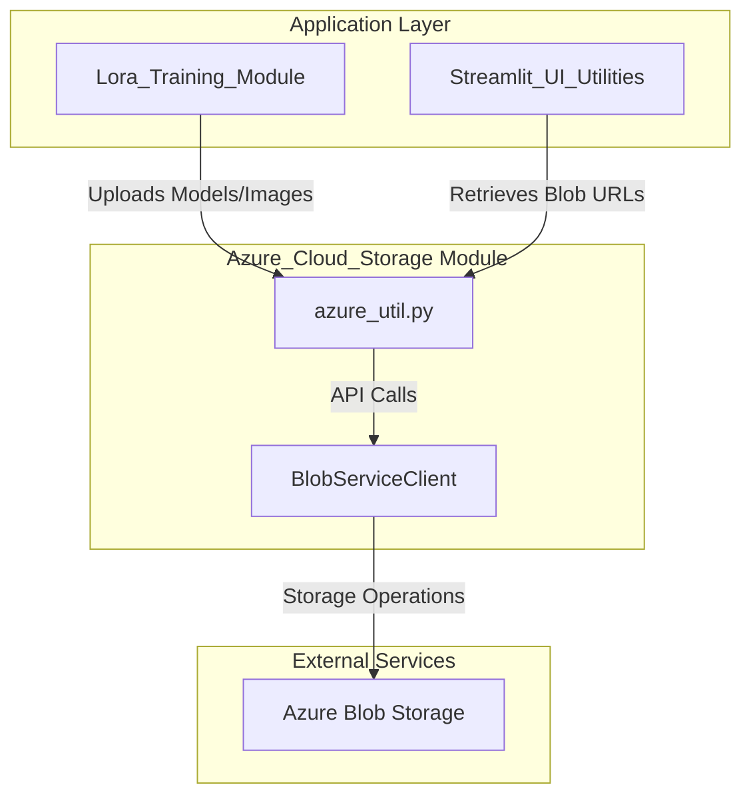
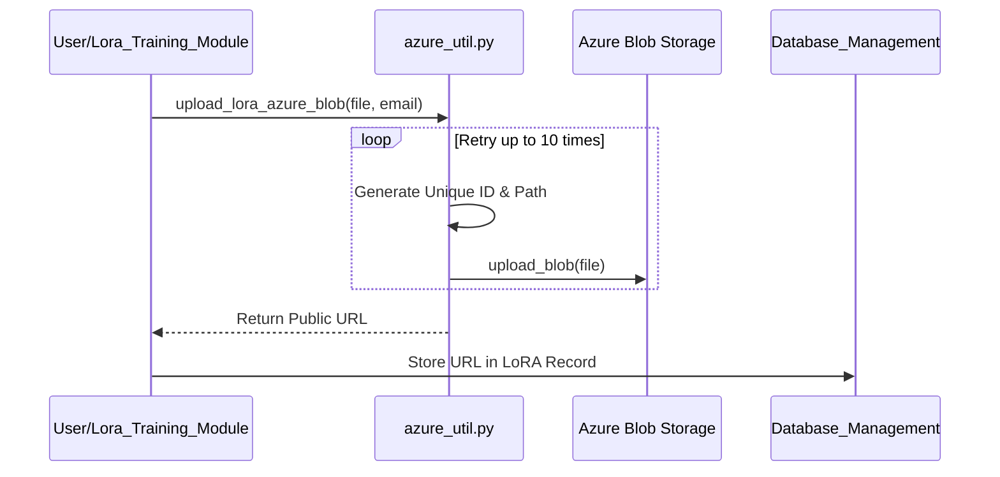

# Azure Cloud Storage Module

The `Azure_Cloud_Storage` module provides a centralized interface for interacting with Azure Blob Storage. It handles the lifecycle of cloud-based assets, specifically focusing on the storage and retrieval of LoRA (Low-Rank Adaptation) models and associated training images used within the design ideation ecosystem.

## Architecture and Integration

This module acts as the persistence layer for large binary files that are not suitable for traditional database storage. It integrates closely with the [Lora_Training_Module](Lora_Training_Module.md) for model management and the [Streamlit_UI_Utilities](Streamlit_UI_Utilities.md) for asset retrieval.

## Core Components

### Blob Service Client Management
The module initializes a singleton `BlobServiceClient` using environment variables for authentication.

*   **`get_blob_service_client()`**: Returns the authenticated Azure Blob Service client.
*   **`get_blob_url()`**: Retrieves the SAS (Shared Access Signature) token or base URL for blob access.

### Asset Upload Operations
The module provides specialized functions for uploading different types of assets with built-in retry logic and unique naming conventions.

| Function | Purpose | Path Pattern |
| :--- | :--- | :--- |
| `upload_lora_azure_blob` | Uploads LoRA model files | `lora/{userEmail}/{timestamp}{uuid}` |
| `upload_lora_image` | Uploads training images for LoRA | `lora/image/{lora_id}/{timestamp}{uuid}.JPG` |

### Data Flow: LoRA Asset Management

## Key Features

### 1. Robust Upload Mechanism
All upload functions implement a retry loop (up to 10 attempts) to handle transient network issues or service throttling, ensuring high reliability for large file transfers.

### 2. Structured Pathing
Assets are organized hierarchically within the `aidesignoutput` container:
- **Models:** Organized by user email to facilitate access control and auditing.
- **Images:** Grouped by `lora_id` to maintain the relationship between a model and its training dataset.

### 3. Lifecycle Management
The module includes `delete_lora_image(lora_id)`, which performs a prefix-based search to bulk-delete all training images associated with a specific LoRA ID, maintaining storage hygiene.

## Dependencies
- **Azure SDK**: `azure-storage-blob` for cloud communication.
- **Streamlit**: Used to trigger UI state refreshes (`st.session_state.history_refresh = True`) after successful uploads.
- **Environment Variables**:
    - `AZURE_ACCOUNT_URL`: The base URL for the storage account.
    - `AZURE_CREDENTIAL`: Authentication key or token.

## Related Modules
- [Lora_Training_Module](Lora_Training_Module.md): Primary consumer for model and image uploads.
- [Database_Management](Database_Management.md): Stores the URLs generated by this module for metadata tracking.
- [Streamlit_UI_Utilities](Streamlit_UI_Utilities.md): Uses blob utilities to display images in the frontend.
