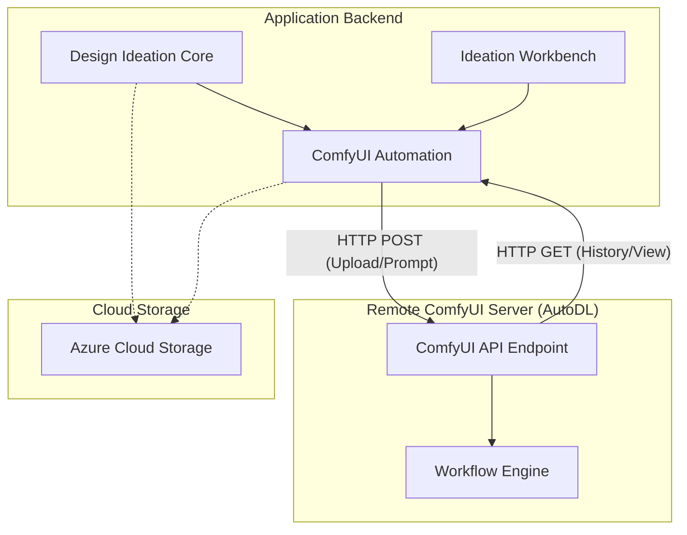
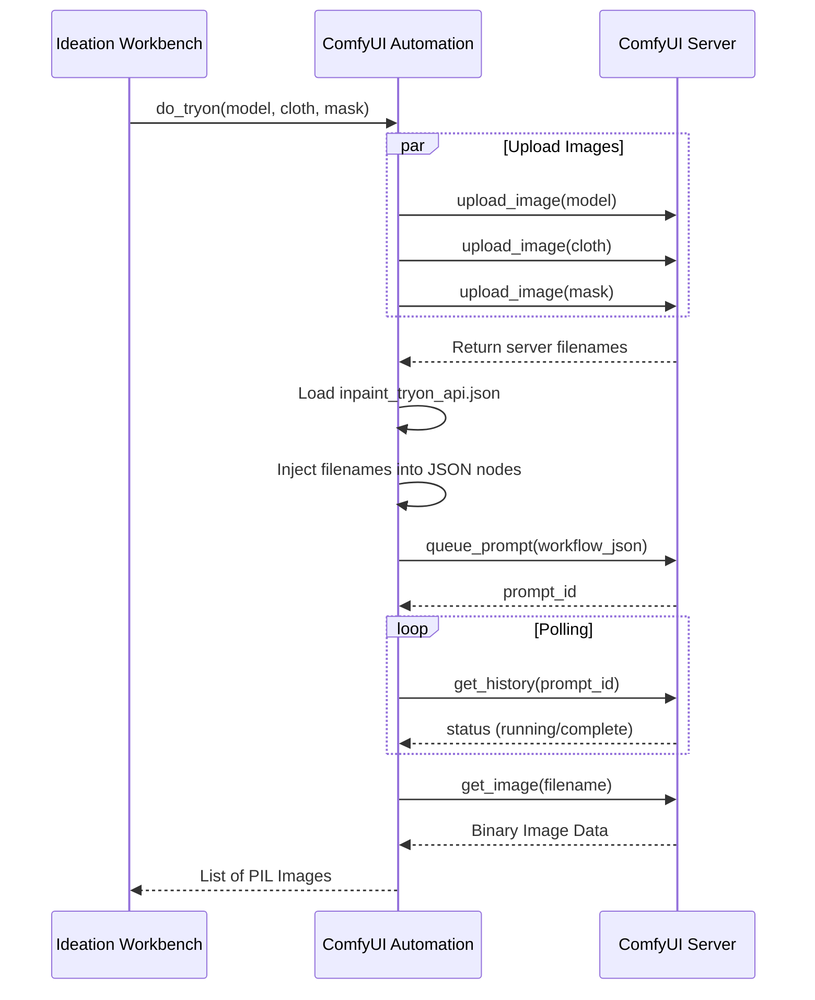

# ComfyUI_Automation Module Documentation

## Introduction
The `ComfyUI_Automation` module provides a robust bridge between the application's backend and a remote ComfyUI server (typically hosted on AutoDL). It automates complex image generation and manipulation workflows by programmatically interacting with ComfyUI's API. 

The module handles image uploads, workflow JSON manipulation, prompt queuing, and asynchronous result polling, enabling features like virtual try-ons, clothing extraction, and 3D character realism enhancement.

## Architecture Overview

The module operates as a client-side automation layer that communicates with a ComfyUI instance via HTTP. It abstracts the complexity of ComfyUI's node-based system into high-level Python functions.

### System Context

## Core Components

### 1. Communication & Polling Logic
The foundation of the module lies in its ability to manage the lifecycle of a ComfyUI request without requiring a persistent WebSocket connection.

*   **`upload_image`**: A versatile utility that handles local files, URLs, or base64 strings, uploading them to the ComfyUI server's input directory.
*   **`queue_prompt`**: Submits a serialized JSON workflow to the ComfyUI `/prompt` endpoint.
*   **`get_images_by_polling`**: The primary execution wrapper. It queues a prompt and then enters a polling loop (`poll_result_until_ready`) to check the `/history` endpoint until the generation is complete, then retrieves the resulting images via the `/view` endpoint.

### 2. Specialized Workflow Functions
These functions map specific business logic to ComfyUI workflow templates (stored as JSON files in `assets/comfyui/`).

| Function | Purpose | Workflow File |
| :--- | :--- | :--- |
| `do_tryon` | Performs virtual try-on using a model, cloth, and mask. | `inpaint_tryon_api.json` |
| `clothing_extraction_white` | Extracts clothing items and places them on a pure white background. | `clothing_extraction_white.json` |
| `get_3d_realism` | Enhances 3D character renders to look like real-world photography. | `real.json` |
| `change_pose` | Generates character sheets and multi-angle views for 3D characters. | `skeleton_face_pose_gen.json` |
| `do_print_to_product` | Applies a texture/print onto a product (e.g., a scarf). | `textform.json` |

## Data Flow: Virtual Try-On Example

The following sequence diagram illustrates the typical data flow when a user requests a virtual try-on.

## Configuration
The module relies on environment variables for server connectivity:
*   `AUTODL_COMFYUI_SERVER_ADDRESS`: The endpoint of the ComfyUI server.
*   `AUTODL_TOKEN`: Authentication token for the server.

## Integration with Other Modules
*   **[Design_Ideation_Core](Design_Ideation_Core.md)**: Uses `clothing_extraction_white` during the garment identification and extraction phase.
*   **[Ideation_Workbench](Ideation_Workbench.md)**: Calls `do_tryon` and `get_3d_realism` to provide advanced visualization features to the user.
*   **[Azure_Cloud_Storage](Azure_Cloud_Storage.md)**: While ComfyUI uses its own local storage for processing, final results are often passed back to the UI utilities to be saved in Azure.

## Error Handling
The module includes robust error handling for:
*   **Network Failures**: Retries and timeouts during polling.
*   **SSL Issues**: Options to bypass SSL verification for development environments (`verify_ssl=False`).
*   **Workflow Integrity**: Validates that expected output nodes exist in the returned data before attempting to process images.
