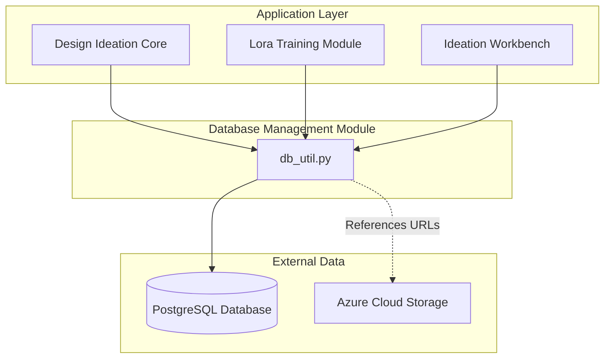
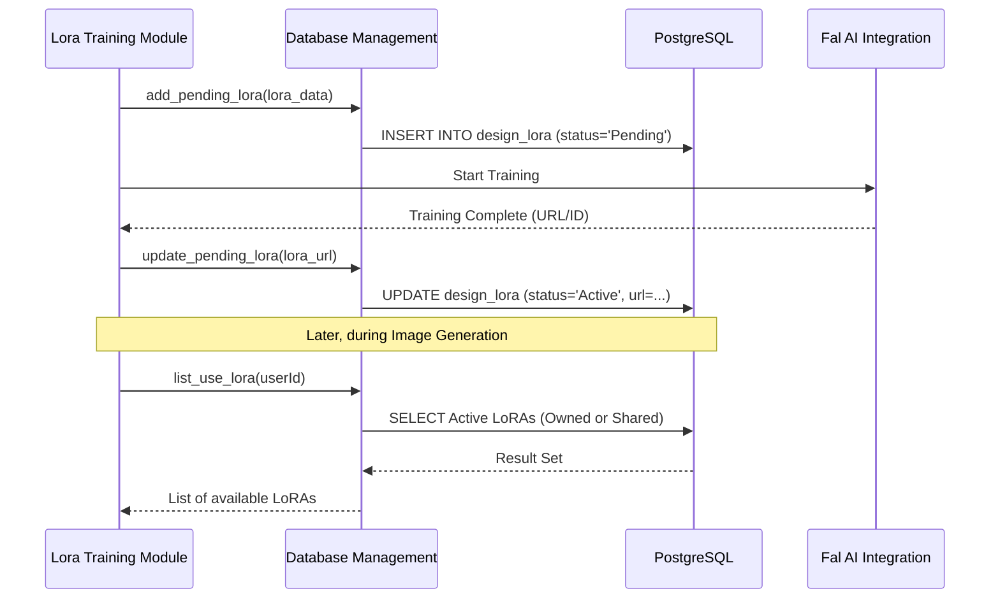

# Database Management Module

The Database Management module serves as the central data persistence layer for the Design Ideation system. It manages relational data using PostgreSQL, handling everything from user quotas and API keys to complex LoRA (Low-Rank Adaptation) model metadata and access control.

## Architecture and Dependencies

The module acts as a bridge between the application logic and the PostgreSQL database. It is primarily utilized by the [Lora_Training_Module](Lora_Training_Module.md) for model tracking and the [Design_Ideation_Core](Design_Ideation_Core.md) for user management and history.

## Core Functionality

### 1. Connection Management
The module uses `psycopg2` to establish and manage connections to the PostgreSQL instance. Connection parameters are retrieved from environment variables (`DB_USER`, `DB_PASSWORD`, `DB_HOST`, `DB_PORT`, `DB_DATABASE`).

### 2. LoRA Model Management
This is the most complex part of the module, managing the lifecycle of LoRA models:
*   **Creation:** Adding new LoRA records in 'Pending' or 'Active' states.
*   **Metadata:** Storing training configurations, model types (dev/pro), and owner information.
*   **Image Tracking:** Managing the relationship between LoRA models and their training/generated images.
*   **Status Updates:** Transitioning models from 'Pending' to 'Active' or 'Failed' based on training results.

### 3. Access Control (RBAC)
The module implements a granular access control system for LoRA models:
*   **Visibility Levels:** 'Creator Only', 'Restricted', or 'Anyone'.
*   **Access Levels:** 'Read-only', 'Admin', or 'Chat-only'.
*   **Grant Management:** Functions to add, update, or revoke user access to specific models.

### 4. Resource & Quota Management
To ensure system stability and fair usage, the module tracks:
*   **User Quotas:** Daily usage limits per model/service.
*   **API Keys:** Management of external service keys (e.g., Kling) with token-based rotation and decrementing.

## Data Flow: LoRA Training Lifecycle

The following diagram illustrates how the database module tracks a LoRA model from initialization to usage.

## Component Reference

### Key Functions in `db_util.py`

| Function | Description |
| :--- | :--- |
| `get_db_connect()` | Establishes a connection to the PostgreSQL database. |
| `add_lora(lora_data)` | Creates a new LoRA record and returns the generated UUID. |
| `list_lora(userId)` | Retrieves all LoRAs owned by or shared with a specific user. |
| `add_lora_access(...)` | Grants a specific user access to a LoRA model. |
| `update_user_quota(...)` | Increments the usage count for a user on a specific model. |
| `get_kling_key_from_db()` | Retrieves an available API key and decrements its token count. |

## Database Schema Overview

The module interacts with several key tables:
*   `public.design_lora`: Stores core model metadata.
*   `public.design_lora_access`: Manages permissions between users and models.
*   `public.design_lora_image`: Links images to LoRA models.
*   `public.design_user_quota`: Tracks daily usage per user/model.
*   `public.design_kolor_key`: Manages external API credentials and tokens.

## Integration with Other Modules

*   **[Azure_Cloud_Storage](Azure_Cloud_Storage.md):** While `db_util.py` stores the URLs, the actual files are managed by the Azure module.
*   **[Fal_AI_Integration](Fal_AI_Integration.md):** Training IDs and results from Fal AI are persisted via this module.
*   **[Lora_Training_Module](Lora_Training_Module.md):** Uses this module to list, view, and update training progress.
