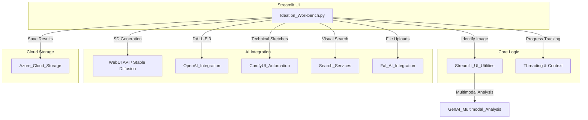
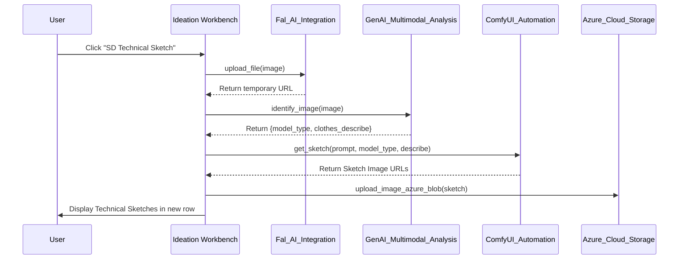

# Ideation Workbench Module

The **Ideation Workbench** is a core interactive module within the Design Ideation system. It serves as a creative sandbox where designers can upload source images, perform visual searches, and iteratively generate new design variations using various AI techniques including Stable Diffusion, DALL-E 3, and ComfyUI workflows.

## Overview

The module provides a "row-based" iterative workflow. Each generation step creates a new row of images derived from a selection in the previous row. This allows for a branching "evolution" of design ideas, from initial concept to technical sketches.

### Key Capabilities
*   **Visual Search:** Integration with Bing/SerpApi to find similar products based on an uploaded image.
*   **AI Image Generation:** Multi-engine support (Stable Diffusion, DALL-E 3) for creating variations in style, color, and fabric.
*   **Product Extraction:** Using multimodal LLMs to describe garments and re-generate them with DALL-E 3.
*   **Sketch Generation:** Converting realistic photos into artistic drawing sketches or precise technical sketches.
*   **Fine-tuning:** Interactive UI for adjusting prompts, seeds, and model parameters for specific rows.

## Architecture and Data Flow

The Ideation Workbench acts as a coordinator between the frontend UI (Streamlit) and various backend AI services.

### Component Interaction Diagram

## Core Functions

### Image Generation Engines

| Function | Engine | Purpose |
| :--- | :--- | :--- |
| `gen_sd_image` | Stable Diffusion (WebUI) | Uses ControlNet (Canny/Depth) to generate variations while maintaining shape. |
| `gen_Dall_E_3_image` | OpenAI DALL-E 3 | High-quality creative generation based on extracted product descriptions. |
| `gen_comfyui_sketch_image` | ComfyUI | Specialized workflow for generating technical sketches from photos. |
| `technical_sketch` | Fal.ai + ComfyUI | Orchestrates image uploading, multimodal description, and sketch generation. |

### Iterative Workflow Logic

The module manages state using `st.session_state.ide_imgRowSetting` and `st.session_state.ide_imageRowList`.

1.  **Source Selection:** User uploads an image or selects a result from a search.
2.  **Action Trigger:** User clicks a function (e.g., "Change Styles").
3.  **Analysis:** `identify_image` calls [GenAI_Multimodal_Analysis](GenAI_Multimodal_Analysis.md) to understand the garment attributes.
4.  **Threaded Execution:** `call_func_with_progress_bar` starts a background thread to call AI APIs without freezing the UI.
5.  **State Update:** New images are appended to the session state, and a new UI row is rendered.

## Process Flow: Technical Sketch Generation

This flow illustrates the complex interaction between multiple services to produce a technical sketch.

## UI Components

*   **Source Panel:** Handles initial file uploads and displays visual search results.
*   **Action Buttons:** `add_gen_image_bottom_btn` generates the toolbar for each row (Styles, Colors, Extraction, etc.).
*   **Fine-tune Popovers:** `add_sd_fine_tune` and `add_extraction_fine_tune` provide advanced parameter control (Seed, Negative Prompts, Resolution) per row.
*   **Batch Download:** `download_file` aggregates selected images into a ZIP file for the user.

## Dependencies

*   **[Streamlit_UI_Utilities](Streamlit_UI_Utilities.md):** For session state management and image processing.
*   **[GenAI_Multimodal_Analysis](GenAI_Multimodal_Analysis.md):** For garment attribute extraction.
*   **[ComfyUI_Automation](ComfyUI_Automation.md):** For specialized sketch workflows.
*   **[OpenAI_Integration](OpenAI_Integration.md):** For DALL-E 3 generation.
*   **[Azure_Cloud_Storage](Azure_Cloud_Storage.md):** For persistent storage of generated designs.
