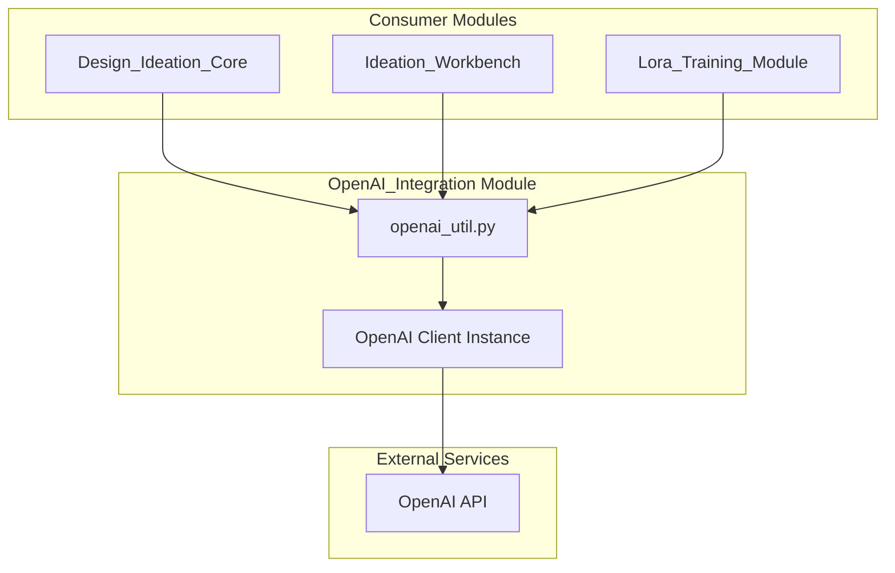
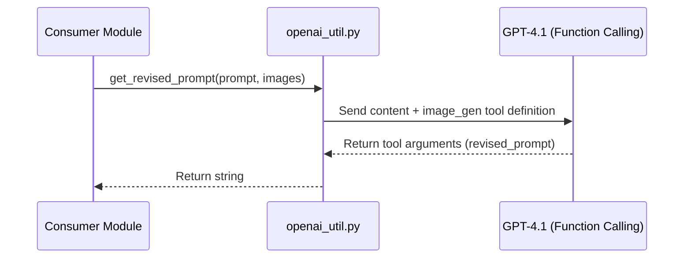
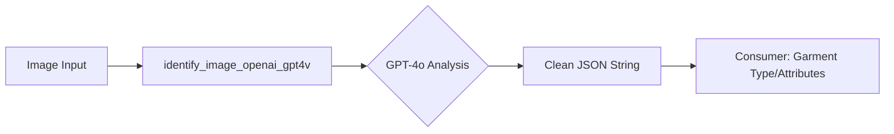

# OpenAI Integration Module

## Introduction
The `OpenAI_Integration` module serves as the primary interface between the Design Ideation system and OpenAI's suite of generative AI models. It provides high-level abstractions for image generation (DALL-E 3), multimodal analysis (GPT-4o), prompt refinement, and video generation (Sora).

This module is critical for the [Design_Ideation_Core](Design_Ideation_Core.md) and [Ideation_Workbench](Ideation_Workbench.md) modules, enabling features like automated garment identification, high-quality design generation, and intelligent prompt engineering.

## Architecture and Component Relationships

The module is structured as a utility library (`openai_util.py`) that wraps the official OpenAI Python SDK and provides custom REST implementations for emerging features like Sora.

### Component Overview
*   **Image Generation**: Interfaces with DALL-E 3 and specialized GPT-image models for creating and editing design assets.
*   **Multimodal Analysis**: Uses GPT-4o-mini to analyze visual inputs, specifically for garment identification and design extraction.
*   **Prompt Engineering**: Implements logic to "revise" user prompts into high-fidelity instructions suitable for generative models.
*   **Video Generation**: Provides a polling-based implementation for Sora video generation and downloading.

### Dependency Diagram

## Core Functionality

### 1. Image Generation & Editing
The module supports both standard DALL-E 3 generation and advanced image editing/masking.

| Function | Model | Purpose |
| :--- | :--- | :--- |
| `call_gen_Dall_E_3_image` | dall-e-3 | Generates high-quality images from text prompts. |
| `call_gen_gpt_image_1` | gpt-image-1.5 | Handles both generation and image-to-image editing. |
| `call_mask_gpt_image_1` | gpt-image-1.5 | Performs inpainting/editing using a source image and a mask. |

### 2. Multimodal Analysis
The `identify_image_openai_gpt4v` function processes image messages and returns structured JSON data. It is frequently used by [GenAI_Multimodal_Analysis](GenAI_Multimodal_Analysis.md) for garment classification.

### 3. Prompt Refinement
The module includes sophisticated prompt revision logic that uses function calling to transform simple user ideas into detailed generative prompts.

### 4. Video Generation (Sora)
Since Sora uses a different workflow, the module implements a custom polling mechanism:
1.  **Initiate**: `sora_generate_video` sends the prompt and optional reference files.
2.  **Poll**: The function enters a loop, checking the status via `_request_with_retry` until completion or failure.
3.  **Download**: `sora_download_video` retrieves the final binary data.

## Data Flow: Image Identification
This flow describes how an image is analyzed to extract design metadata.

## Configuration
The module requires the following environment variables:
*   `OPENAI_API_KEY`: Your OpenAI API key.
*   `OPENAI_API_BASE`: (Optional) Custom API endpoint, defaults to `https://api.openai.com/v1`.

## Related Modules
*   [Design_Ideation_Core](Design_Ideation_Core.md): Uses this module for `identify_garment` and `add_prompt_writer`.
*   [Ideation_Workbench](Ideation_Workbench.md): Uses this module for core image generation tasks.
*   [GenAI_Multimodal_Analysis](GenAI_Multimodal_Analysis.md): Provides alternative analysis using Gemini models.
