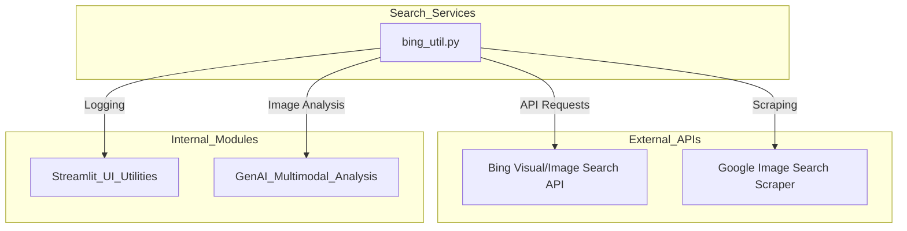
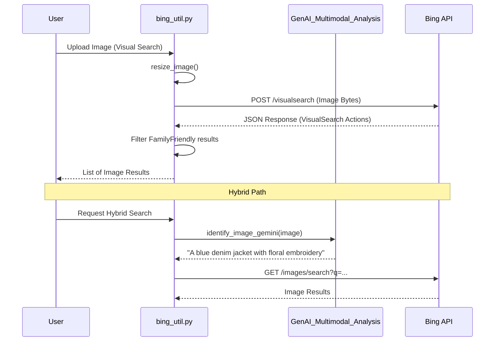

# Search Services Module

The **Search_Services** module provides image-based and keyword-based search capabilities by integrating with external search engines, primarily Microsoft Bing Search APIs. It enables the system to find visually similar products, reference images, and design inspirations based on either uploaded images or textual descriptions.

## Architecture and Dependencies

The module acts as a bridge between the internal design tools and external search providers. It utilizes image processing to prepare data for API consumption and leverages multimodal AI to enhance search accuracy.

### Dependency Map

- **[Streamlit_UI_Utilities](Streamlit_UI_Utilities.md)**: Used for logging search activities.
- **[GenAI_Multimodal_Analysis](GenAI_Multimodal_Analysis.md)**: Used to generate descriptive keywords from images to perform hybrid visual-text searches.

## Core Functionality

### 1. Visual Search
The module allows users to upload an image and find visually similar items.
- **Image Resizing**: Before sending to Bing, images are automatically resized and compressed (target < 1MB) to meet API constraints while maintaining quality.
- **Bing Visual Search**: Utilizes the `v7.0/images/visualsearch` endpoint to identify objects and find similar images.

### 2. Keyword Search
Performs traditional image searches based on text strings.
- **Bing Image Search**: Uses the `v7.0/images/search` endpoint.
- **Google Scraper**: A fallback/alternative method using `BeautifulSoup` to parse Google Image search results.

### 3. Hybrid AI Search
Combines multimodal AI with keyword search.
- The `visual_search` function uses Gemini (via `GenAI_Multimodal_Analysis`) to "see" the image and generate a precise 1-line textual description, which is then used to perform a keyword-based image search.

## Component Interaction

The following diagram illustrates the flow of a Visual Search request:

## Data Flow

1.  **Input**: `PIL.Image` or `bytes` (for visual search) or `string` (for keyword search).
2.  **Processing**:
    *   Images are converted to RGB and iteratively compressed until they fit the size limit.
    *   API headers are populated with `Ocp-Apim-Subscription-Key`.
3.  **Output**: A list of dictionaries containing:
    *   `thumbnailUrl`: URL for the image preview.
    *   `webSearchUrl`: The source page or search result page.
    *   Metadata (e.g., `isFamilyFriendly`).

## Key Functions

| Function | Description |
| :--- | :--- |
| `call_bing_visual_search` | Sends an image to Bing to find visually similar images. |
| `call_bing_keyword_search` | Performs a text-to-image search using Bing API. |
| `visual_search` | **Hybrid**: Uses Gemini to describe an image, then searches by that description. |
| `resize_image` | Utility to ensure images meet the 1MB limit for Bing APIs. |

## Configuration
The module requires the following environment variables:
- `BING_VISUAL_SUBSCRIPTION_KEY`
- `BING_TEXT_SUBSCRIPTION_KEY`
