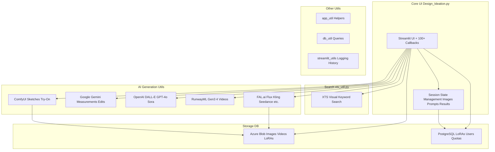
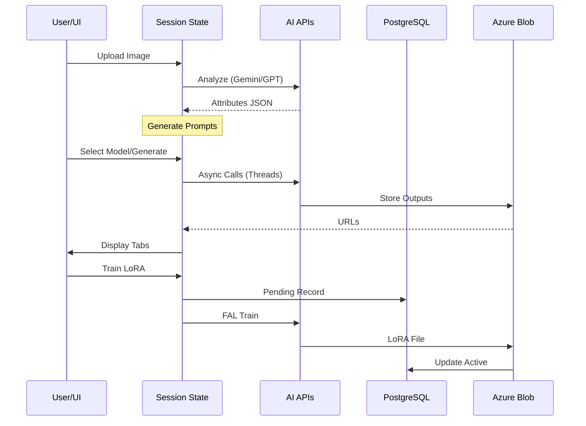

# LFAIDesign Module Documentation

## Introduction and Purpose

The **LFAIDesign** module is a comprehensive Streamlit-based web application for **LF Design Ideation**, an AI-powered tool designed for fashion and apparel designers. It enables users to upload product images, perform AI-driven analysis, generate design variations, conduct similarity searches, estimate garment measurements, perform virtual try-ons, create 3D models and videos, and train custom AI models (LoRAs). 

**Core Purpose**:
- Accelerate fashion design ideation through multimodal AI integration.
- Support end-to-end workflow: Image analysis → Ideation → Generation → Refinement → Export.
- Integrates 20+ AI models/providers (Flux, DALL-E, Gemini, RunwayML, Kling, etc.) for diverse outputs.

This module fits into the **LF AI Suite** as the primary creative ideation engine, interfacing with shared utilities for storage (Azure Blob), database (PostgreSQL), and external APIs.

## Architecture Overview

The module follows a **session-state heavy Streamlit monolith** architecture with heavy reliance on utility modules for API orchestration.



**Data Flow**:
1. **Upload/Analysis**: Image → GPT-4V/Gemini → Attributes (JSON).
2. **Generation**: Prompt + Image → Multi-model API calls (async threads + progress bars).
3. **Output**: Images/Videos/3D → Azure Blob → Session State → UI Tabs.
4. **Persistence**: LoRAs → DB → Training via FAL.ai.

**Key Relationships**:
- **Design_Ideation.py** orchestrates everything (500+ functions).
- **xts_util.py** handles internal XTS product searches.
- Utils like `fal_util.py` abstract 50+ external APIs.

## High-Level Sub-Modules

For detailed documentation, see individual files:

- **[UI Core](Design_Ideation.md)**: Main Streamlit app logic, session state, all callbacks.
- **[Search](xts_util.md)**: XTS visual/keyword product similarity search.
- **[AI Generation](fal_util.md)**: FAL.ai integrations (Flux, Kling, etc.).
- **[Gemini Utils](genai_util.md)**: Google Gemini for measurements/edits.
- **[OpenAI Utils](openai_util.md)**: DALL-E, GPT-4o, Sora.
- **[Storage/DB](db_util.md)**: PostgreSQL LoRA/user management, Azure Blob.

## Component Interaction Diagram



## Process Flows

### 1. Image Ideation Flow
```
Upload → Identify (GPT/Gemini) → Select Model (Flux/DALL-E/etc.) → Generate (Async) → Refine → Export
```

### 2. Custom LoRA Training
```
Upload Images → Config (Trigger/Steps) → FAL Train (Async Poll) → DB Update → List/Use
```

### 3. POM (Point-of-Measure) Flow
```
Upload → Garment Type ID → Template Match → Gemini Estimate → Edit → Export Table
```

See sub-module docs for full details.
