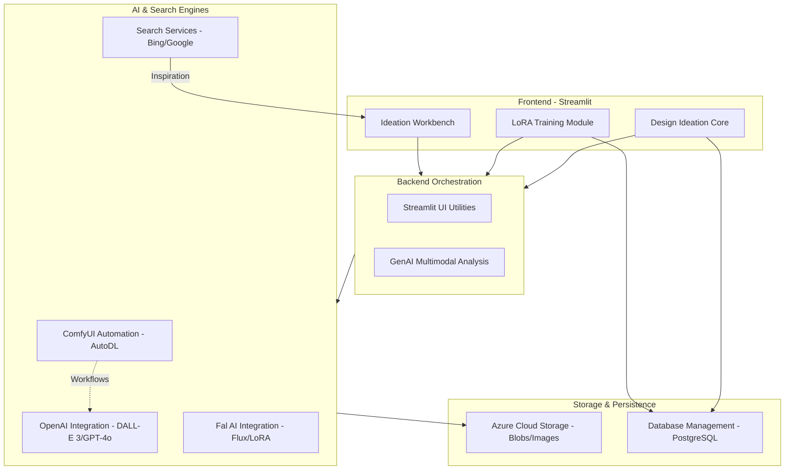
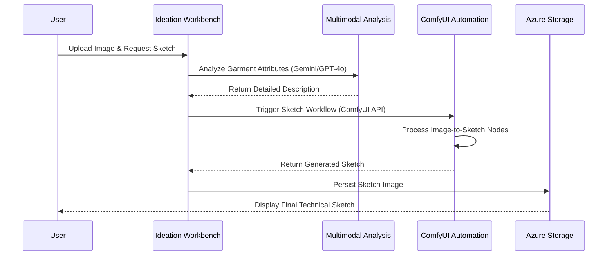

# LFAIDesign Repository Overview

## Purpose
The **LFAIDesign** repository is a comprehensive AI-driven design ideation and fashion technology platform. It is designed to streamline the creative workflow for designers by integrating state-of-the-art generative AI models (Stable Diffusion, DALL-E 3, Flux, and Gemini) with specialized fashion tools. 

The platform enables users to perform visual searches for inspiration, generate iterative design variations, create technical sketches from photos, train custom LoRA models for specific styles, and perform virtual try-ons. It serves as an end-to-end "Creative Sandbox" that bridges the gap between initial design concepts and production-ready technical assets.

---

## End-to-End Architecture
The repository follows a modular architecture where a **Streamlit-based Frontend** coordinates between various **AI Service Integrations**, **Cloud Storage**, and **Relational Databases**.

### Key Workflow: Technical Sketch Generation
This diagram illustrates the cross-module interaction required to transform a design photo into a technical sketch:

---

## Core Modules Documentation

The following modules represent the functional pillars of the LFAIDesign system:

| Module | Description |
| :--- | :--- |
| **[Ideation Workbench](app/backend/pages/Ideation_Workbench.py)** | The primary creative interface for iterative image generation, visual search, and design evolution. |
| **[ComfyUI Automation](app/backend/utils/autodl_comfyui_util.py)** | Manages remote execution of complex node-based workflows for virtual try-ons and clothing extraction. |
| **[OpenAI Integration](app/backend/utils/openai_util.py)** | Handles DALL-E 3 image generation, GPT-4o multimodal analysis, and prompt refinement. |
| **[Database Management](app/backend/utils/db_util.py)** | Manages PostgreSQL persistence for user quotas, LoRA metadata, and access control. |
| **[Azure Cloud Storage](app/backend/utils/azure_util.py)** | Provides a robust interface for storing and retrieving large binary assets like models and generated images. |
| **[Search Services](app/backend/utils/bing_util.py)** | Integrates Bing and Google APIs for visual and keyword-based design inspiration. |
| **[GenAI Multimodal Analysis](app/backend/utils/genai_util.py)** | Uses Gemini and other LLMs to identify garment types and measure design attributes. |
| **[Fal AI Integration](app/backend/utils/fal_util.py)** | Facilitates high-end Flux model generation and cloud-based LoRA training. |