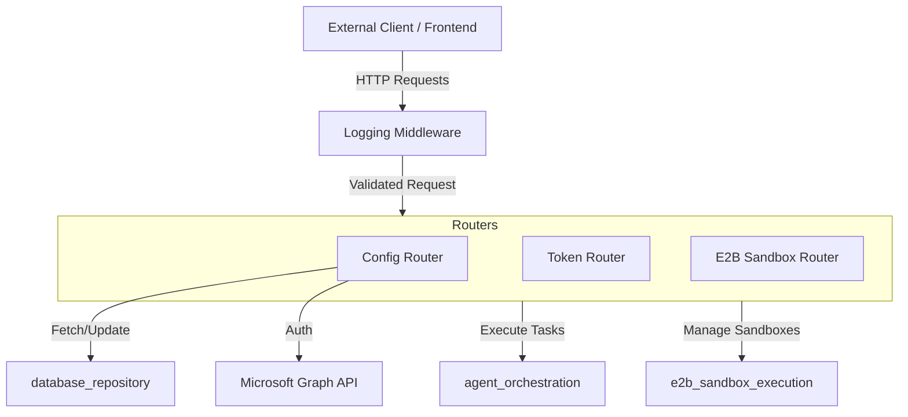
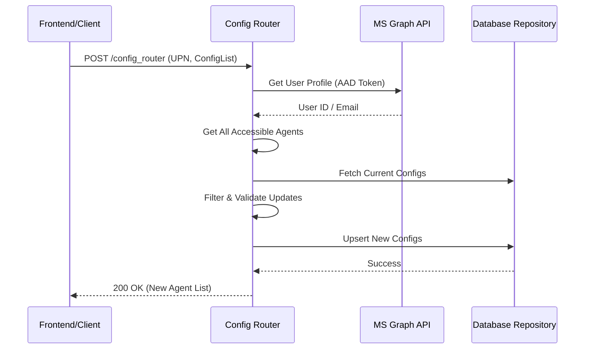

# API Layer Module

## Introduction
The `api_layer` module serves as the entry point and communication bridge for the LFAI Portal's backend services. It provides a structured interface for external requests, handles cross-cutting concerns like logging and authentication, and manages specific business logic such as user-specific agent routing configurations.

This module is built using **FastAPI**, ensuring high performance and type safety through Pydantic models.

## Architecture Overview

The `api_layer` acts as the orchestration layer between the frontend (or external clients) and the internal system components like the [database_repository](database_repository.md) and [agent_orchestration](agent_orchestration.md).

### Component Relationship

## Core Components

### 1. Logging Middleware
The `LoggingMiddleware` is a standard FastAPI middleware that intercepts every incoming request and outgoing response.

*   **Functionality**:
    *   Logs request method, URL path, and client host.
    *   Captures and logs JSON request bodies (with special handling for Starlette's request stream).
    *   Calculates and injects `X-Response-Time` into the response headers.
    *   Logs response status codes and total processing time.

### 2. Config Router
The `ConfigRouter` (specifically `config_routers.py`) manages user-specific configurations for AI agents. It was migrated from Azure Logic Apps to provide a more robust and maintainable Python-based implementation.

*   **Key Models**:
    *   `AgentConfigItem`: Defines the routing status (`Allow_Route`) for a specific `Agent_Id`.
    *   `ConfigRouterRequest`: Contains the user's UPN and a list of `AgentConfigItem` updates.
    *   `ConfigRouterResponse`: Returns the updated agent list and configuration status.

*   **Core Logic**:
    1.  **User Verification**: Fetches user profile from Microsoft Graph API using AAD tokens.
    2.  **Access Control**: Retrieves the full list of agents the user is authorized to see.
    3.  **Configuration Upsert**: Compares requested changes against existing database records and updates only necessary entries in the [database_repository](database_repository.md).
    4.  **State Synchronization**: Returns a merged view of agents with their updated routing permissions.

### 3. Data Flow: Agent Configuration Update

## Integration Points

*   **[database_repository](database_repository.md)**: Used for persisting user agent configurations (`upsert_user_agent_configs`, `get_user_agent_configs`).
*   **[agent_orchestration](agent_orchestration.md)**: The API layer provides the endpoints that eventually trigger agent execution and routing logic.
*   **[e2b_sandbox_execution](e2b_sandbox_execution.md)**: Dedicated routers handle sandbox lifecycle management for code execution tasks.
*   **Microsoft Graph**: Used for identity verification and retrieving user metadata.

## API Reference Summary

| Endpoint | Method | Description |
| :--- | :--- | :--- |
| `/config_router` | POST | Updates user-specific agent routing preferences. |
| `/tokens/access_token` | GET/POST | Handles AAD token exchange and session management. |
| `/e2b/sandboxes` | POST/GET | Manages E2B code execution environments. |
