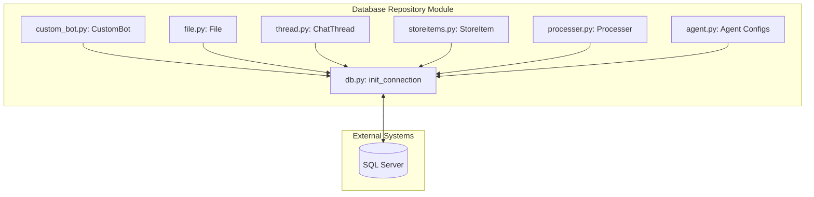
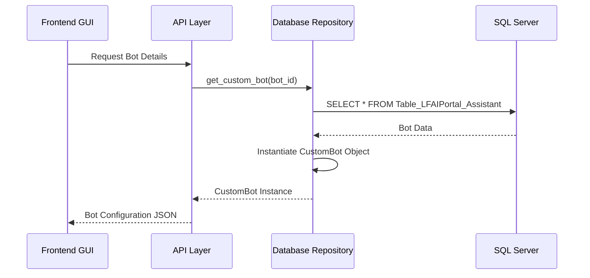
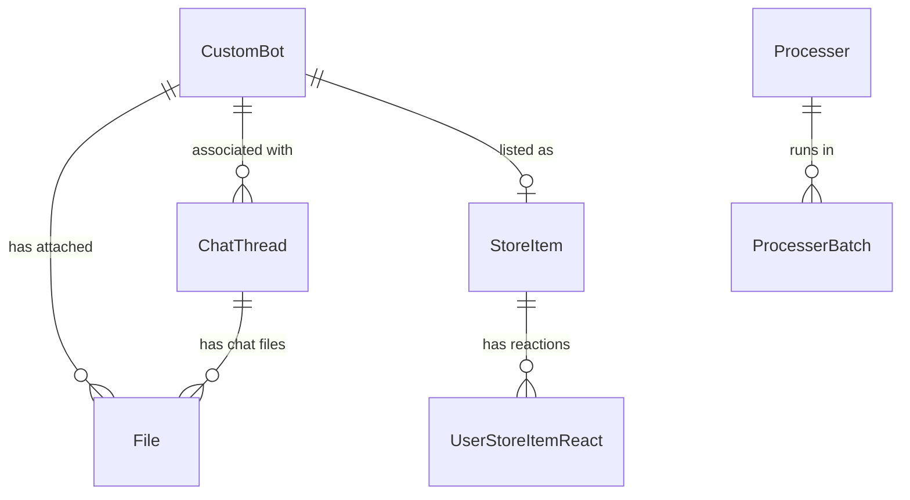

# Database Repository Module

The `database_repository` module serves as the Data Access Layer (DAL) for the LFAI Portal. It provides a structured interface for interacting with the underlying SQL Server database, encapsulating data models and repository patterns for various system entities such as Custom Bots, Files, Chat Threads, Store Items, and Processors.

## Architecture and Component Relationships

The module is organized into several repository files, each focusing on a specific domain of the system. All repositories share a common connection initialization utility.

### Core Components

- **`db.py`**: The foundation of the module, providing `init_connection()` to establish connections to the SQL Server using `pyodbc`. It also includes custom output converters for handling specific SQL types like `datetimeoffset`.
- **`custom_bot.py`**: Manages the lifecycle and configuration of `CustomBot` and `CustomBotChat` entities. It handles bot metadata, synchronization folders, and access control.
- **`file.py`**: Handles metadata for files uploaded to the system, including their association with assistants or chat threads, and their storage destinations.
- **`thread.py`**: Manages chat session history (`ChatThread`), including user-specific threads and interaction logs for different LLM providers.
- **`storeitems.py`**: Controls the "AI Store" functionality, managing `StoreItem` and `StoreItemCustomBot` entities, including their categories, authors, and featured status.
- **`processer.py`**: Manages "Smart Extraction" processors, including their prompts, engines, and batch processing jobs.
- **`agent.py`**: Specifically handles configurations for the Agent Router, allowing per-user settings for agent availability.

### Component Interaction Diagram

## Data Flow

The following diagram illustrates how data flows through the repository when a user interacts with a Custom Bot.

## Entity Relationships

The database schema follows a relational model where various entities are linked via IDs.

## Integration with Other Modules

- **[llm_clients](llm_clients.md)**: The repository stores the configuration (model, instructions, tools) used by LLM clients to initialize chat sessions.
- **[agent_orchestration](agent_orchestration.md)**: Uses `agent.py` to retrieve user-specific routing configurations and `thread.py` to persist session history.
- **[frontend_gui_logic](frontend_gui_logic.md)**: Directly calls repository functions to populate UI components like the Bot Directory or Chat History.
- **[external_tools](external_tools.md)**: File metadata stored via `file.py` is used by tools like `FileSearchProTool` to locate and process documents.

## Key Functionalities

### Custom Bot Management
The `CustomBot` class encapsulates complex logic for bot synchronization with external sources (like SharePoint) and manages different agent types (OpenAI, Dify, etc.).

### AI Store Logic
`StoreItem` and its subclasses manage the presentation layer of bots and tools in the portal, including thumbnail handling and "featured" status.

### Smart Extraction (Processors)
The `Processer` repository handles the configuration for automated document processing, including prompt engineering and batch job tracking.

### Thread and History
`ChatThread` provides a unified way to track conversations across different providers, supporting both OpenAI's thread-based model and generic interaction logging for other providers like Gemini.
