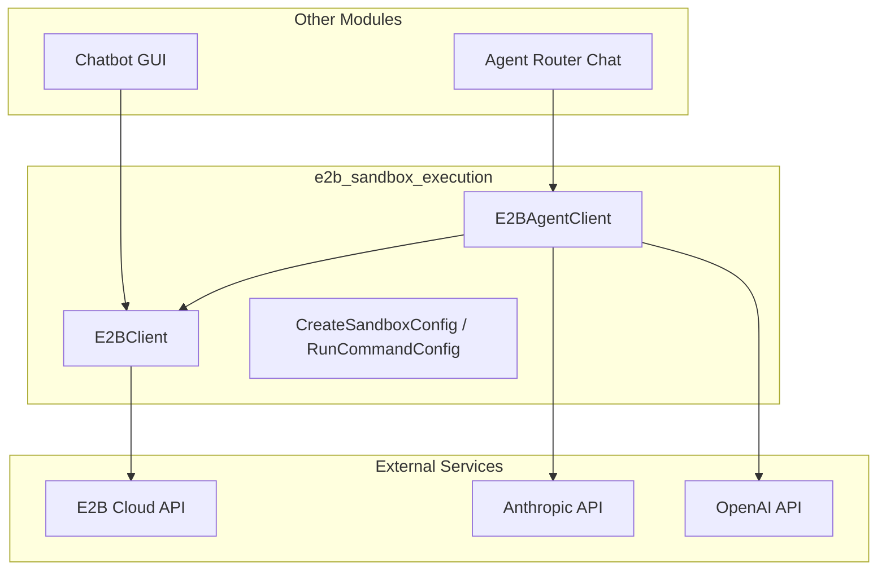
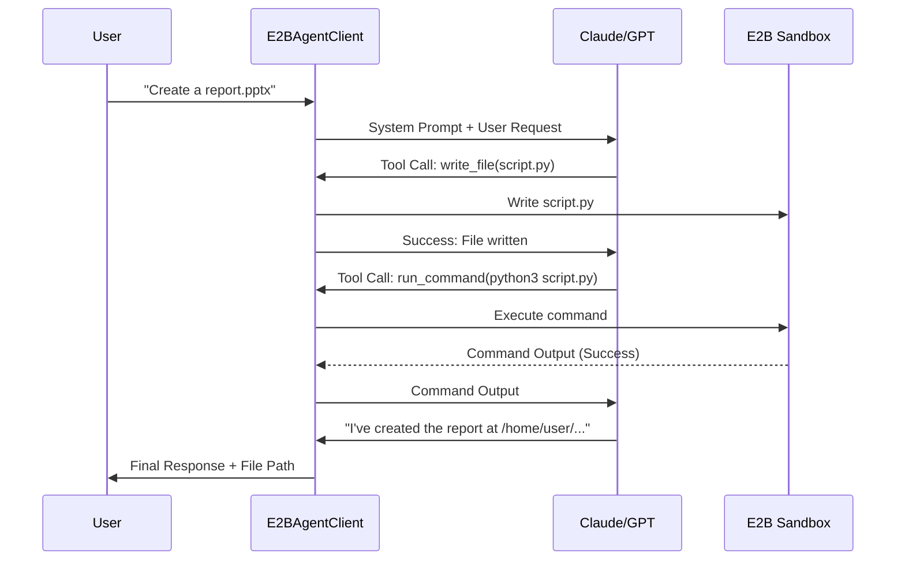

# E2B Sandbox Execution Module

The `e2b_sandbox_execution` module provides a robust interface for managing and interacting with isolated cloud sandboxes provided by E2B. It enables secure code execution, file system management, and agentic automation within Ubuntu-based Linux environments.

## Overview

This module acts as the bridge between the application's logic (including LLM agents) and the E2B infrastructure. It handles sandbox lifecycle management, command execution, and complex file operations, allowing agents to perform tasks like data analysis, report generation, and software installation in a safe, ephemeral environment.

### Key Features
- **Sandbox Lifecycle**: Create, connect, pause, and terminate E2B sandboxes.
- **Command Execution**: Run shell commands synchronously or in the background with real-time output streaming.
- **File System Management**: Comprehensive operations including listing, reading, writing, renaming, and recursive directory management.
- **Agent Integration**: A specialized `E2BAgentClient` that connects LLMs (Claude/GPT) to the sandbox via tool-calling.
- **Optimized Data Transfer**: In-sandbox ZIP compression to handle large file transfers efficiently.

## Architecture and Component Relationships

The module is structured into two primary layers: the low-level client for infrastructure management and the high-level agent client for automated task execution.

### Component Diagram



## Core Components

### E2BClient
The primary interface for managing E2B sandboxes. It wraps the E2B SDK to provide simplified methods for common operations.

- **Sandbox Management**: `create_sandbox`, `connect_sandbox`, `pause_sandbox`, `kill_sandbox`.
- **Command Execution**: 
    - `sandbox_run_command`: Synchronous execution.
    - `sandbox_run_command_background`: Asynchronous execution with PID tracking and output callbacks.
- **File Operations**:
    - `sandbox_files_list`: Lists directory contents.
    - `sandbox_files_write_text` / `sandbox_files_read_bytes`: Basic I/O.
    - `sandbox_upload_files`: Handles `UploadedFile` objects from Streamlit.
    - `create_zip_in_sandbox`: Uses native Linux commands inside the sandbox to package files, avoiding API overhead for many small files.

### E2BAgentClient
An agentic wrapper that allows LLMs to control a sandbox. It defines a set of tools that the LLM can call to interact with the environment.

- **Supported Models**: Optimized for `claude-3-5-sonnet` and GPT-4o.
- **Tools Provided to LLM**:
    - `run_command`: Execute shell commands.
    - `write_file`: Create or update files.
    - `read_file`: Read file contents (with auto-truncation for context window safety).
    - `list_files`: Explore the directory structure.
- **Agent Loop**: Implements a "Think-Act-Observe" loop where the LLM generates tool calls, the client executes them in the sandbox, and the results are fed back to the LLM until the task is complete.

## Data Flow: Agent Task Execution

The following sequence shows how a user request (e.g., "Generate a PPT from this data") is processed.



## Integration with Other Modules

- **[agent_orchestration](agent_orchestration.md)**: The `E2BAgentClient` is often invoked by the `AgentRouterChat` when a task requires code execution or file manipulation.
- **[api_layer](api_layer.md)**: Uses `CreateSandboxConfig` and `RunCommandConfig` for standardized request handling in API endpoints.
- **[frontend_gui_logic](frontend_gui_logic.md)**: The `E2BClient` is used directly by Streamlit pages (like `e2b_chatbot.py`) to provide users with a terminal-like experience and file explorer.

## Configuration

The module relies on the following environment variables:
- `E2B_API_KEY`: Required for sandbox creation.
- `ANTHROPIC_API_KEY`: Required for Claude-powered agents.
- `OPENAI_API_PROJECT_KEY`: Required for GPT-powered agents.

## Usage Example

```python
from e2b_sandbox_execution.e2b_client import E2BClient

# Initialize client
client = E2BClient(user_id="user_123")

# Create a new sandbox
sandbox_id = client.create_sandbox()

# Run a command
client.sandbox_run_command(sandbox_id, "pip install pandas")

# Upload a file
client.sandbox_files_write_text(sandbox_id, "/home/user/hello.txt", "Hello World")
```
