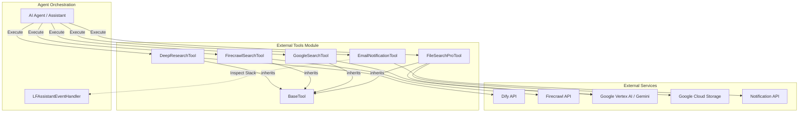

# External Tools Module

The `external_tools` module provides a standardized framework and a collection of specialized tools that extend the capabilities of AI agents. These tools enable agents to interact with external systems, perform deep research, search the web, query specialized file stores, and send notifications.

## Overview

The module is built around a `BaseTool` abstraction, ensuring a consistent interface for execution across different tool types. It integrates with various external APIs including Dify, Firecrawl, Google Gemini (Vertex AI), and custom internal notification services.

### Core Components

| Component | Description |
| :--- | :--- |
| `BaseTool` | Abstract base class defining the `execute` interface for all tools. |
| `DeepResearchTool` | Leverages Dify's deep research capabilities for long-running, iterative research tasks. |
| `FirecrawlSearchTool` | Advanced web search and scraping tool using the Firecrawl API. |
| `GoogleSearchTool` | Web search functionality powered by Google Gemini 2.5 Flash. |
| `FileSearchProTool` | A RAG-enhanced tool that searches and analyzes files stored in Google Cloud Storage using Gemini. |
| `EmailNotificationTool` | Sends HTML email notifications to users or owners via a custom API. |

---

## Architecture & Data Flow

The following diagram illustrates how the `external_tools` module interacts with AI agents and external services.

---

## Component Details

### BaseTool
The foundation of the module. It defines the contract that all tools must follow.
- **Method**: `execute(params: Dict[str, Any]) -> Dict[str, Any]`
- **Purpose**: Ensures that the agent orchestration layer can call any tool using a uniform signature.

### DeepResearchTool
Designed for complex queries requiring iterative searching and synthesis.
- **Integration**: Connects to Dify API.
- **Features**: 
    - Supports streaming responses.
    - Prevents duplicate concurrent requests for the same query/user.
    - Handles long-running requests with extended timeouts (200s).
- **Dependencies**: [openai_integration](openai_integration.md) (often used within Assistant workflows).

### FirecrawlSearchTool
A powerful web search tool that can optionally scrape full page content.
- **Capabilities**: Search, Scrape (Markdown/HTML), and Metadata extraction.
- **Parameters**: `query`, `limit`, `scrape_content`, `formats`, `lang`, `country`.

### FileSearchProTool
An advanced RAG (Retrieval-Augmented Generation) implementation.
- **Process Flow**:
    1. **Metadata Filtering**: Uses Gemini 2.5 Flash to select the most relevant files based on AI-generated summaries.
    2. **Content Analysis**: Passes selected file URIs (from Google Cloud Storage) back to Gemini for deep reading and answering.
- **Dependencies**: [google_cloud_integration](google_cloud_integration.md), [database_repository](database_repository.md) (for file metadata).

### EmailNotificationTool
Facilitates communication by sending automated emails.
- **Context Awareness**: Uses Python's `inspect` module to look up the call stack and find the active `LFAssistantEventHandler` to retrieve `assistant_id` and `thread_id`.
- **Security**: Integrates with APIM (API Management) using subscription keys.

---

## Interaction with Other Modules

- **[agent_orchestration](agent_orchestration.md)**: Tools are typically registered and invoked by the `AgentRouterChat` or `GenericAgentClient`.
- **[openai_integration](openai_integration.md)**: The `EmailNotificationTool` and `FileSearchProTool` specifically look for `LFAssistantEventHandler` to extract session context.
- **[google_cloud_integration](google_cloud_integration.md)**: `FileSearchProTool` and `GoogleSearchTool` rely on Vertex AI credentials and Gemini models.
- **[database_repository](database_repository.md)**: `FileSearchProTool` queries the database to find files attached to specific assistants.

## Configuration

Tools require environment variables for API keys:
- `DIFY_API_KEY_DEEPRESEARCH`
- `FIRECRAWL_API_KEY`
- `GEMINI_API_KEY` (or Vertex AI Service Account)
- `CUSTOM_BOT_NOTIFICATION_API`
