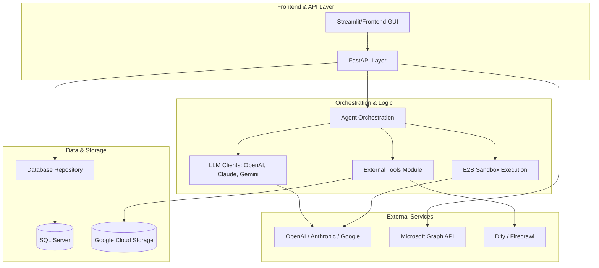

# LFAIPortal Repository Overview

## Purpose
The **LFAIPortal** is a comprehensive AI-native platform designed to orchestrate, manage, and deploy specialized AI agents and "Custom Bots." It serves as a centralized hub for enterprise AI interactions, providing a robust backend for Large Language Model (LLM) integration, secure code execution via sandboxes, automated document processing (Smart Extraction), and an "AI Store" for discovering and configuring specialized assistants. The portal bridges the gap between raw LLM capabilities and end-user business applications through a structured management layer.

---

## End-to-End Architecture
The following diagram illustrates the high-level flow from the user interface through the API and orchestration layers to the external AI services and data persistence.

---

## Core Modules Documentation

The LFAIPortal is organized into several specialized modules that handle specific domains of the application:

### 1. [Database Repository](app/backend/database/repository)
The Data Access Layer (DAL) of the system. It manages interactions with the SQL Server database, handling entities such as:
*   **Custom Bots & Store Items**: Metadata and lifecycle for AI assistants.
*   **Chat Threads**: Persistence of conversation history across different providers.
*   **Processors**: Configuration for "Smart Extraction" document processing.
*   **Files**: Metadata for documents used in RAG or chat sessions.

### 2. [External Tools Module](app/backend/utils/tools)
Extends the capabilities of AI agents by providing a standardized `BaseTool` interface. Key tools include:
*   **DeepResearchTool**: Iterative research via Dify.
*   **FirecrawlSearchTool**: Advanced web scraping and searching.
*   **FileSearchProTool**: RAG-enhanced file analysis using Google Vertex AI.
*   **EmailNotificationTool**: Automated communication via custom APIs.

### 3. [E2B Sandbox Execution](app/backend/utils/e2b_utils.py)
Provides secure, isolated cloud environments for code execution.
*   **E2BClient**: Manages the lifecycle of Ubuntu-based sandboxes.
*   **E2BAgentClient**: An agentic wrapper allowing LLMs (like Claude-3.5-Sonnet) to perform data analysis, file manipulation, and shell command execution within the sandbox.

### 4. [API Layer](app/backend/api)
The FastAPI-based entry point for the application.
*   **Logging Middleware**: Handles request/response tracking and performance monitoring.
*   **Config Router**: Manages user-specific agent routing and permissions, integrating with Microsoft Graph for identity verification.

### 5. [Agent Orchestration & LLM Clients](app/backend/utils)
The "brain" of the portal, responsible for:
*   **Agent Router**: Directing user queries to the appropriate model or custom bot.
*   **LLM Clients**: Unified interfaces for interacting with OpenAI, Claude, Deepseek, Grok, and Google Gemini.
*   **GUI Logic**: Streamlit-based utilities for rendering the Chatbot interface and AI Store.