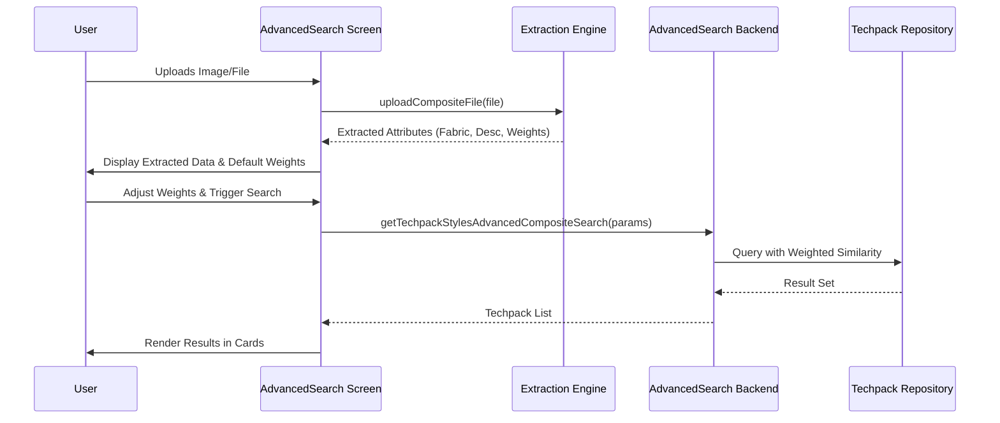

# Advanced Search Module

## Introduction
The **Advanced Search** module is a sophisticated search engine within the Techpack ecosystem, designed to provide users with granular control over discovering and filtering technical packages. It supports two primary modes: a standard attribute-based search and a specialized **Composite Search** (Composition mode).

The module leverages AI-driven extraction and weighted similarity matching to allow users to search by visual elements (photos, line art), material specifications (fabric), and textual descriptions, alongside traditional metadata like brand, season, and factory status.

## Architecture and Component Relationships

The Advanced Search module is primarily a frontend-driven interface that orchestrates complex queries across multiple backend services, including the `ExtractionServiceFactory` for processing uploaded files and the `AdvancedSearchServices` for executing the search logic.

### Component Hierarchy
- **AdvancedSearch (Main Container):** Manages the state for search parameters, results, and UI modes.
- **Provider/Control:** Handles the form logic and input distribution for search criteria.
- **Composition/Main Views:** Specialized UI layouts for "Default" (attribute-heavy) and "Composition" (AI/Weight-heavy) search modes.
- **Techpack Card:** Displays the search results with support for similarity highlighting.

### System Integration
The module interacts with several core systems:
1.  **[Techpack Core Service](techpack_core_service.md):** Fetches customer and brand metadata.
2.  **[Extraction Engine](extraction_engine.md):** Processes uploaded images or documents to extract searchable attributes (fabric, description) during composite search.
3.  **[Frontend Common UI](frontend_common_ui.md):** Utilizes shared components like `MultiSelect`, `DateRangePicker`, and `CommonButton`.

## Data Flow

The following diagram illustrates the data flow during a **Composite Search** operation, where a user uploads a file to find similar Techpacks.

## Core Functionality

### 1. Search Modes
- **Default Mode:** Focuses on explicit metadata filtering (Style Number, Season, Brand, Factory Country, PO State).
- **Composition Mode:** A "search-by-example" workflow. Users upload a reference file, and the system extracts key features. Users can then assign relative importance (weights) to:
    - Style Description
    - Fabric Composition
    - Product Photos
    - Extracted Visual Features

### 2. Weighted Similarity Logic
The module enforces a strict weighting system where the sum of weights for active search criteria must not exceed 1.0 (100%). This ensures the backend similarity engine can accurately rank results based on the user's priorities.

### 3. Advanced Filtering
Beyond basic attributes, the module supports:
- **Cost & FOB Ranges:** Numerical range filtering for financial planning.
- **Factory & Supplier Metadata:** Filtering by factory status and country of origin.
- **Visual Presence:** Filtering based on whether a Techpack has line art or product photos.

## Component Reference: QueryParams

The `QueryParams` interface defines the schema for all searchable dimensions:

| Field | Type | Description |
| :--- | :--- | :--- |
| `brand` | `string` | Target customer/brand name |
| `fabric` | `string` | Material/Fabric description for similarity matching |
| `styleDescription` | `string` | Textual description of the garment |
| `weights` | `WeightField` | Numeric weights for Description, Fabric, and Photos |
| `costRange` | `[number, number]` | Min/Max estimated cost |
| `factoryCountry` | `string` | Country of manufacture |
| `POState` | `string` | Filter by Purchase Order association |

## Related Modules
- **[Techpack Detail](techpack_core_service_details.md):** Users can navigate from search results to the full Techpack view.
- **[Extraction Engine](extraction_engine.md):** Provides the AI logic for "Composition" mode file processing.
- **[Data Models API](data_models_api.md):** Defines the `Techpack` and `ApiResponseDto` structures used for results.
