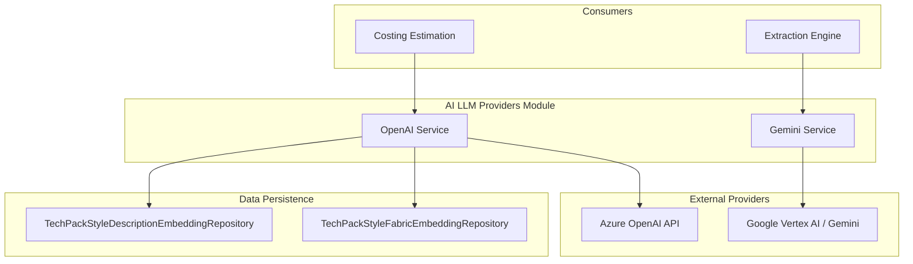

# AI LLM Providers Module

## Overview
The `ai_llm_providers` module serves as the core interface between the TechPack application and various Large Language Model (LLM) services. It provides standardized services for generating text embeddings, performing smart data extraction from documents (PDFs/Images), and executing complex prompts for apparel merchandising analysis.

The module primarily integrates with:
- **Azure OpenAI**: Used for generating high-quality text embeddings for style descriptions and fabrics.
- **Google Gemini (Vertex AI)**: Used for multimodal analysis, including document extraction (BOM/POM) and image analysis.

## Architecture

The module is designed as a service layer that abstracts the complexities of different AI provider SDKs.

## Sub-Modules

### [OpenAI Service](openai_service.md)
Handles interactions with Azure OpenAI. Its primary responsibility is generating and caching embeddings. It implements a "DB-first" strategy where it checks for existing embeddings in the repository before calling the external API to optimize costs and performance.

### [Gemini Service](gemini_service.md)
Handles multimodal interactions with Google's Gemini models. It is specialized for:
- **Smart Extraction**: Extracting structured JSON data from TechPack PDFs and images.
- **Merchandising Logic**: Contains specialized prompts for different garment customers (e.g., Walmart, Reformation, Doen) to identify Bill of Materials (BOM) and Point of Measurement (POM) data.
- **Vision Analysis**: Analyzing multiple images simultaneously with a single prompt.

## Key Functionalities

| Functionality | Provider | Description |
|:---|:---|:---|
| **Embeddings** | Azure OpenAI | Converts style descriptions and fabric details into vector representations for similarity searches. |
| **Document Extraction** | Google Gemini | Parses complex TechPack documents to extract structured merchandising data. |
| **Image Analysis** | Google Gemini | Uses Vision capabilities to analyze garment images and sketches. |
| **Prompt Engineering** | Internal | Maintains a library of specialized prompts tailored for various apparel brands and document formats. |

## Integration with Other Modules
- **[extraction_engine](extraction_engine.md)**: Uses `GeminiService` to perform the actual data lifting from uploaded files.
- **[techpack_repository](techpack_repository.md)**: `OpenAIService` interacts with embedding repositories to store and retrieve vector data.
