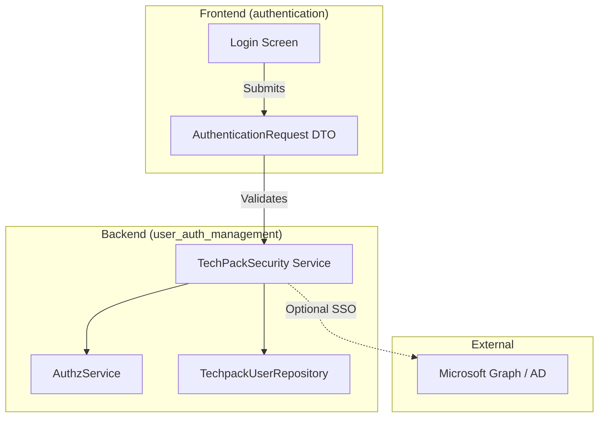
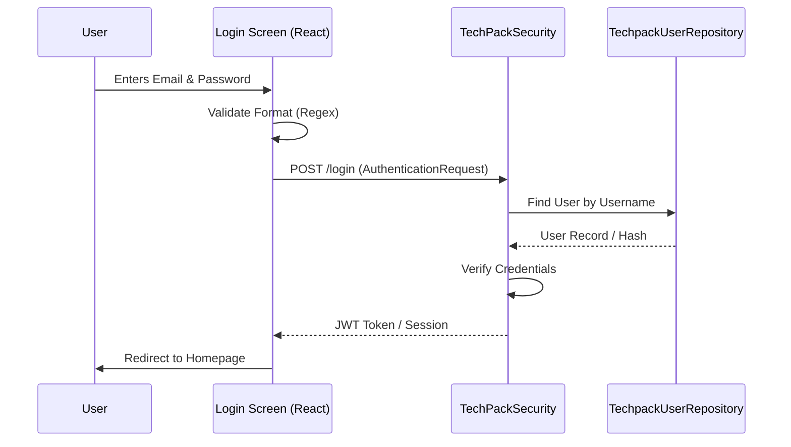

# Authentication Module

The Authentication module manages user access to the TechPack system. It provides the interface and logic for user identification, credential validation, and session establishment, ensuring that only authorized personnel can access sensitive product data and costing information.

## Overview

The authentication process is split between a React-based frontend login interface and a backend security layer. It serves as the gateway to the system, protecting resources managed by the [techpack_core_service](techpack_core_service.md) and [costing_estimation](costing_estimation.md) modules.

### Key Responsibilities
*   **User Interface**: Providing a secure login form for credential entry.
*   **Input Validation**: Ensuring email formats and required fields are met before submission.
*   **Identity Management**: Interfacing with the [user_auth_management](user_auth_management.md) module to verify user records.
*   **Secure Communication**: Handling the transmission of `AuthenticationRequest` payloads.

## Architecture

The authentication flow involves the frontend login screen, the backend security services, and external identity providers.



## Component Interaction

### Login Flow
The following sequence diagram illustrates the process from user input to successful authentication.



## Core Components

### Frontend Login Screen
Located in `frontend/src/screens/login/index.tsx`, this component handles the user interface.

*   **AuthenticationRequest**: An interface defining the structure of the login payload:
    ```typescript
    export interface AuthenticationRequest {
      username: string;
      password: string;
    }
    ```
*   **Validation Logic**: Uses `react-hook-form` for client-side validation.
    *   **Email**: Validated against a standard email regex.
    *   **Password**: Required field validation.
*   **UI Components**: Utilizes shared components like `FormInput` and `CommonButton` from the [frontend_common_ui](frontend_common_ui.md) module.

### Backend Security Integration
The authentication module relies heavily on the following backend services (detailed in [user_auth_management](user_auth_management.md)):

1.  **TechPackSecurity**: The primary service for handling login logic and token generation.
2.  **AuthzService**: Manages role-based access control (RBAC) once the user is authenticated.
3.  **MicrosoftGraphAdapter**: (Optional) Used for enterprise SSO integrations via the [external_adapters](external_adapters.md) module.

## Data Flow

1.  **Capture**: The user enters credentials into the `AuthenticationRequest` form.
2.  **Validation**: The frontend checks for basic formatting errors.
3.  **Transmission**: The request is sent to the backend API.
4.  **Verification**: The backend compares credentials against the `User` model stored in the `TechpackUserRepository`.
5.  **Authorization**: Upon success, the system determines user permissions (e.g., can they view [costing_estimation](costing_estimation.md) data?).

## Related Modules
*   [user_auth_management](user_auth_management.md): Contains the backend logic, user models, and repository.
*   [frontend_common_ui](frontend_common_ui.md): Provides the input fields and buttons used in the login form.
*   [external_adapters](external_adapters.md): Handles third-party authentication providers like Microsoft Graph.
