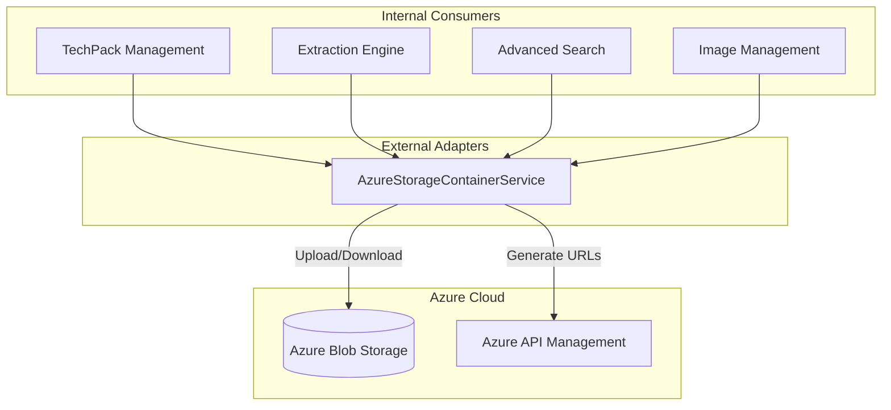
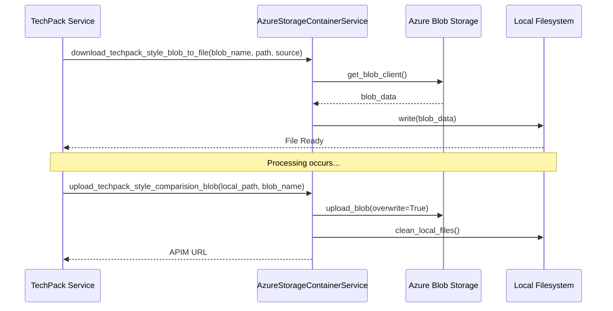

# Azure Storage Module

The `azure_storage` module is a core utility within the `external_adapters` layer, providing a centralized interface for interacting with Azure Blob Storage. It handles the persistence, retrieval, and lifecycle management of various document types, including TechPack files, comparison reports, and images used for advanced search.

## Overview

The module encapsulates the complexity of the Azure Storage SDK, providing high-level methods for:
- Downloading documents (PLM and Non-PLM TechPacks) to local working directories.
- Uploading generated reports and processed images.
- Managing local file cleanup after storage operations.
- Generating accessible URLs for stored assets via an API Management (APIM) host.

## Architecture and Component Relationships

The module consists of a primary service class that interacts with the Azure Blob Storage infrastructure.

### Component Diagram

## Core Components

### AzureStorageContainerService

The `AzureStorageContainerService` is the singleton-style service responsible for all blob operations. It uses environment-based configuration for storage accounts, access keys, and container names.

#### Key Responsibilities:
1.  **Blob Retrieval**: Downloads files from specific containers (e.g., `teckpackdoc`, `nonplm`) to local paths for processing.
2.  **Blob Persistence**: Uploads local files to Azure, ensuring containers exist before upload.
3.  **URL Generation**: Constructs public/internal URLs through the `AZURE_STORAGE_HOST` (APIM) to allow frontend access to files.
4.  **Cleanup**: Provides utility methods to remove temporary local files after they have been successfully synced to the cloud.

## Data Flow

The following diagram illustrates the typical flow when a TechPack is processed:

## Container Mapping

The module manages several distinct containers based on the functional requirement:

| Container Constant | Default Value | Purpose |
|--------------------|---------------|---------|
| `AZURE_STORAGE_CONTAINER_TECHPACK_STYLE` | `teckpackdoc` | Storage for official PLM TechPack documents. |
| `AZURE_STORAGE_CONTAINER_TECHPACK_NONPLM` | `nonplm` | Storage for user-uploaded (Non-PLM) documents. |
| `AZURE_STORAGE_CONTAINER_TECHPACK_COMPARISION` | `techpackcomparision` | Generated comparison reports between TechPacks. |
| `AZURE_STORAGE_CONTAINER_INPUT_ADVANCED_SEARCH` | `advanced-search/input` | Images uploaded for visual/advanced search queries. |

## Integration with Other Modules

- **[extraction_engine](extraction_engine.md)**: Uses this module to download raw PDF/Excel files before starting the extraction process.
- **[techpack_core_service](techpack_core_service.md)**: Relies on this module to fetch the source files for TechPack details.
- **[image_management](image_management.md)**: Utilizes storage for processed images and thumbnails.
- **[xts_transformation](xts_transformation.md)**: May use storage for intermediate transformation artifacts.

## Configuration

The service relies on the following environment variables:
- `AZURE_STORAGE_ACCOUNT`: The name of the storage account.
- `AZURE_STORAGE_ACCESS_KEY`: The secret key for authentication.
- `AZURE_STORAGE_HOST`: The base URL (usually an APIM endpoint) for accessing blobs.
- `AZURE_STORAGE_SAS_TOKEN`: Shared Access Signature for specific policy-based access.
