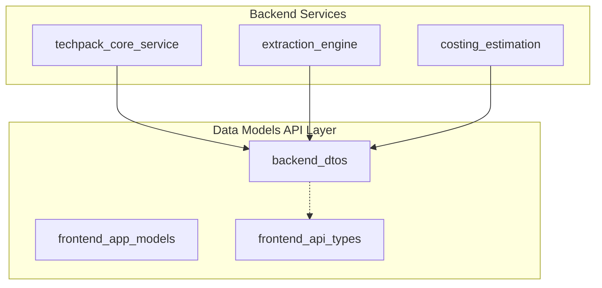
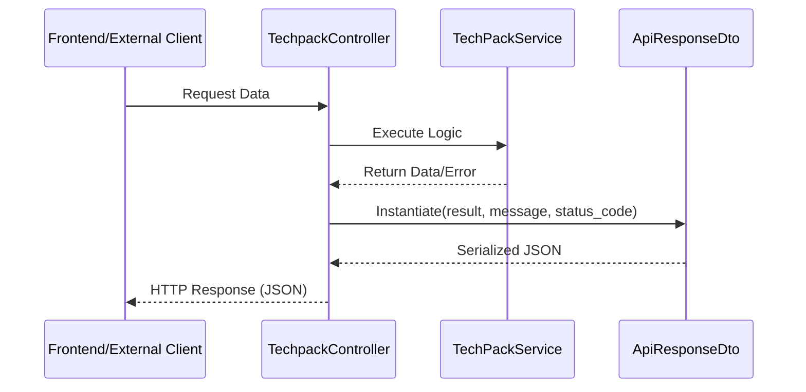

# Backend DTOs Module

## Introduction

The `backend_dtos` module provides standardized Data Transfer Objects (DTOs) used for communication between the backend services and external consumers (including the frontend). Its primary purpose is to ensure a consistent structure for API responses, facilitating error handling, data parsing, and uniform messaging across the system.

This module acts as a bridge between the internal logic of services like [techpack_core_service](techpack_core_service.md) or [extraction_engine](extraction_engine.md) and the [frontend_api_types](frontend_api_types.md).

## Architecture and Component Relationships

The module is a core part of the `data_models_api` layer. It defines the schema for how data leaves the backend environment.

### Component Diagram



## Core Components

### ApiResponseDto

The `ApiResponseDto` is the primary container for all backend API responses. It uses `dataclasses_json` to support seamless serialization and deserialization between Python objects and JSON.

#### Key Features:
- **Field Exclusion**: Fields that are `None` are automatically excluded from the serialized JSON output to keep payloads lean.
- **Flexible Initialization**: Includes a `from_dict` class method that filters out unexpected keys, ensuring robustness when parsing external data or legacy structures.

#### Data Structure:

| Field | Type | Description |
| :--- | :--- | :--- |
| `request_url` | Optional[int] | The URL of the original request (Metadata). |
| `method` | Optional[int] | The HTTP method used (Metadata). |
| `request_body` | Optional[int] | The original request body (Metadata). |
| `status_code` | Optional[str] | HTTP status code or internal status string. |
| `body` | Optional[str] | The raw response body content. |
| `result` | Optional[str] | The processed result or payload of the operation. |
| `message` | Optional[str] | Human-readable message or error description. |

## Data Flow and Process

The following diagram illustrates how `ApiResponseDto` is typically used within a request-response cycle.



## Integration with Other Modules

- **[techpack_core_service](techpack_core_service.md)**: Uses these DTOs to wrap techpack details before sending them to the client.
- **[extraction_engine](extraction_engine.md)**: Wraps extraction results (from PDF/Excel) into the `result` field of the DTO.
- **[frontend_api_types](frontend_api_types.md)**: The TypeScript definitions in the frontend are designed to match the structure provided by `ApiResponseDto`.

## Usage Example

```python
from models.api_response_dto import ApiResponseDto

# Creating a successful response
response = ApiResponseDto(
    status_code="200",
    result="{'id': 123, 'name': 'Sample Techpack'}",
    message="Success"
)

# Serializing to JSON
json_output = response.to_json()
```
