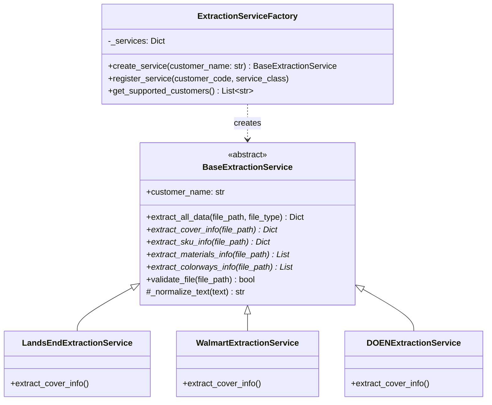
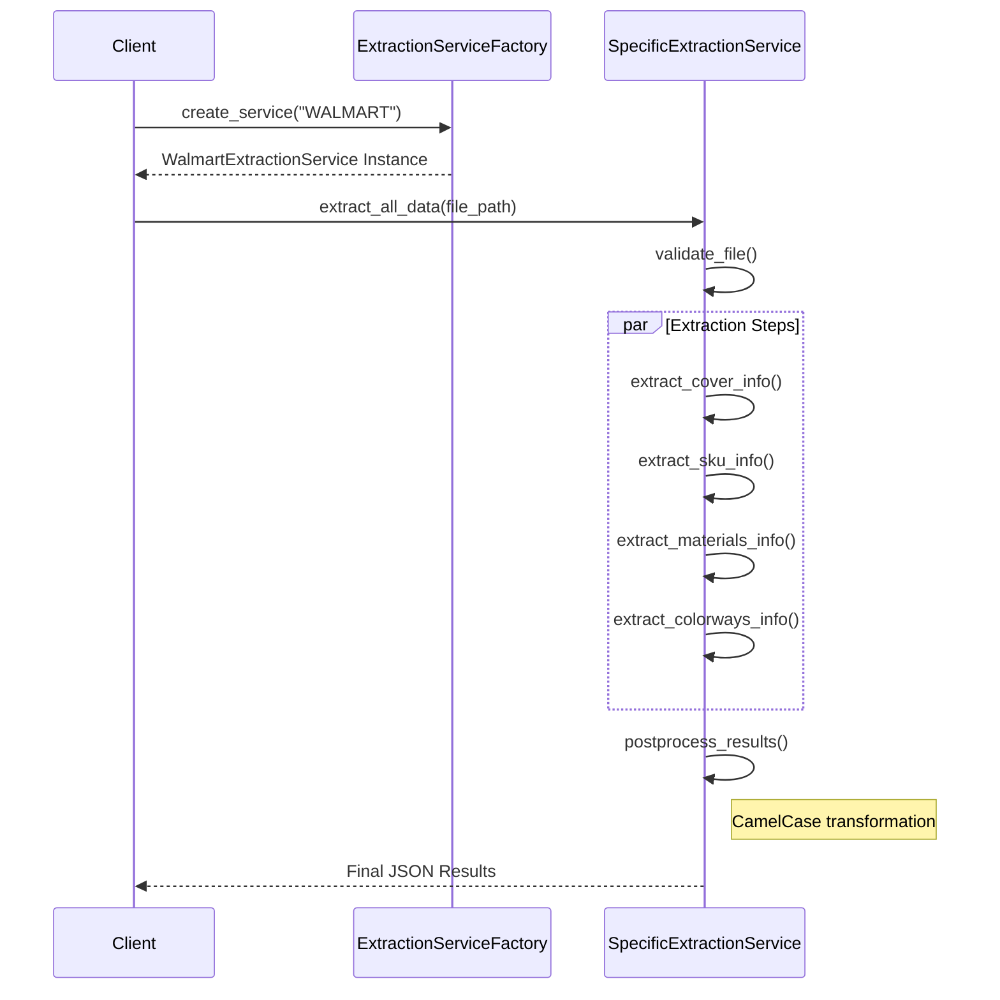

# Core Extraction Module

## Introduction
The `core_extraction` module serves as the foundational layer for the system's data extraction engine. It provides a standardized framework and factory mechanism for extracting structured information (such as Bill of Materials, Colorways, and SKU details) from various technical package (TechPack) formats, including PDFs and Excel files.

By utilizing an abstract base class and a factory pattern, the module ensures consistency across different customer-specific extraction implementations while allowing for specialized logic required by different retail brands.

## Architecture and Component Relationships

### Component Overview
The module is structured around two primary components:
1.  **`BaseExtractionService`**: An abstract base class (ABC) that defines the lifecycle and common utility methods for all extraction services.
2.  **`ExtractionServiceFactory`**: A creational pattern implementation that manages the registration and instantiation of customer-specific extraction services.

### Class Diagram

## Functional Workflow

### Data Extraction Process
The `BaseExtractionService` implements a template method `extract_all_data` which orchestrates the extraction sequence.

## Key Features

### 1. Text Normalization
The module includes robust text normalization logic in `BaseExtractionService` to handle common PDF extraction issues:
*   **Ligature Resolution**: Converts special characters like `fi`, `fl`, `ff` into standard character sequences (`fi`, `fl`, `ff`).
*   **Whitespace Cleaning**: Normalizes non-breaking spaces, thin spaces, and various Unicode invisible characters.
*   **Hyphen/Underscore Handling**: Specialized cleaning for technical identifiers that may contain line-break hyphens.

### 2. Extensibility
New customers can be added by:
1.  Inheriting from `BaseExtractionService`.
2.  Implementing the abstract extraction methods.
3.  Registering the new class in `ExtractionServiceFactory`.

## System Integration
The `core_extraction` module is a dependency for several other high-level services:
*   **[techpack_core_service](techpack_core_service.md)**: Uses extraction to populate the core repository.
*   **[xts_transformation](xts_transformation.md)**: Consumes extracted data to transform it into XTS-compatible formats.
*   **[ai_llm_providers](ai_llm_providers.md)**: Often works in tandem with extraction services to parse unstructured text using Gemini or OpenAI.

## Data Flow
1.  **Input**: Raw file path (PDF/XLSX) and Customer Identifier.
2.  **Processing**: 
    *   Factory selects the driver.
    *   Driver parses document structure.
    *   Utilities normalize text and regex patterns match sizes/SKUs.
3.  **Output**: A standardized dictionary containing `covers`, `materials`, `colorways`, and `skus` with keys transformed to `camelCase` for frontend compatibility.
