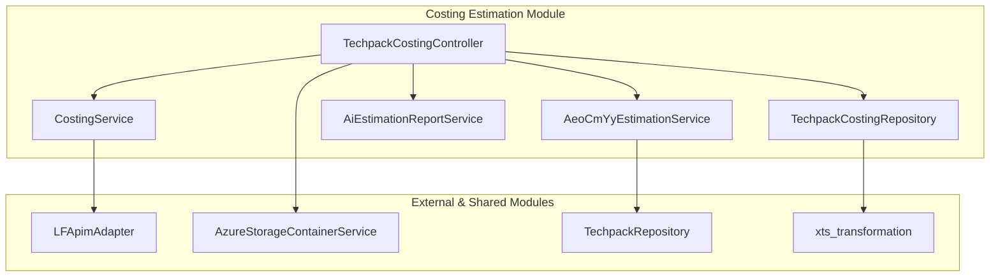

# Costing Estimation Module

## Overview
The **Costing Estimation Module** is a critical component of the Techpack system designed to automate and manage the estimation of manufacturing costs, specifically **CM (Cost of Making)** and **YY (Yield/Consumption)**. It leverages external AI services and internal data repositories to provide accurate financial projections for garment production based on Techpack specifications.

The module supports both manual user-triggered estimations and automated daily batch processing, ensuring that costing data remains up-to-date as Techpack versions evolve.

## Key Functionalities
- **Asynchronous Cost Estimation**: Handles heavy computational tasks (CM and YY retrieval) using a bounded thread pool to prevent system overload.
- **AI-Driven Insights**: Integrates with external adapters to fetch AI-estimated costs based on PDF Techpack analysis.
- **RFQ Management**: Facilitates the creation and lookup of Requests for Quotation (RFQ) within the XTS system.
- **Automated Reporting**: Generates and enqueues email reports (Success/Error) for AI estimations.
- **Batch Processing**: Automatically queues styles for daily AI estimation updates.

## Architecture Overview

### Component Relationship
The module follows a controller-service-repository pattern, interacting with external adapters for AI processing and storage services for file management.

## Sub-Modules

### [Costing Core Services](costing_services.md)
Contains the primary logic for managing asynchronous tasks and specific customer estimation workflows (e.g., AEO).
- **CostingService**: Manages the `BoundedThreadPoolExecutor` for non-blocking task submission.
- **AeoCmYyEstimationService**: Handles batch queuing for AEO-specific styles.

### [Costing Data & Operations](costing_data_operations.md)
Manages the API endpoints and database interactions.
- **TechpackCostingController**: The main entry point for RFQ lookups, manual sync triggers, and report enqueuing.
- **TechpackCostingRepository**: Handles persistence for CM/YY costs and RFQ creation logs.

### [Estimation Reporting](estimation_reporting.md)
Dedicated to processing and formatting estimation data for stakeholder communication.
- **AiEstimationReportService**: Computes display-ready data from raw estimation results.

## Data Flow: AI Cost Retrieval
1. **Trigger**: User requests CM/YY sync via `TechpackCostingController`.
2. **Queue**: Task is submitted to `CostingService` (Async).
3. **Download**: Techpack PDF is retrieved from `AzureStorageContainerService`.
4. **External Call**: `LFApimAdapter` sends the file to the AI engine.
5. **Persistence**: Results are standardized and saved via `TechpackCostingRepository`.
6. **Notification**: An email report is enqueued if the sync was manual.
