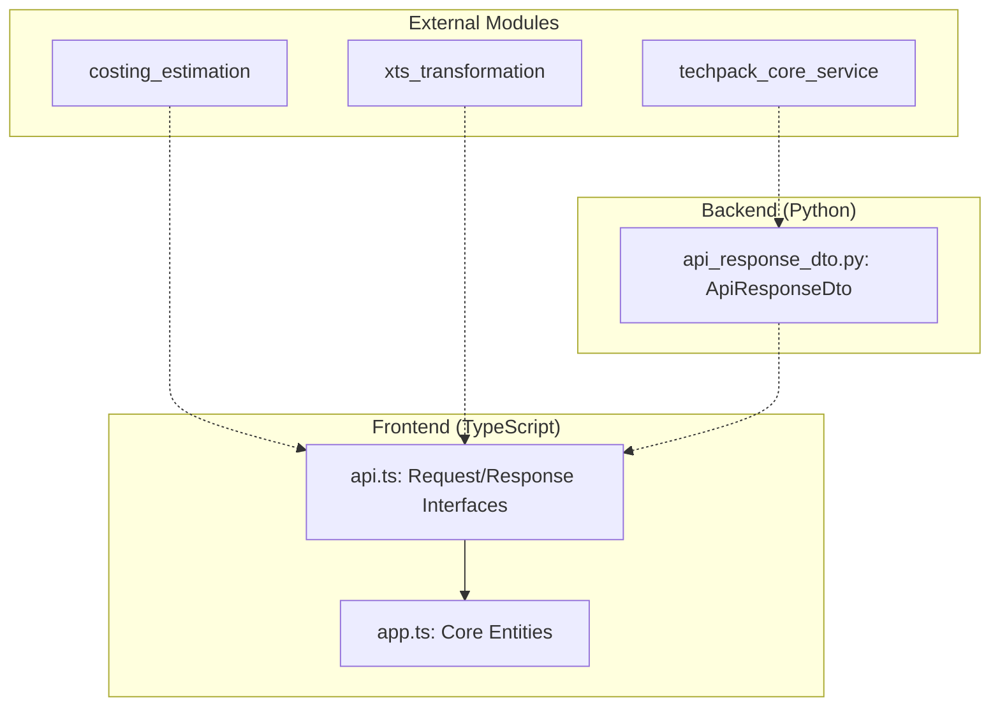
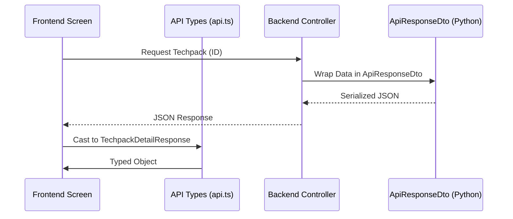

# Data Models API Module

## Introduction
The `data_models_api` module serves as the central definition layer for data structures used across the system's communication boundaries. It bridges the gap between the backend services and the frontend application by providing standardized TypeScript interfaces and Python Data Transfer Objects (DTOs).

The module ensures type safety and consistency for:
- Techpack details and search results.
- API response envelopes.
- Costing and RFQ (Request for Quotation) data.
- XTS (External Tracking System) order information.

## Architecture Overview

The module is divided into two primary environments:
1.  **Frontend Types (`frontend/src/types/`)**: TypeScript interfaces defining the shape of API requests and responses, as well as internal application state.
2.  **Backend DTOs (`models/`)**: Python dataclasses used for serializing and deserializing API responses.

### Component Relationship Diagram

## Sub-modules High-level Functionality

### [Frontend API Types](frontend_api_types.md)
Defines the contracts for all API interactions. It includes request structures for advanced searches, similarity searches, and comparison requests, along with their corresponding response shapes.
- **Key Components**: `TechpackDetailResponse`, `TRFQCostResponse`, `TTechpackStyleAdvancedSearchRequest`.

### [Frontend App Models](frontend_app_models.md)
Contains the core domain models used within the frontend application state. These models represent the "source of truth" for entities like Techpacks, Customers, and BOM (Bill of Materials) details.
- **Key Components**: `Techpack`, `TechpackDetail`, `BOMDetail`, `TechpackFilterState`.

### [Backend DTOs](backend_dtos.md)
Provides standardized Python structures for outgoing API responses, ensuring a consistent format (status codes, messages, and body) across all backend controllers.
- **Key Components**: `ApiResponseDto`.

## Related Modules
- [techpack_core_service](techpack_core_service.md): Uses these models for core techpack operations.
- [costing_estimation](costing_estimation.md): Utilizes `TRFQCostResponse` for financial data.
- [xts_transformation](xts_transformation.md): Maps external data to `TTechpackXTSOrder` structures.

## Data Flow Example: Techpack Retrieval

