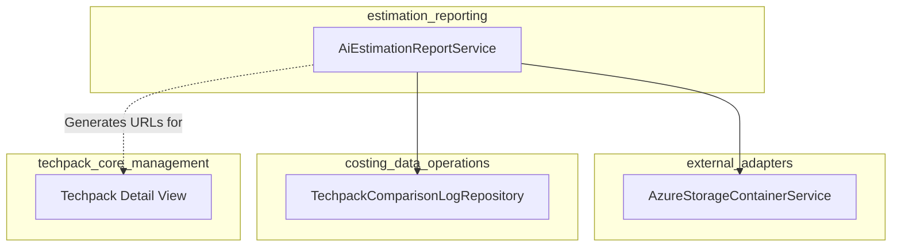
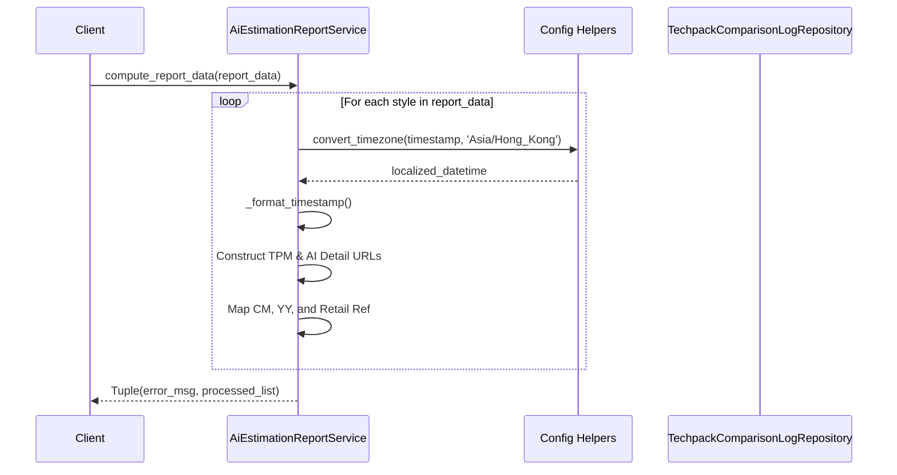

# Estimation Reporting Module

## Introduction
The `estimation_reporting` module is a specialized component within the [costing_estimation](costing_estimation.md) system. Its primary purpose is to process and format AI-driven estimation data into structured reports. It acts as a bridge between raw techpack data logs and user-facing reporting interfaces, providing formatted insights into style estimations, including Cut & Make (CM) costs, Yield (YY), and retail price references.

## Architecture and Relationships
The module is centered around the `AiEstimationReportService`, which interacts with storage services and data repositories to aggregate style information.

### Component Dependencies

- **[external_adapters](external_adapters.md)**: Uses `AzureStorageContainerService` for potential file-based report storage or asset retrieval.
- **[costing_estimation](costing_estimation.md)**: Provides the raw estimation data (CM, YY, Retail Ref) that this module processes.
- **[techpack_core_management](techpack_core_management.md)**: The service generates deep links (TPM URLs) that point back to the Techpack Detail screens in the main application.

## Core Functionality

### AI Estimation Report Service
The `AiEstimationReportService` is responsible for the transformation of raw techpack style logs into a display-ready format.

#### Key Features:
1.  **Data Normalization**: Converts raw database records into a standardized dictionary format with fallback values (e.g., 'N/A') for missing data.
2.  **Timezone Localization**: Converts UTC timestamps to 'Asia/Hong_Kong' timezone for consistent business reporting.
3.  **Deep Linking**: Dynamically constructs URLs to the Techpack Management (TPM) platform, allowing users to jump directly from a report to the specific style or AI estimation detail page.
4.  **Estimation Mapping**: Aggregates specific AI-extracted metrics:
    *   **CM (Cut & Make)**: Manufacturing cost estimations.
    *   **YY (Yield)**: Material usage estimations.
    *   **Retail Ref**: Retail price reference ranges.

## Data Flow
The following diagram illustrates how data flows through the service to produce a report.

## Component Details

### AiEstimationReportService
| Method | Description |
| :--- | :--- |
| `compute_report_data(report_data)` | Processes a list of raw style logs. It handles timezone conversion, string formatting, and URL generation for the frontend. |
| `_format_timestamp(timestamp)` | Internal helper to ensure consistent date-time strings without microseconds. |

### Data Structure (Processed Output)
The service produces a list of objects with the following structure:
- `customer_name`: Display name or customer identifier.
- `style_no`: The unique style number.
- `first_timestamp_lf_captured`: The initial capture date in HK timezone.
- `tpm_url`: Link to the Techpack detail page.
- `cm_url`: Link specifically to the AI estimation section of the Techpack.
- `cm` / `yy` / `retail_ref`: The core estimation metrics.

## Integration with Other Modules
- **[extraction_engine](extraction_engine.md)**: The data processed here is originally extracted from documents by the extraction services.
- **[techpack_core_service](techpack_core_service.md)**: Provides the underlying techpack metadata that populates the report fields.
