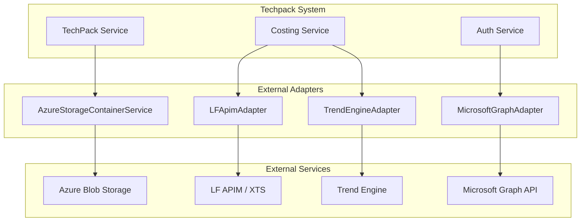

# External Adapters Module

## Overview
The `external_adapters` module serves as the integration layer between the Techpack system and various external services. It abstracts the complexities of third-party APIs and cloud storage, providing a unified interface for the rest of the application to interact with external data sources, AI services, and infrastructure.

## Architecture
The module is designed using the Adapter pattern, ensuring that changes in external API specifications have minimal impact on the core business logic.

## Sub-modules and Components

### 1. [LF APIM Adapter](lf_apim.md) (`LFApimAdapter`)
Handles communication with the Li & Fung API Management (APIM) platform. It is primarily used for:
- Fetching CM (Cut & Make) costing data.
- Fetching YY (Yield) costing data.
- Creating RFQs (Request for Quotations) in the XTS system.
- **Key File**: `adapter/lfai_apim_adapter.py`

### 2. [Microsoft Graph Adapter](microsoft_graph.md) (`MicrosoftGraphAdapter`)
Facilitates integration with Microsoft Azure AD via the Graph API.
- Retrieves user profile information (email, display name, MS ID) using OAuth2 access tokens.
- **Key File**: `adapter/microsoft_graph_adapter.py`

### 3. [Azure Storage Service](azure_storage.md) (`AzureStorageContainerService`)
Manages all interactions with Azure Blob Storage.
- Uploading and downloading Techpack files, images, and comparison reports.
- Managing different containers for PLM, Non-PLM, and Advanced Search data.
- Local file cleanup after processing.
- **Key File**: `services/AzureStorageContainerService.py`

### 4. [Trend Engine Adapter](trend_engine.md) (`TrendEngineAdapter`)
Connects to the Trend Engine service to fetch market data.
- Retrieves retail price information based on brand and product descriptions.
- **Key File**: `adapter/trend_engine_adapter.py`

## Integration with Other Modules
- **[costing_estimation](costing_estimation.md)**: Uses `LFApimAdapter` and `TrendEngineAdapter` for calculating estimates.
- **[user_auth_management](user_auth_management.md)**: Uses `MicrosoftGraphAdapter` for identity verification.
- **[image_management](image_management.md)**: Relies on `AzureStorageContainerService` for persisting image assets.
- **[techpack_core_service](techpack_core_service.md)**: Uses Azure storage for document management.
