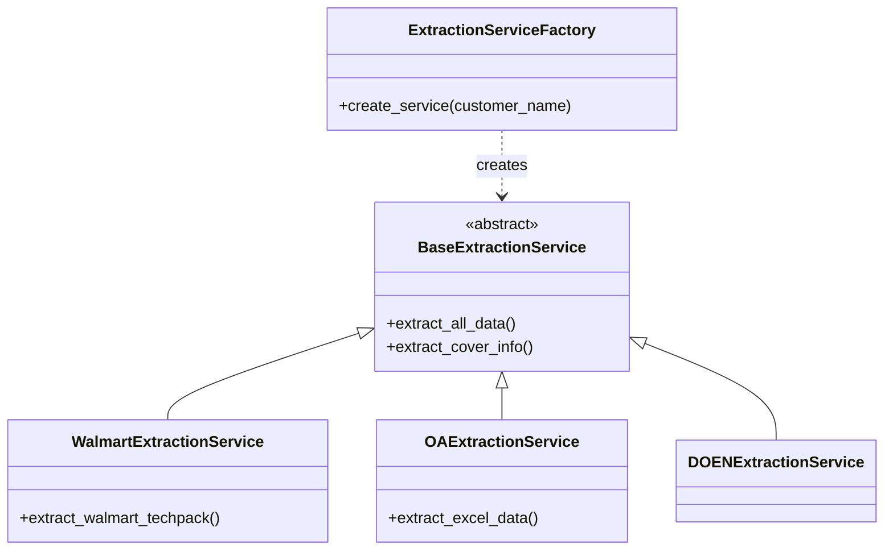

# Extraction Engine Module

## Overview
The `extraction_engine` is a critical service layer designed to automate the ingestion and parsing of technical packages (Tech Packs) from various apparel customers. Its primary purpose is to transform unstructured data—ranging from complex PDFs to Excel spreadsheets—into structured, system-ready formats. 

The engine utilizes a **Factory Design Pattern** to handle diverse customer-specific document formats (e.g., Walmart, Lands' End, Etam) and leverages advanced AI capabilities through LLM providers for smart data lifting and multimodal analysis.

## Architecture

The module is organized into two primary sub-systems: **Extraction Services**, which handle the document parsing logic, and **AI LLM Providers**, which provide the intelligence for complex data extraction and embeddings.

```mermaid
graph TD
    subgraph Extraction_Engine [Extraction Engine]
        direction TB
        Factory[ExtractionServiceFactory]
        Base[BaseExtractionService]
        
        subgraph Services [Extraction Implementations]
            PDF[PDF Extraction Services<br/>Walmart, DOEN, LandsEnd]
            Excel[Excel Extraction Services<br/>OA]
        end
        
        subgraph AI_Layer [AI LLM Providers]
            OpenAI[OpenAIService]
            Gemini[GeminiService]
        end
    end

    %% Relationships
    Factory --> Base
    Base <|-- PDF
    Base <|-- Excel
    PDF -.-> Gemini
    Excel -.-> OpenAI
    
    %% External Inputs
    Docs[(PDF / Excel Files)] --> Factory
```

### Component Relationship (Class Hierarchy)
The following diagram illustrates how specific customer services inherit from the base extraction logic:



## Core Components Documentation

The `extraction_engine` is composed of several specialized components:

| Component | Description |
|:---|:---|
| **[Extraction Services](extraction_services.md)** | The core logic for parsing documents. It includes the `ExtractionServiceFactory` for dynamic service selection and specific implementations for PDF and Excel formats. |
| **[AI LLM Providers](ai_llm_providers.md)** | Provides the interface for `OpenAIService` (Azure) and `GeminiService` (Google Vertex AI). These are used for multimodal document analysis, vision tasks, and generating text embeddings. |
| **Core Extraction** | Defines the `BaseExtractionService` abstract class, ensuring a consistent interface for all customer-specific extraction logic. |
| **PDF/Excel Services** | Specialized handlers using libraries like `pdfplumber`, `camelot-py`, and `openpyxl` to extract BOM, POM, and SKU data. |

## Integration
- **Upstream**: Receives files from the `AzureStorageContainerService`.
- **Downstream**: Passes structured data to the **XTS Transformation** module for canonical formatting and eventually to the **Techpack Core Service** for persistence.