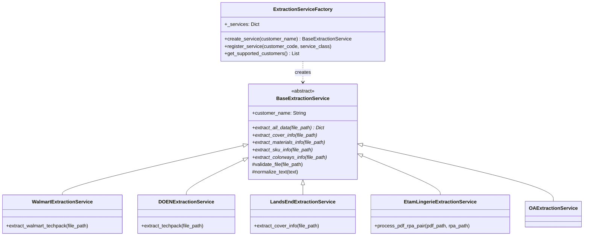

# Extraction Services Module

## Overview
The `extraction_services` module is a core component of the extraction engine designed to automate the parsing and data extraction from technical packages (Tech Packs) provided by various customers (e.g., Walmart, Lands' End, Etam, DOEN). It transforms unstructured or semi-structured documents (PDFs and Excel files) into structured data formats suitable for downstream processing in the techpack system.

The module employs a **Factory Pattern** to dynamically select the appropriate extraction logic based on the customer identity, ensuring scalability and maintainability as new customer formats are added.

## Architecture

### Component Relationship
The module follows an object-oriented design with a clear separation between the factory, the base abstraction, and specific customer implementations.

### Data Flow
1. **Input**: A document file (PDF/XLSX) and a customer identifier.
2. **Factory Selection**: `ExtractionServiceFactory` instantiates the specific service.
3. **Extraction**: The service uses libraries like `pdfplumber`, `camelot-py`, or `openpyxl` to parse the file.
4. **Normalization**: Text is cleaned (ligature removal, whitespace normalization).
5. **Output**: A structured dictionary containing Style Info, BOM (Bill of Materials), Colorways, and SKUs.

## Sub-Modules

The extraction logic is divided into specialized services for different customers and document types:

| Sub-Module | Description | Documentation |
|------------|-------------|---------------|
| **Core Extraction** | Contains the Factory and Base Abstract class defining the extraction interface. | [core_extraction.md](core_extraction.md) |
| **PDF Extraction Services** | Implementations for PDF-based Tech Packs (Walmart, DOEN, LandsEnd, Etam). | [pdf_extraction_services.md](pdf_extraction_services.md) |
| **Excel Extraction Services** | Implementations for Excel-based Tech Packs (OA). | [excel_extraction_services.md](excel_extraction_services.md) |

## Integration with Other Modules
- **AI LLM Providers**: Some extraction services may utilize [ai_llm_providers.md](ai_llm_providers.md) (OpenAI/Gemini) for complex text parsing.
- **XTS Transformation**: Extracted data is often passed to [xts_transformation.md](xts_transformation.md) to be converted into the system's internal canonical format.
- **Techpack Core**: The results are eventually persisted via [techpack_core_service.md](techpack_core_service.md).

## Technical Dependencies
- **pdfplumber**: Primary tool for text and basic table extraction from PDFs.
- **camelot-py**: Used for advanced table parsing (lattice and stream modes), especially in Walmart and DOEN services.
- **openpyxl / pandas**: Used for Excel (OA) data processing.
- **fitz (PyMuPDF)**: Used for high-performance text positioning in Lands' End extraction.
