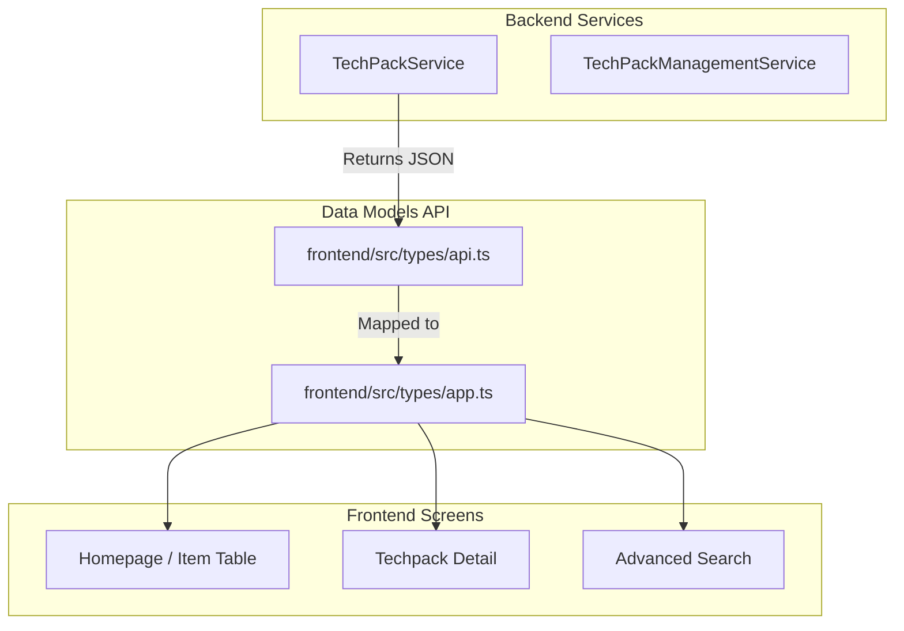
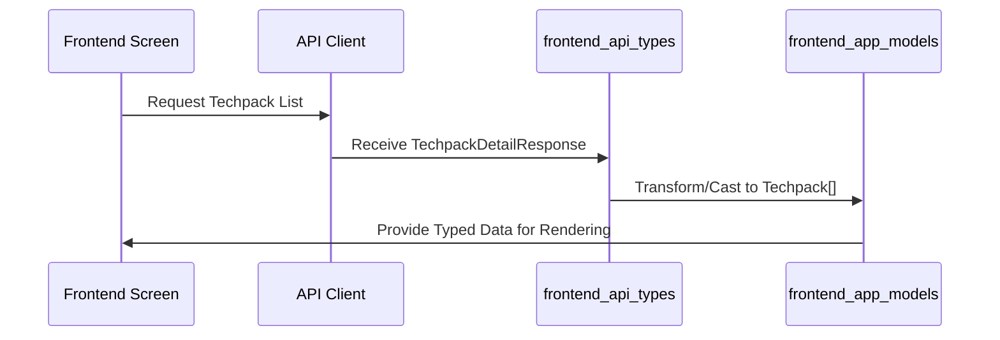

# Frontend App Models

The `frontend_app_models` module serves as the central type definition layer for the frontend application. It defines the core data structures, interfaces, and types that represent business entities (like Techpacks), UI states, and API request/response shapes used across the React application.

## Overview

This module is primarily contained within `frontend/src/types/app.ts`. It acts as the "Source of Truth" for data modeling on the client side, ensuring type safety between the frontend components and the data received from the backend services.

### Key Responsibilities:
- **Entity Modeling**: Defining the structure of core business objects like `Techpack`, `BOMDetail`, and `Customer`.
- **State Management Types**: Providing interfaces for complex UI states, such as table filters and search parameters.
- **API Integration**: Defining request payloads and response structures for frontend-backend communication.
- **UI Configuration**: Modeling layout and column configurations for dynamic data displays.

## Component Relationships

The models defined here are utilized by various parts of the system, bridging the gap between raw API data and the UI components.

## Core Data Structures

### 1. Techpack Entity
The `Techpack` interface is the primary data model representing a technical package in the system.

| Field | Type | Description |
|-------|------|-------------|
| `techpack_style_log_id` | `number` | Unique identifier for the techpack log. |
| `style_no` | `string` | The style number of the garment. |
| `customer_name` | `string` | Name of the customer/brand. |
| `review_status` | `string` | Current status in the review workflow. |
| `bom_details` | `BOMDetail[]` | List of Bill of Materials (only in `TechpackDetail`). |

### 2. Filtering and Search
The module defines complex types for managing the state of filters in the techpack list and advanced search screens.

- **`TableFilterState`**: Represents the active filters applied to the techpack table (e.g., style number, season, agent).
- **`TTechpackQueryParams`**: The structure used to send search queries to the backend.

### 3. BOM (Bill of Materials)
The `BOMDetail` and `GroupedBOMDetail` interfaces model the hierarchical structure of materials, parts, and items required for garment production.

## Data Flow: From API to UI

The following diagram illustrates how these models are used during a typical data fetching operation.

## Module Dependencies

- **[frontend_api_types](frontend_api_types.md)**: This module often works in tandem with `api.ts` which defines the raw DTOs (Data Transfer Objects) from the backend.
- **[frontend_screens](frontend_screens.md)**: Consumes these models to render tables, forms, and detail views.
- **[techpack_core_service](techpack_core_service.md)**: The backend source for the data structured by these models.

## Technical Details

### Type Definitions
The module uses TypeScript interfaces and type aliases to provide strict typing:
- **Interfaces**: Used for objects with a defined structure (e.g., `Techpack`, `UserInfo`).
- **Type Aliases**: Used for unions or complex mappings (e.g., `TableFilterAction`, `ColumnConfiguration`).

### Layout Configuration
The `TLayoutConfig` and `ColumnConfiguration` types allow the frontend to dynamically adjust table columns based on customer-specific settings or user preferences, supporting a highly flexible UI.
