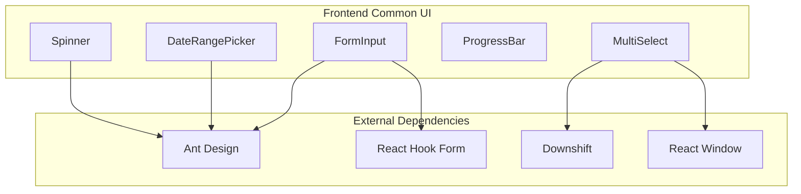

# Frontend Common UI Module

## Overview
The `frontend_common_ui` module provides a collection of reusable, standardized UI components used across the entire frontend application. These components are built on top of popular libraries like **Ant Design**, **React Hook Form**, and **Downshift** to ensure consistency, accessibility, and high performance.

The module serves as the foundational UI kit for other modules such as [frontend_screens](frontend_screens.md), providing essential building blocks like inputs, multi-selects, date pickers, and feedback indicators.

## Architecture and Component Relationships

The components in this module are designed to be stateless or self-contained, often wrapping complex third-party logic into a simplified API tailored for the system's specific needs.

## Core Components

### 1. FormInput
A controlled input component integrated with `react-hook-form`. It supports custom prefixes (user/lock icons) and displays validation errors automatically.
- **File**: `frontend/src/components/input/index.tsx`
- **Key Features**: Icon integration, automated error messaging, seamless form state management.

### 2. MultiSelect
A sophisticated multi-selection dropdown built with `downshift` for accessibility and `react-window` for virtualization, allowing it to handle large datasets efficiently.
- **File**: `frontend/src/components/multi-select/index.tsx`
- **Key Features**: Virtualized list, search filtering, checkbox selection, and "tag" style display for selected items.

### 3. DateRangePicker
A wrapper around Ant Design's RangePicker, simplified for the application's specific date range requirements.
- **File**: `frontend/src/components/date-range-picker/index.tsx`
- **Key Features**: Standardized date formatting (YYYY-MM-DD), easy integration with parent state.

### 4. ProgressBar
A dynamic progress indicator that simulates loading progress and snaps to completion when triggered.
- **File**: `frontend/src/components/progress-bar/index.tsx`
- **Key Features**: Randomized incremental steps for a "natural" feel, configurable duration and width.

### 5. Spinner
A standard loading indicator used to signal background processing.
- **File**: `frontend/src/components/spinner/index.tsx`
- **Key Features**: Customizable size, consistent branding using the `accent-blue` theme.

## Integration with Other Modules
These components are primarily consumed by the [frontend_screens](frontend_screens.md) module to build complex interfaces like:
- **Authentication**: Uses `FormInput` for login credentials.
- **Advanced Search**: Uses `MultiSelect` and `DateRangePicker` for filtering.
- **Techpack Management**: Uses `ProgressBar` and `Spinner` during data extraction or report generation.
