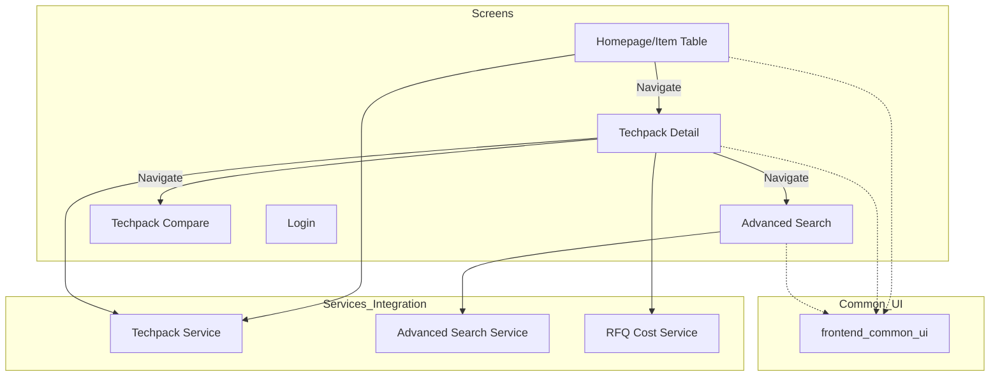

# Frontend Screens Module

## Overview
The `frontend_screens` module serves as the primary user interface layer of the Techpack management system. It provides a comprehensive suite of React-based screens that allow users to interact with techpack data, perform advanced AI-driven searches, compare versions, and manage authentication.

The module is built using **React**, **TypeScript**, and **Ant Design**, leveraging **React Query** for state management and data fetching. It integrates deeply with the [techpack_core_service](techpack_core_service.md) for data operations and [extraction_engine](extraction_engine.md) for AI-powered similarity searches.

## Architecture and Data Flow

The frontend follows a component-based architecture where screens act as orchestrators for various UI components and services.

## Sub-Modules

The module is organized into several key functional areas:

| Sub-Module | Description | Key Components | Documentation |
| :--- | :--- | :--- | :--- |
| **Homepage** | The main dashboard featuring a searchable and filterable table of all techpacks. | `TechpackDataSource` | [homepage.md](homepage.md) |
| **Techpack Detail** | Detailed view of a specific techpack, including BOM (Bill of Materials), images, and similarity search triggers. | `Fabric`, `BOMFabricationInput` | [techpack_detail.md](techpack_detail.md) |
| **Advanced Search** | A complex search interface supporting multi-modal queries (text, image, weights) and composite AI searches. | `QueryParams`, `Composition` | [advanced_search.md](advanced_search.md) |
| **Techpack Compare** | Interface for side-by-side comparison of different techpack versions. | `Navigation Props` | [techpack_compare.md](techpack_compare.md) |
| **Authentication** | User login and session management interface. | `AuthenticationRequest` | [authentication.md](authentication.md) |

## Component Relationships

- **Data Models**: Screens utilize types defined in [data_models_api](data_models_api.md) (e.g., `Techpack`, `TechpackDetailResponse`) to ensure type safety across the API boundary.
- **Common UI**: All screens rely on [frontend_common_ui](frontend_common_ui.md) for standardized inputs, buttons, and loaders.
- **AI Integration**: The `Advanced Search` and `Techpack Detail` screens interact with the [extraction_engine](extraction_engine.md) via backend services to perform image and text similarity analysis.

## Process Flows

### Similarity Search Flow
1. User clicks "Search" on a fabric or image in `TechpackDetail`.
2. The screen calls `techpackService.getTechpackSimilarImage` or `getDescriptionFabricSimilaritySearch`.
3. Results are rendered in a grid of `TechpackCard` components.
4. Users can toggle "PO Associated" filters to narrow results based on purchase order data.

### Advanced Composite Search
1. User uploads a file or enters multiple criteria (Fabric, Description, Image).
2. User adjusts "Weights" for each criteria (totaling $\le 1.0$).
3. `AdvancedSearch` sends a composite request to the backend.
4. Results are displayed with relevance scores.
