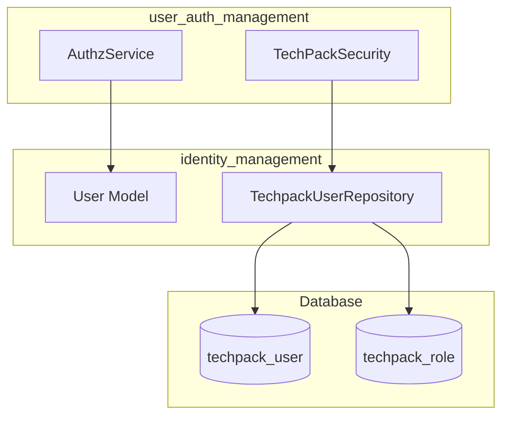
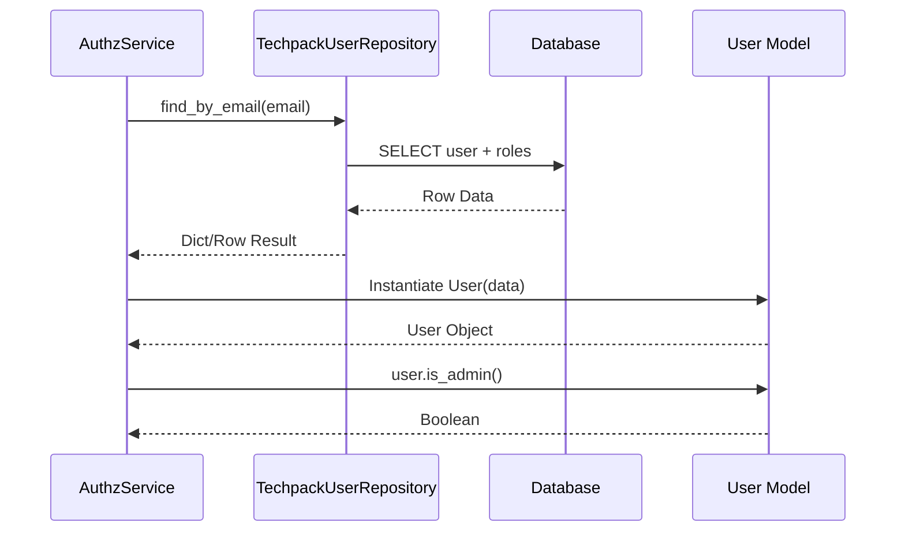
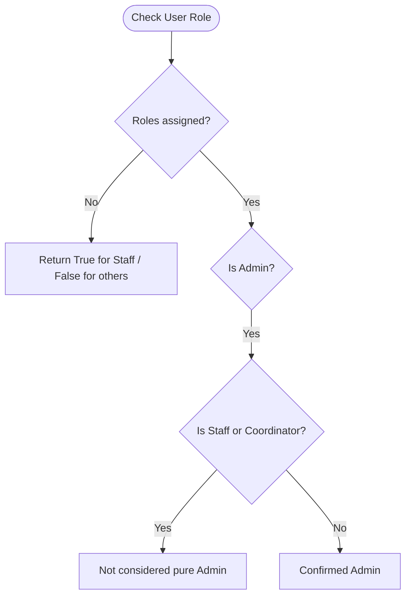

# Identity Management Module

## Introduction
The **Identity Management** module is a core sub-component of the [user_auth_management](user_auth_management.md) system. It is responsible for defining the user domain model and providing data access layers to retrieve user information and roles from the database. This module serves as the foundation for authentication and authorization processes by providing a structured representation of users and their associated permissions.

## Architecture and Component Relationships

The module follows a standard repository pattern to decouple the domain logic from the data access layer.

### Component Diagram

## Core Components

### 1. User Model (`models/user.py`)
The `User` class is a dataclass representing the system's user entity. It encapsulates user attributes and provides helper methods for role-based checks.

*   **Roles Defined**:
    *   `Admin`: Full system access.
    *   `Staff`: LF Staff members.
    *   `Coordinator`: LF Organization Coordinators.
*   **Key Methods**:
    *   `is_staff()`: Checks if the user has the "LF Staff" role.
    *   `is_coordinator()`: Checks if the user has the "LF Org Coordinator" role.
    *   `is_admin()`: Checks if the user is an Admin (and specifically not Staff or Coordinator).

### 2. TechpackUserRepository (`repository/techpack_user.py`)
This component handles all database interactions related to user data. It uses `psycopg2` for executing SQL queries against the PostgreSQL database.

*   **`find_by_email(email)`**: Retrieves user details including their aggregated roles from the `techpack_user` and `techpack_role` tables.
*   **`find_by_xts_email(xts_email)`**: Retrieves security-specific user information (like `corp_customer_code`) from the `techpack_user_security` table, likely used for integration with external XTS systems.

## Data Flow

The following sequence diagram illustrates how user identity is resolved during a typical request lifecycle within the [user_auth_management](user_auth_management.md) context.

## Integration with Other Modules

*   **[user_auth_management](user_auth_management.md)**: This module provides the `User` object and repository used by `AuthzService` and `TechPackSecurity` to enforce access control.
*   **[external_adapters](external_adapters.md)**: The `ms_id` field in the `User` model facilitates mapping between local users and external identities (e.g., via `MicrosoftGraphAdapter`).
*   **[xts_transformation](xts_transformation.md)**: The `find_by_xts_email` method supports workflows related to XTS order management by linking users to corporate customer codes.

## Process Flow: Role Verification

