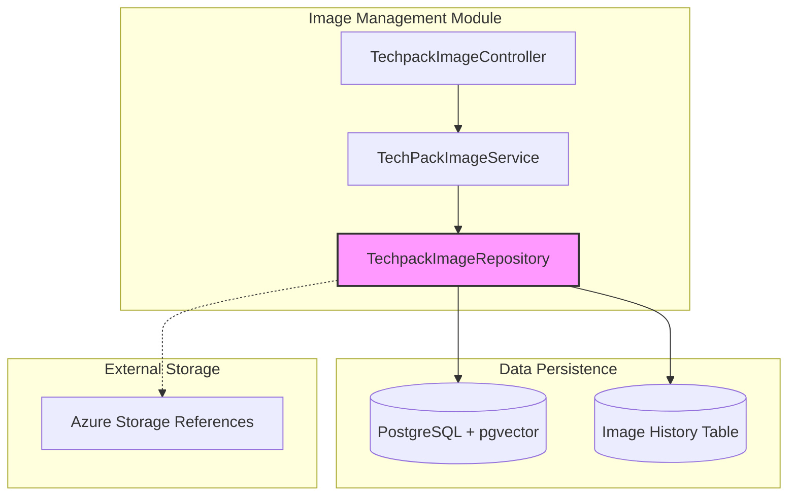
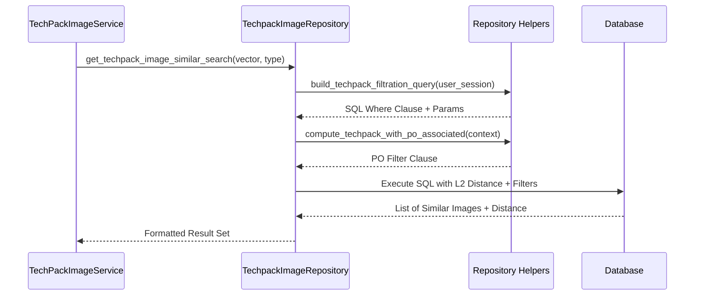

# Image Data Management Module

## Introduction
The **Image Data Management** module is a core sub-component of the [image_management](image_management.md) system. It serves as the persistence layer for all image-related metadata, embeddings, and storage references within the TechPack ecosystem. 

This module is responsible for managing the lifecycle of image records, including their association with specific TechPacks, handling version history, and performing high-performance vector similarity searches for AI-driven features like "Similar Style" discovery.

## Architecture and Component Relationships

The module is centered around the `TechpackImageRepository`, which interacts directly with the PostgreSQL database (utilizing vector extensions for similarity searches) and maintains references to files stored in Azure Blob Storage.

### Component Diagram

## Core Functionality

### 1. Image Metadata Persistence
The module stores comprehensive metadata for every image processed by the system:
*   **Storage References:** Container names, storage account names, and unique image IDs (paths).
*   **Associations:** Links images to `teckpack_style_log_id` and groups them via `group_image_id`.
*   **Classification:** Tracks `image_type` (e.g., Line Art, Product Image, Style) and identifies "Cover Images".

### 2. Vector Similarity Search
One of the most critical features of this module is the ability to perform spatial searches using image embeddings.
*   **L2 Distance Search:** Uses the `l2_distance` function to find images with similar visual characteristics.
*   **Dual Embedding Support:** Supports searching via standard `embedding` (typically for line art/sketches) or `original_image_embedding` (for product photos).
*   **Contextual Filtering:** Integrates with [user_auth_management](user_auth_management.md) to ensure similarity results only include TechPacks the user is authorized to view.

### 3. Versioning and History
To maintain data integrity during TechPack updates, the module implements a "Move to History" pattern:
*   When new images are uploaded for an existing style, old records are moved from `techpack_style_log_id` to `techpack_style_log_image_history`.
*   This ensures that historical versions of a TechPack still reference the correct images as they existed at that point in time.

## Data Flow: Image Search Process

The following diagram illustrates how a similarity search request flows through the repository:

## Key Components

### TechpackImageRepository
The primary data access object. Key methods include:
*   `insert_image_column`: Creates new image records with embeddings.
*   `get_techpack_image_similar_search`: The core engine for finding visually similar styles.
*   `move_old_images_to_history_table`: Manages the transition of records to the history table.
*   `get_techpack_image_urls_by_techpack_ids`: Batch retrieves storage URLs for frontend display.

## Integration with Other Modules
*   **[external_adapters](external_adapters.md):** Uses `AzureStorageContainerService` references to construct public URLs.
*   **[techpack_core_service](techpack_core_service.md):** Provides the `techpack_id` context for all image associations.
*   **[user_auth_management](user_auth_management.md):** Supplies session data to `helpers` for row-level security filtering in queries.
*   **[costing_estimation](costing_estimation.md):** Similarity searches often join with costing tables to show price ranges for similar styles.
