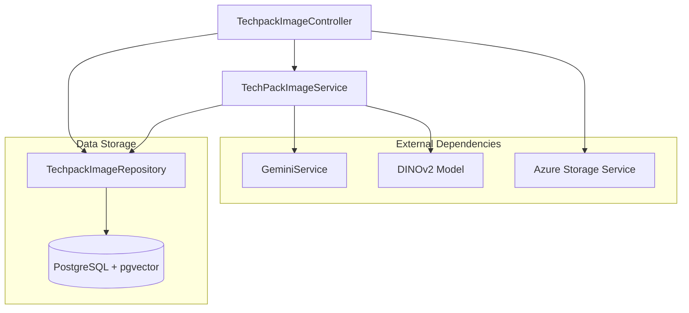
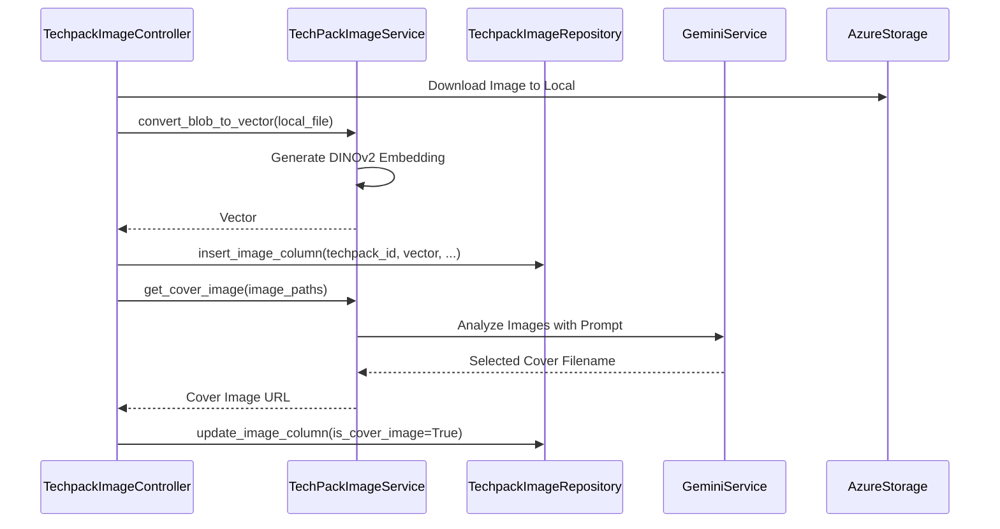

# Image Management Module

## Overview
The **Image Management Module** is a core component of the Techpack system responsible for the lifecycle of fashion product images. It handles image ingestion, storage in Azure Blob Storage, vector embedding generation for similarity searches, and AI-driven image classification and selection.

The module leverages advanced computer vision models (like Facebook's DINOv2) and LLMs (Google Gemini) to provide intelligent features such as identifying cover images, classifying garment types, and performing visual similarity searches across the techpack repository.

## Architecture
The module follows a standard Controller-Service-Repository pattern, integrating with external AI services and cloud storage.

### Component Diagram

## Key Functionalities

### 1. Image Ingestion & Processing
When a new techpack is ingested, the module:
- Downloads images from PLM or external sources.
- Generates vector embeddings using the **DINOv2** model.
- Stores metadata and embeddings in the database for future searches.
- Manages versioning by moving old images to history tables.

### 2. AI-Powered Classification
Using **Google Gemini Vision**, the module can:
- **Identify Cover Images**: Automatically select the best "hero" shot from a collection of sketches and photos.
- **Garment Classification**: Determine if an image is a technical sketch, a lifestyle photo, or a logo, and identify the garment type (e.g., shirt, pants).
- **Retail Matching**: Sort and rank retail product images based on their similarity to a techpack's design intent.

### 3. Similarity Search
The module provides two types of visual search:
- **Line Art Search**: Optimized for technical sketches and drawings.
- **Product Image Search**: Optimized for real-world product photos.
- **Vector Search**: Uses L2 distance (via `pgvector` or FAISS) to find the most visually similar techpacks in the system.

## Sub-modules
The Image Management module is divided into the following functional areas:

| Sub-module | Description |
|------------|-------------|
| [Image Processing & AI](image_processing_ai.md) | Handles vectorization, DINOv2 integration, and Gemini-based classification. |
| [Image Data Management](image_data_management.md) | Manages database operations, history tracking, and repository patterns. |
| [Image API & Orchestration](image_api_orchestration.md) | Provides REST endpoints and coordinates complex ingestion workflows. |

## Process Flow: Image Ingestion

## Integration with Other Modules
- **[techpack_core_service](techpack_core_service.md)**: Provides the base techpack data that images are associated with.
- **[external_adapters](external_adapters.md)**: Uses `AzureStorageContainerService` for physical file persistence.
- **[extraction_engine](extraction_engine.md)**: Utilizes `GeminiService` for visual analysis.
