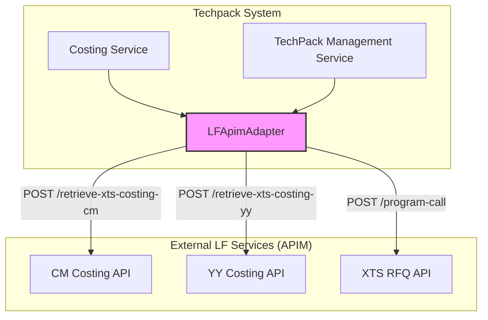
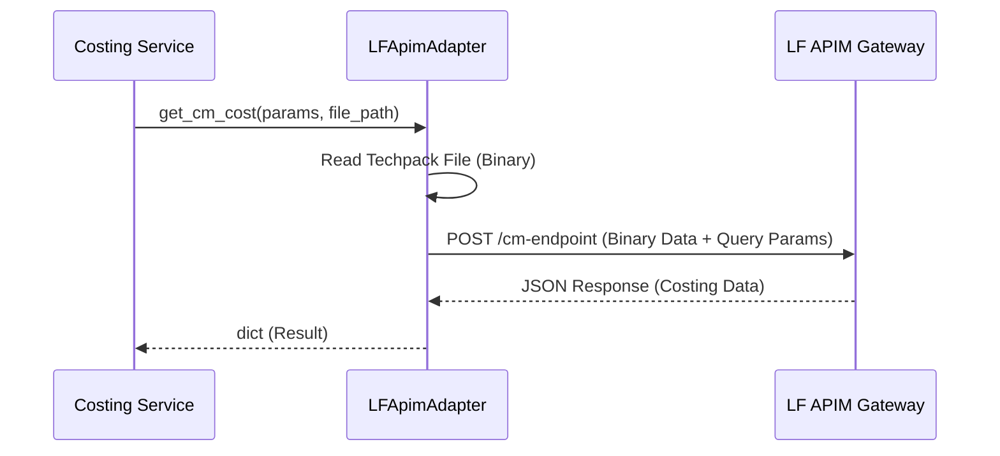

# LF APIM Adapter Module

The `lf_apim` module serves as the integration layer between the Techpack system and external Li & Fung (LF) API Management (APIM) services. It facilitates critical costing estimations (CM and YY) and handles the creation of Request for Quotations (RFQ) within the XTS ecosystem.

## Overview

The module encapsulates the logic for communicating with external RESTful services. It manages authentication via subscription keys, handles file uploads for analysis, and processes responses from the LF AI Hub and XTS platforms.

### Key Responsibilities
- **CM Costing Integration**: Fetches "Cut and Make" (CM) cost estimations by sending Techpack files to the APIM endpoint.
- **YY Costing Integration**: Fetches "Yield" (YY) estimations for fabric consumption.
- **XTS RFQ Creation**: Triggers the creation of RFQs in the XTS system based on processed Techpack data.

## Architecture and Component Relationships

The `lf_apim` module is part of the `external_adapters` layer. It is primarily consumed by the [costing_estimation](costing_estimation.md) module to provide real-world cost data.

### Component Diagram

## Core Component: LFApimAdapter

The `LFApimAdapter` class is the central hub for all APIM interactions. It uses environment variables for configuration, allowing for seamless transitions between SIT, UAT, and Production environments.

### Configuration Parameters

| Parameter | Description | Default / Source |
|-----------|-------------|------------------|
| `DOMAIN` | Base URL for APIM services | `APIM_SERVICE_DOMAIN` |
| `XTS_RFQ_DOMAIN` | Base URL for XTS RFQ services | `XTS_RFQ_DOMAIN` |
| `SUBSCRIPTION_KEY` | Ocp-Apim-Subscription-Key | `SUBSCRIPTION_KEY` |
| `CM_COST_ENDPOINT` | Endpoint for CM costing | `/api-np/retrieve-xts-costing-cm/v2` |
| `YY_COST_ENDPOINT` | Endpoint for YY costing | `/api-np/retrieve-xts-costing-yy/v4` |

### Data Flow: Costing Estimation

When a user requests a costing estimation, the system follows this flow:

## Integration with Other Modules

- **[costing_estimation](costing_estimation.md)**: Uses `get_cm_cost` and `get_yy_cost` to populate the `AiEstimationReportService`.
- **[techpack_core_service](techpack_core_service.md)**: Provides the `techpack_style_log_id` required for RFQ creation.
- **[xts_transformation](xts_transformation.md)**: While this module handles data mapping, `lf_apim` handles the actual network transport to XTS.

## Error Handling

The adapter implements robust error handling for network requests:
1. **Request Exceptions**: Catches `requests.RequestException` and logs the error, returning the exception string.
2. **API Errors**: Checks for non-200 status codes and extracts error messages from the JSON response body.
3. **Empty Responses**: Validates that the API returned data before passing it back to the calling service.

## Implementation Details

### CM Costing (`get_cm_cost`)
Sends the raw binary content of a Techpack PDF/Excel to the APIM. It allows overriding default production countries and quantities via the `vals` dictionary.

### YY Costing (`get_yy_cost`)
Similar to CM costing, but focuses on fabric width parameters (`cuttableWidth`, `cuttableWidthUom`).

### XTS RFQ Creation (`create_xts_rfq`)
Unlike the costing methods, this sends a JSON payload containing:
- `techPackMgmtId`: The internal ID of the Techpack.
- `xtsUserId`: The ID of the user triggering the action.
- `overwriteStyle`: Flag to determine if existing XTS styles should be updated.
