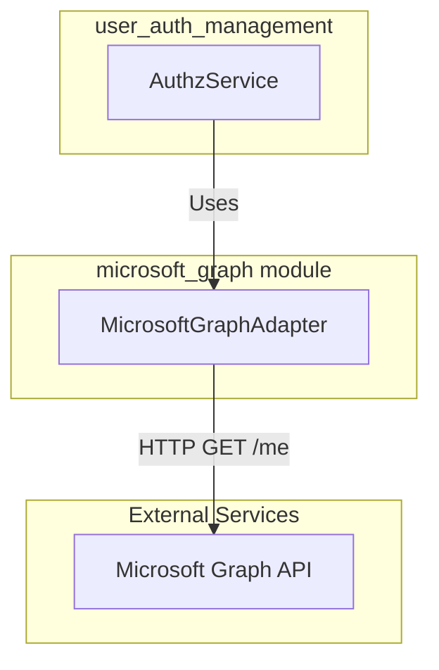
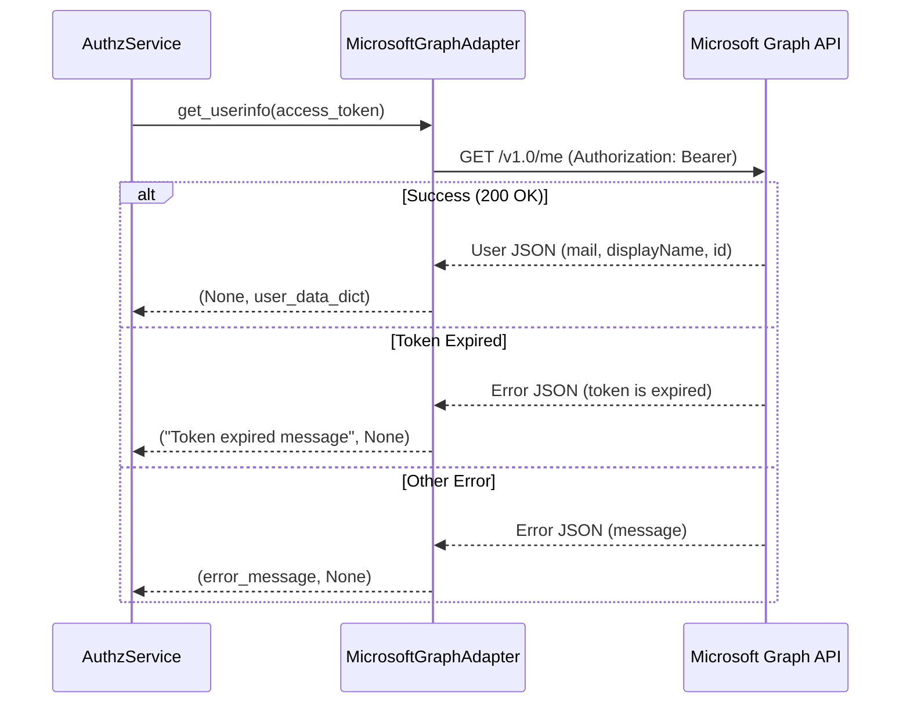

# Microsoft Graph Module

The `microsoft_graph` module serves as an external adapter within the [external_adapters](external_adapters.md) layer. Its primary responsibility is to interface with the Microsoft Graph API to retrieve authenticated user profile information, facilitating identity verification and user data synchronization within the system.

## Overview

This module acts as a bridge between the application's internal authentication flow and Microsoft's identity services. It specifically handles the communication with the `/v1.0/me` endpoint to extract essential user details such as email, display name, and unique Microsoft identifiers.

## Architecture and Component Relationships

The module is encapsulated within a single adapter class that abstracts the HTTP communication logic.

### Component Diagram

### Core Component: MicrosoftGraphAdapter

The `MicrosoftGraphAdapter` is the central class of this module.

| Feature | Description |
| :--- | :--- |
| **Endpoint** | Defaults to `https://graph.microsoft.com/v1.0/me` |
| **Authentication** | Bearer Token (OAuth 2.0) |
| **Data Mapping** | Transforms Graph API response into a standardized internal dictionary |

## Data Flow

The following sequence diagram illustrates how the module interacts with Microsoft Graph to fetch user information during the authentication or profile synchronization process.

## Integration with Other Modules

- **[user_auth_management](user_auth_management.md)**: This module is the primary consumer of the `MicrosoftGraphAdapter`. The `AuthzService` uses the retrieved user data to validate sessions and map Microsoft identities to internal [User](user_auth_management.md) models.
- **[external_adapters](external_adapters.md)**: This module sits alongside other adapters like `AzureStorageContainerService` and `LFApimAdapter` to provide a unified interface for external service interactions.

## Configuration

The module relies on environment variables for flexibility across different environments:

- `MICROSOFT_GRAPH_DOMAIN`: The base URL for the Microsoft Graph API (Default: `https://graph.microsoft.com`).
- `USER_INFO_ENDPOINT`: The specific path to fetch user info (Default: `/v1.0/me`).

## Error Handling

The adapter provides specific error handling for:
1. **Invalid Tokens**: Returns an error if the access token is missing.
2. **Expired Tokens**: Specifically detects "token is expired" messages from Microsoft and returns a standardized `Auth.TOKEN_EXPIRED_MESSAGE`.
3. **API Failures**: Captures and logs error messages returned by the Graph API for debugging purposes.
