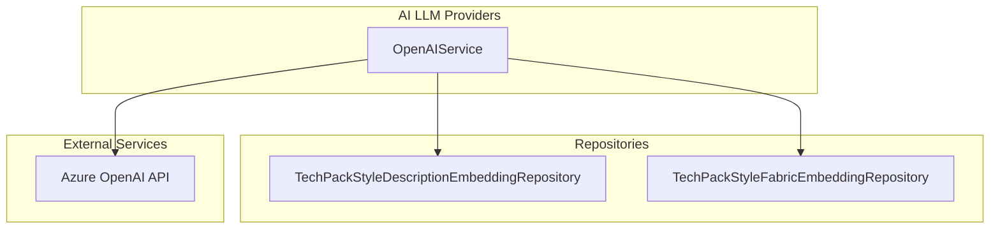
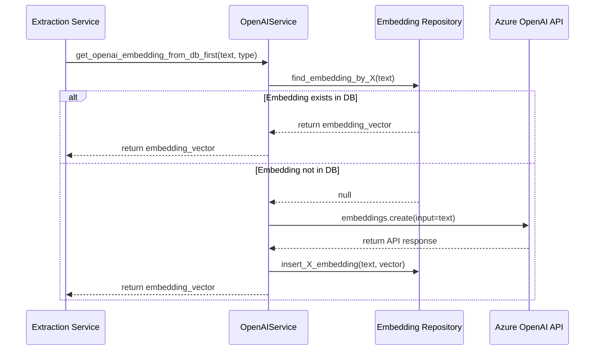

# OpenAI Service Module

The `openai_service` module is a core component of the **AI LLM Providers** layer within the [extraction_engine](extraction_engine.md). It provides a standardized interface for interacting with Azure OpenAI services, specifically focusing on generating vector embeddings for text data. These embeddings are crucial for semantic search, similarity comparisons, and data extraction tasks across the TechPack system.

## Architecture and Component Relationships

The `OpenAIService` acts as a bridge between the application's business logic and the Azure OpenAI API. It implements a caching mechanism using local repositories to minimize API calls and improve performance.

### Component Diagram

## Core Functionality

### 1. Embedding Generation
The service provides methods to convert text inputs into high-dimensional vector embeddings using the `text-embedding-3-small` model (default). This is handled via the `get_azure_openai_embeddings` method.

### 2. Database-First Caching Strategy
To optimize costs and latency, the service implements a "DB-first" lookup strategy. Before calling the external OpenAI API, it checks if an embedding for the specific input already exists in the database.

*   **Style Description Embeddings**: Managed via `TechPackStyleDescriptionEmbeddingRepository`.
*   **Fabric Embeddings**: Managed via `TechPackStyleFabricEmbeddingRepository`.

### Data Flow: Embedding Retrieval

## Configuration

The service is configured via environment variables, with defaults set for the Azure environment:

| Variable | Description | Default Value |
| :--- | :--- | :--- |
| `OPENAI_ENDPOINT` | Azure OpenAI resource endpoint | `https://oaieusggtpd01.openai.azure.com/` |
| `OPENAI_API_KEY` | Authentication key | `068d54...` |
| `OPENAI_MODEL_NAME` | Model used for embeddings | `text-embedding-3-small` |
| `OPENAI_DEPLOYMENT` | Azure deployment name | `text-embedding-3-small` |
| `OPENAI_API_VERSION_CURRENT` | API version for requests | `2024-12-01-preview` |

## Integration with Other Modules

*   **[extraction_engine](extraction_engine.md)**: Uses this service to process unstructured data from TechPacks (PDFs/Excel) into searchable vectors.
*   **[techpack_repository](techpack_repository.md)**: The embedding repositories interact with the database layer to persist vector data.
*   **[gemini_service](gemini_service.md)**: Acts as an alternative LLM provider within the same `ai_llm_providers` category.

## Error Handling
The service includes robust error handling for:
*   `openai.APIError`: Specifically catches and logs Azure OpenAI service-related issues.
*   General Exceptions: Catches unexpected runtime errors during API calls or database interactions to prevent system crashes.
