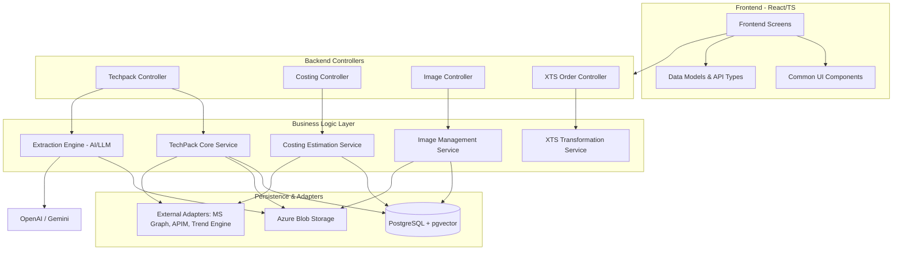

# LFAITechPack Repository Overview

## Purpose
The **LFAITechPack** repository is a comprehensive management system designed to digitize, automate, and optimize the lifecycle of Technical Packages (TechPacks) in the garment manufacturing industry. 

The platform serves as an intelligent bridge between unstructured design documents (PDFs/Excel) and structured manufacturing data. Its primary goals include:
*   **Automated Data Extraction**: Using AI (Gemini/OpenAI) to parse complex BOM (Bill of Materials) and POM (Point of Measure) data.
*   **Intelligent Search**: Enabling multi-modal similarity searches based on fabric composition, text descriptions, and visual garment sketches.
*   **Costing & Estimation**: Automating CM (Cost of Making) and YY (Yield) projections through AI-driven analysis.
*   **System Integration**: Synchronizing internal TechPack designs with external manufacturing systems (XTS) and retail trend engines.

---

## End-to-End Architecture
The repository follows a modern full-stack architecture, utilizing a **React/TypeScript** frontend and a **Python-based service-repository** backend. It integrates heavily with AI providers and cloud infrastructure.

---

## Core Modules Documentation

The repository is organized into specialized modules that handle specific domains of the TechPack lifecycle:

### 1. [TechPack Core Service](techpack_core_service.md)
The central orchestration layer. It manages the lifecycle of TechPacks, including versioning, comparison, and the integration of data from extraction to persistence.

### 2. [Extraction Engine](extraction_engine.md)
A factory-pattern-based service that automates document parsing. It uses `pdfplumber` and `openpyxl` alongside LLMs (Gemini/OpenAI) to transform raw files into structured JSON.

### 3. [Costing Estimation](costing_estimation.md)
Handles the financial aspect of production. It manages asynchronous tasks for calculating manufacturing costs (CM) and material yields (YY) using AI-driven insights and historical data.

### 4. [Image Management](image_management.md)
Manages garment sketches and photos. It uses **DINOv2** for generating vector embeddings and **Gemini Vision** for garment classification and cover image selection, enabling visual similarity searches.

### 5. [XTS Transformation](xts_transformation.md)
Responsible for data interoperability. It maps internal TechPack models to the standardized schema required by the External Tracking System (XTS) for production orders.

### 6. [External Adapters](external_adapters.md)
The integration hub for third-party services, including **Azure Storage**, **Microsoft Graph** (for Auth), and **Trend Engines** (for retail price benchmarking).

### 7. [Frontend Screens & UI](frontend_screens.md)
The user interface layer providing dashboards for TechPack management, advanced composite search interfaces (text + image + fabric), and side-by-side version comparisons.

### 8. [User Auth & Security](user_auth_management.md)
Handles identity management and Role-Based Access Control (RBAC), integrating Microsoft Azure AD tokens with internal JWT-based session security.