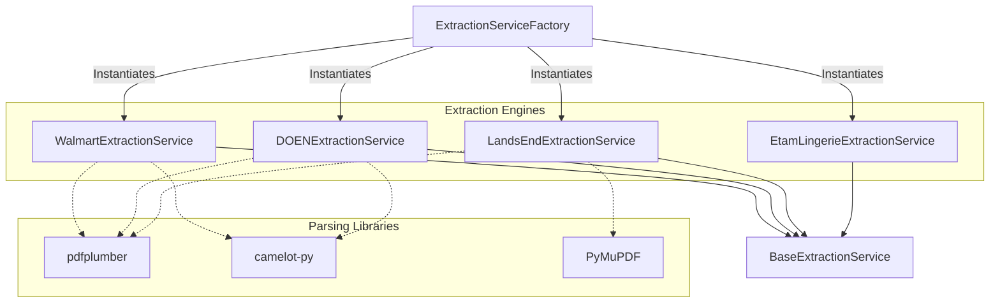
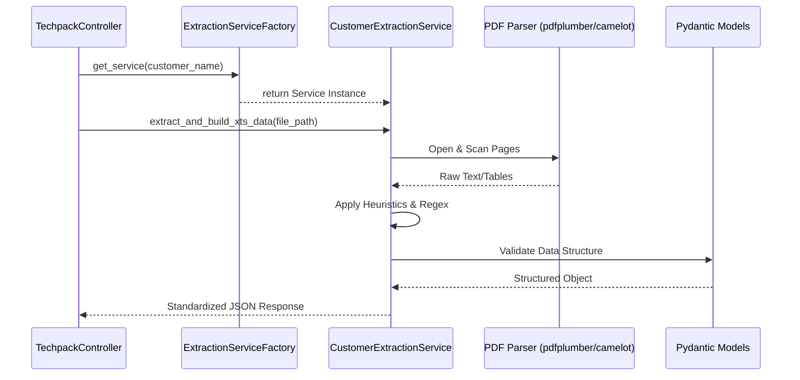

# PDF Extraction Services

The `pdf_extraction_services` module is a specialized sub-component of the [extraction_services](extraction_services.md) layer. It provides automated data extraction capabilities for technical specification documents (Tech Packs) provided in PDF format by various retail customers.

## Overview

This module implements customer-specific extraction logic to parse complex PDF layouts, including headers, Bill of Materials (BOM), Points of Measure (POM), and Colorway information. It leverages advanced PDF parsing libraries like `pdfplumber`, `camelot-py`, and `PyMuPDF (fitz)` to handle both text-based and table-heavy documents.

### Key Responsibilities
- **Document Parsing**: Converting unstructured PDF data into structured JSON formats.
- **Table Extraction**: Identifying and extracting tabular data (BOM, POM) across multiple pages.
- **Data Normalization**: Mapping customer-specific terminology to a standardized internal data model.
- **Heuristic Analysis**: Using spatial coordinates and text patterns to identify field-value pairs.

## Architecture

The module follows a factory pattern where the [ExtractionServiceFactory](core_extraction.md) instantiates the appropriate service based on the customer name.

## Component Details

### 1. WalmartExtractionService
Specialized for Walmart Tech Packs. It uses a dual-flavor approach with `camelot` (lattice and stream) to ensure high-fidelity table extraction.

- **Core Logic**:
    - `WalmartHeaderExtractor`: Parses the first page for style numbers, seasons, and departments.
    - `WalmartBOMExtractor`: Specifically looks for "MATERIALS" and "FABRICATION" keywords.
    - `WalmartColorwayExtractor`: Handles complex merged cells in colorway tables.
- **Data Model**: Uses `WalmartModel` Pydantic schema for validation.

### 2. DOENExtractionService
Handles DOEN brand Tech Packs, which often feature distinct "GRADING" and "POM" sections.

- **Key Features**:
    - **Spatial Extraction**: Uses `extract_field_value` to find text to the right of specific labels based on coordinate tolerances.
    - **Hybrid Parsing**: Combines `pdfplumber` for text flow and `camelot` for correcting table overflows where text might bleed across columns.
    - **Dynamic POM**: Automatically detects size ranges (XXS-XXL) and maps them to measurement columns.

### 3. LandsEndExtractionService
Designed for Lands' End documents, focusing on SKU information and hierarchical product data.

- **Key Features**:
    - **Regex Patterns**: Uses complex regex to extract size extensions and legacy style numbers.
    - **Section Merging**: Implements `_merge_materials` to consolidate BOM items that span multiple pages or sub-sections.
    - **PyMuPDF Integration**: Uses `fitz` for high-performance text block extraction on cover pages.

### 4. EtamLingerieExtractionService
Tailored for Etam Lingerie, with specific logic for "Dimensions" (POM) and "Materials" (BOM).

- **Key Features**:
    - **Standardization**: Uses `standardize_dataframe` to force extracted tables into a fixed schema required by the downstream [xts_transformation](xts_transformation.md) module.
    - **Grading Logic**: Includes specialized logic to convert "Grading Standart" increments into absolute measurement values based on a base size (e.g., Size M).

## Data Flow

The following diagram illustrates how a PDF is processed through the service:

## Integration with Other Modules

- **[core_extraction](core_extraction.md)**: Provides the `BaseExtractionService` abstract class and the factory.
- **[xts_transformation](xts_transformation.md)**: Consumes the JSON output from these services to transform it into XTS-compatible formats.
- **[image_management](image_management.md)**: Services often identify image URLs or placeholders within the PDF that are then processed by the image service.

## Technical Implementation Notes

### Table Extraction Strategies
| Strategy | Library | Use Case |
| :--- | :--- | :--- |
| **Lattice** | Camelot | Tables with explicit grid lines (Walmart). |
| **Stream** | Camelot | Tables without lines, relying on whitespace (DOEN, Etam). |
| **Visual** | pdfplumber | Extracting text based on precise X/Y coordinates (Headers). |

### Common Challenges Handled
1. **CID Character References**: The services include `clean_text` functions to remove `(cid:x)` artifacts often found in exported PDFs.
2. **Merged Cells**: Logic in `WalmartColorwayExtractor` and `BOMExtractor` handles cases where a single header spans multiple data columns.
3. **Multi-page Tables**: Services maintain state (like `current_category`) while iterating through pages to ensure data continuity.
