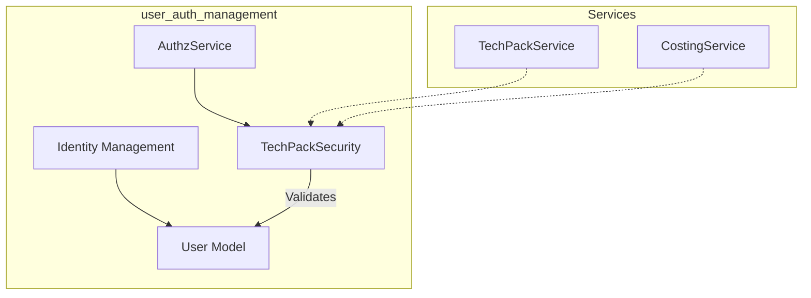
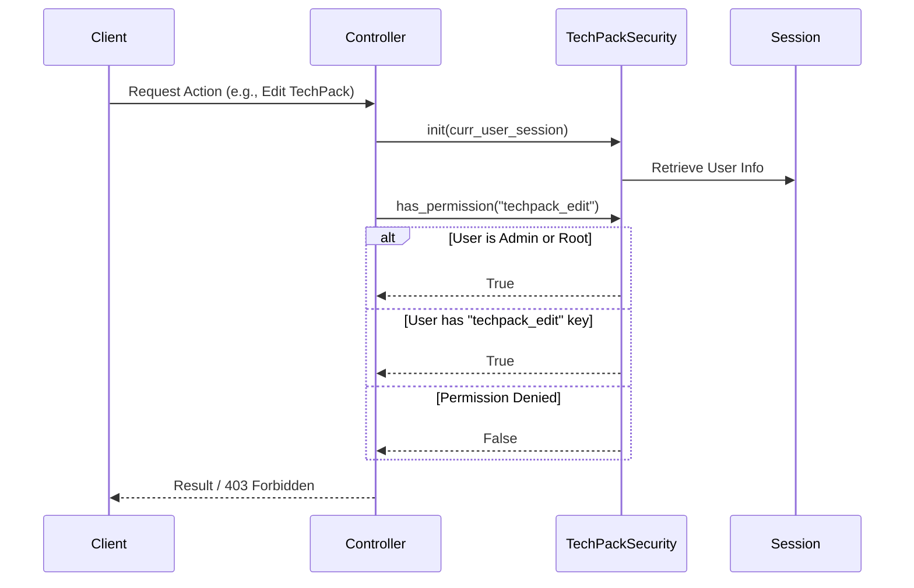

# Security Authorization Module

## Introduction
The **Security Authorization** module is a core component of the [user_auth_management](user_auth_management.md) system. It provides fine-grained access control and permission validation for users interacting with the TechPack platform. By evaluating user sessions and assigned permission keys, it ensures that only authorized personnel can perform specific operations across various services like [techpack_core_service](techpack_core_service.md) and [costing_estimation](costing_estimation.md).

## Architecture and Component Relationships

The module acts as a gatekeeper between the user session and the protected resources. It relies on the identity data provided by the [identity_management](identity_management.md) sub-module.

### Component Diagram

## Core Functionality

### TechPackSecurity
The primary class responsible for authorization logic. It evaluates the current user's session to determine if they have the necessary rights to proceed with an action.

#### Key Logic:
1.  **Admin Override**: Users with the `is_admin` flag set to true bypass all permission checks.
2.  **Root Access**: Users belonging to the `XTS_USER_ROOT` (defined in constants) are granted full access.
3.  **Permission Key Validation**: For standard users, the module checks if a specific `permission_key` exists within the user's permission set.

## Data Flow

The following sequence diagram illustrates how a service uses the `TechPackSecurity` module to authorize a request.

## Integration with Other Modules

-   **[user_auth_management](user_auth_management.md)**: This module is a child of the user authentication management system. It works closely with `AuthzService` to handle the transition from authentication to authorization.
-   **[identity_management](identity_management.md)**: Consumes the `User` model and `TechpackUserRepository` to access user attributes like `permissions` and `root` status.
-   **[techpack_core_service](techpack_core_service.md)**: Used by controllers (e.g., `TechpackController`) to protect endpoints related to techpack creation and modification.
-   **[xts_transformation](xts_transformation.md)**: Specifically handles logic for `XTS_USER_ROOT` users who often interact with XTS order management.

## Security Considerations
-   **Session Integrity**: The module assumes the `curr_user_session` provided is valid and has been verified by the [authentication](user_auth_management.md) layer.
-   **Fail-Closed**: If no user info is found or permissions are missing, the module defaults to returning `False` (Access Denied).
