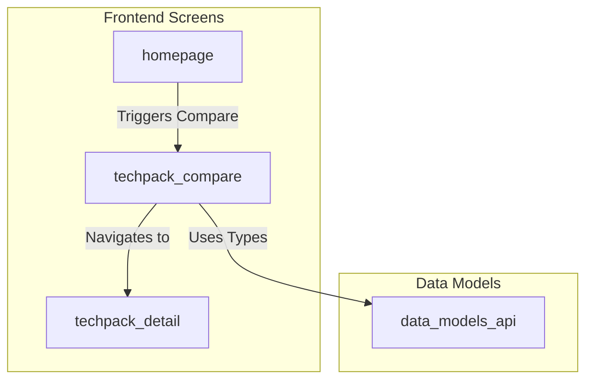
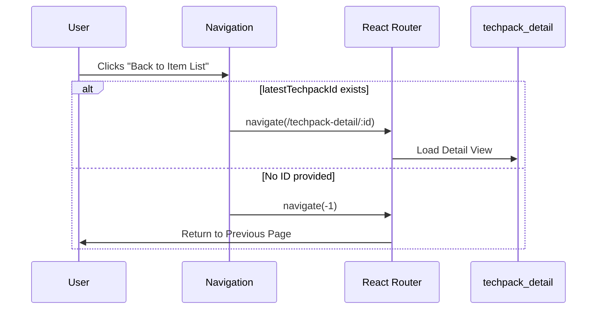

# Techpack Compare Module

## Introduction
The **Techpack Compare** module is a specialized frontend component within the Techpack Management System designed to facilitate the side-by-side comparison of different versions or variations of technical packages (Techpacks). It provides users with a clear, structured interface to identify changes in style specifications, materials, and departmental data across different iterations.

This module primarily serves as a navigation and visualization layer, allowing users to maintain context (Style Number, Season, Company) while drilling down into specific differences between Techpack versions.

## Architecture and Component Relationships

The Techpack Compare module is part of the [frontend_screens](frontend_screens.md) layer and interacts closely with the core data services to fetch and display comparative data.

### Component Hierarchy
- **Navigation Component**: Manages the contextual header and routing logic.
- **Comparison Grid (Implicit)**: Displays the actual data points for comparison (referenced via the `latestTechpackId` and navigation logic).

### Dependency Diagram

## Core Components

### Navigation (`frontend/src/screens/techpack-compare/navigation.tsx`)
The `Navigation` component serves as the persistent header for the comparison view. It displays critical metadata about the items being compared and provides breadcrumb-like navigation back to the source list or specific Techpack details.

**Key Properties (`Props`):**
| Property | Type | Description |
| :--- | :--- | :--- |
| `customerName` | `string` | The name of the client/company associated with the Techpack. |
| `code` | `string` | The Department Code. |
| `latestTechpackId`| `string` | ID of the most recent Techpack version for navigation fallback. |
| `styleNumber` | `string` | The unique identifier for the garment style. |
| `styleSeason` | `string` | The seasonal designation (e.g., Spring 2024). |

## Data Flow and Process Logic

### Navigation Flow
The module handles intelligent routing to ensure the user doesn't lose their place in the workflow.

## Integration with Other Modules

- **[techpack_core_service](techpack_core_service.md)**: Provides the underlying Techpack data that is passed into the comparison view.
- **[frontend_common_ui](frontend_common_ui.md)**: Utilizes shared UI components like icons and typography for a consistent look and feel.
- **[data_models_api](data_models_api.md)**: Uses standardized TypeScript interfaces to ensure data consistency between the backend responses and the comparison display.

## UI Layout
The comparison interface is designed with a fixed header (`z-10`) to ensure that context (Style Number and Season) remains visible even when scrolling through long lists of specifications or material comparisons. It uses a dark-themed utility bar to contrast with the main content area.
