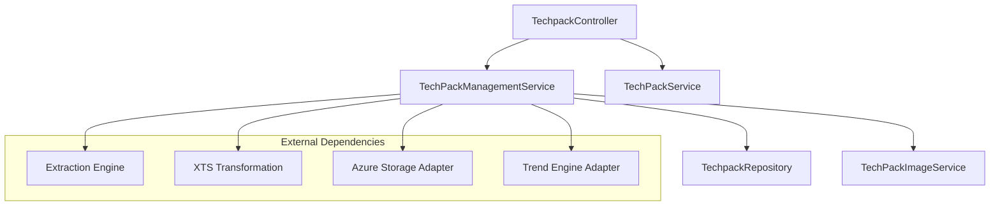
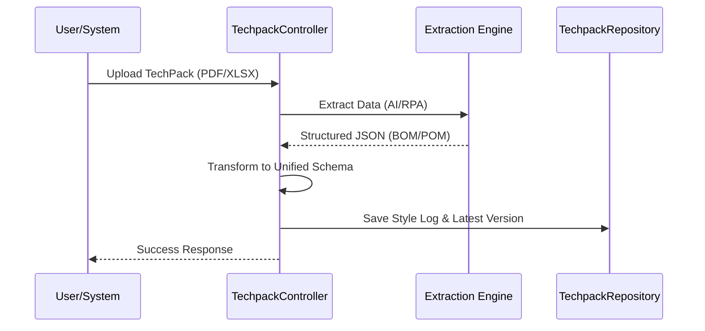

# TechPack Core Service Module

## Overview
The `techpack_core_service` is the central orchestration module of the TechPack management system. It manages the lifecycle of "TechPacks" (Technical Packages for garment manufacturing), including ingestion, data extraction, version comparison, and integration with manufacturing systems (XTS).

The module serves as the bridge between raw document inputs (PDFs/Excel) and structured data used for costing, production, and search.

## Architecture
The module follows a service-repository pattern, interacting with AI services for extraction and external adapters for storage and trend analysis.

### Component Diagram

## Core Sub-modules

### 1. [TechPack Management](techpack_management.md)
Handles high-level business logic including:
- Similarity searching (Fabric, Description, and Image-based).
- TechPack comparison and versioning.
- Retail price reference ingestion and filtering (IQR-based).
- Daily ingestion reporting and email notifications.

### 2. [TechPack Core Services](techpack_core_service_details.md)
Focuses on data fulfillment and transformation:
- Data enrichment for "Long Style" TechPacks.
- Orchestrating transformations to XTS-compatible schemas.
- Managing BOM (Bill of Materials) and POM (Point of Measure) data structures.

### 3. [TechPack Repository](techpack_repository.md)
The data access layer for:
- CRUD operations on TechPack logs and latest versions.
- Complex SQL queries for vector-based similarity searches.
- Costing data retrieval (CM/YY costs).

## Key Process Flows

### TechPack Ingestion & Extraction

### Similarity Search Flow
The system uses a multi-stage search approach:
1. **Exact Match**: Direct attribute filtering.
2. **Vector Search**: Using embeddings for descriptions and images.
3. **Fabric Similarity**: Specialized logic to compare fiber compositions and material types.

## Integration with Other Modules
- **[Extraction Engine](extraction_engine.md)**: Used for parsing raw documents via Gemini/OpenAI.
- **[XTS Transformation](xts_transformation.md)**: Converts internal models to external manufacturing formats.
- **[Image Management](image_management.md)**: Handles vectorization and storage of garment sketches.
- **[External Adapters](external_adapters.md)**: Interfaces with Azure Blob Storage and Trend Engines.
