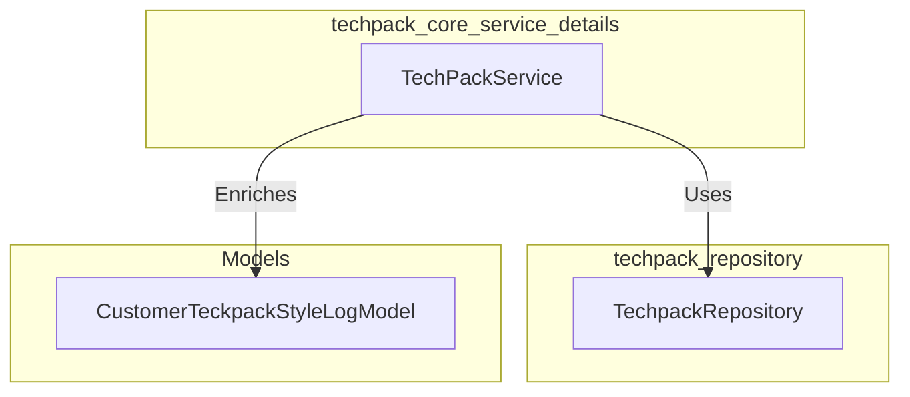
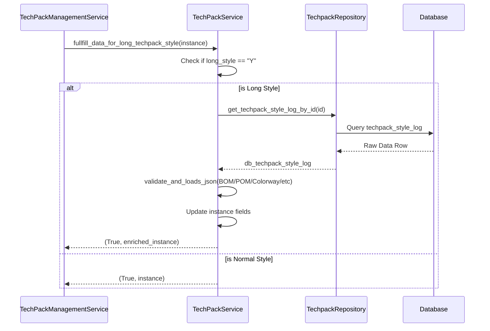

# Techpack Core Service Details

The `techpack_core_service_details` module is a specialized component within the Techpack system responsible for handling detailed data fulfillment for complex techpack styles. It specifically manages the retrieval and enrichment of "long style" techpack data, ensuring that comprehensive information such as Bill of Materials (BOM), Points of Measure (POM), colorways, and supplier details are correctly populated from the persistent storage.

## Architecture and Component Relationships

This module acts as a data enrichment layer between the core repository and the higher-level management services. It focuses on the `TechPackService`, which utilizes the `TechpackRepository` to fetch granular technical details.

### Component Diagram

## Core Components

### TechPackService
The primary service class responsible for business logic related to techpack data fulfillment.

- **Purpose**: To handle the "long style" flag in techpacks and ensure all associated technical data (BOM, POM, etc.) is loaded into the active model instance.
- **Key Method**: `fullfill_data_for_long_techpack_style`
    - Validates if a techpack is marked as a "long style".
    - Fetches raw data from the repository using the log ID.
    - Deserializes JSON data for BOM (AI and Unified), POM (AI and Unified), colorways, suppliers, and custom fields.
    - Updates the `CustomerTeckpackStyleLogModel` instance with the retrieved data.

## Data Flow

The following diagram illustrates how data flows through the service when processing a long techpack style.

## Component Interaction Details

### Data Mapping
The service maps specific indices from the repository result (database row) to the model attributes:

| DB Index | Field Name | Description |
| :--- | :--- | :--- |
| 15 | `bom_ai` | AI-extracted Bill of Materials |
| 16 | `bom_unified` | Unified/Standardized Bill of Materials |
| 25 | `pom_ai` | AI-extracted Points of Measure |
| 26 | `pom_unified` | Unified/Standardized Points of Measure |
| 21 | `colorway` | Color specifications |
| 22 | `size` | Size range and specifications |
| 23 | `suppliers` | Supplier information |
| 24 | `custom_fields` | Additional metadata |

## Dependencies

- **[techpack_repository](techpack_repository.md)**: Used to perform database lookups for techpack logs.
- **[techpack_management](techpack_management.md)**: Typically invokes this service during the techpack lifecycle management.
- **CommonUtil**: Uses `validate_and_loads_json` for safe JSON parsing of database strings.

## Integration with Other Modules

- **Extraction Engine**: The data fulfilled by this module (specifically `bom_ai` and `pom_ai`) is originally generated by the [extraction_engine](extraction_engine.md).
- **XTS Transformation**: Once data is fulfilled here, it is often passed to the [xts_transformation](xts_transformation.md) module to convert the techpack into the XTS schema format.
- **Costing Estimation**: The fulfilled BOM and supplier data are critical inputs for the [costing_estimation](costing_estimation.md) services.
