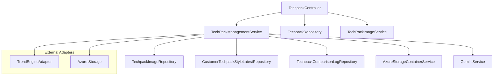
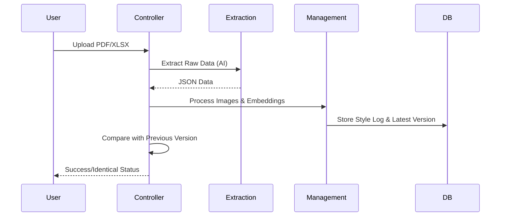

# Techpack Management Module

## Overview
The **Techpack Management Module** is a central component of the Techpack Core Service, responsible for the end-to-end lifecycle management of technical packages (Techpacks). It serves as the orchestration layer between raw data extraction, AI-driven analysis, and downstream business processes like costing and order transformation.

The module handles both PLM (Product Lifecycle Management) and non-PLM data sources, providing advanced search capabilities, version comparison, and automated reporting.

## Architecture
The module follows a service-controller pattern, interacting with various repositories for data persistence and external adapters for cloud storage and AI services.

### Component Diagram

## Sub-modules

### 1. [Techpack Core Management](techpack_core_management.md)
Handles the primary business logic for Techpack operations, including:
- **Advanced Search**: Multi-vector search combining text (fabric, description) and image embeddings.
- **Fabric Similarity**: Specialized logic for matching fabric compositions and materials across different styles.
- **BOM Processing**: Standardizing and grouping Bill of Materials (BOM) data for display and transformation.

### 2. [Techpack Operations & Comparison](techpack_operations.md)
Manages the lifecycle and versioning of Techpacks:
- **PDF Comparison**: Visual and text-based differencing between Techpack versions.
- **Data Extraction**: Orchestrating AI-based extraction (Gemini/OpenAI) for non-PLM files (PDF/XLSX).
- **Ingestion Workflow**: Managing the status of Techpacks as they move from "Pending" to "XTS_Captured".

### 3. [Reporting & Integration](techpack_reporting.md)
Facilitates communication and data flow to other systems:
- **Daily Ingestion Reports**: Automated email reporting for merchandising and vendor teams.
- **XTS Transformation**: Mapping Techpack data to the XTS (External Transformation System) schema for order processing.
- **Retail Price Integration**: Fetching and filtering retail price references via the Trend Engine.

## Data Flow: Non-PLM Ingestion

## Related Modules
- [Extraction Engine](extraction_engine.md): Provides the underlying AI extraction logic.
- [Image Management](image_management.md): Handles image vectorization and storage.
- [Costing Estimation](costing_estimation.md): Utilizes Techpack data for CM/YY calculations.
