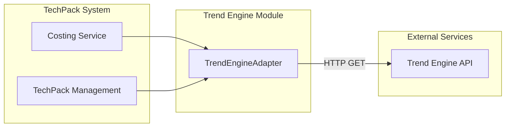
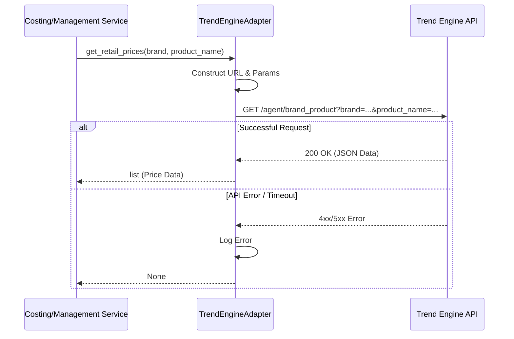

# Trend Engine Module

## Introduction

The **Trend Engine** module serves as an external integration layer that connects the TechPack system with the Trend Engine platform. Its primary purpose is to enrich TechPack data with external market intelligence, specifically retail pricing information based on brand and product descriptions.

This module is part of the [external_adapters](external_adapters.md) group and provides a standardized way to query market trends to assist in costing and competitive analysis.

## Architecture

The module follows an adapter pattern, encapsulating the complexities of external API communication (HTTP requests, error handling, and environment-based configuration) behind a clean interface.

### Component Relationship

## Core Components

### TrendEngineAdapter

The `TrendEngineAdapter` is the central component of this module. It handles the authentication-less (header-based) communication with the Trend Engine REST API.

- **Endpoint Configuration**: Uses environment variables `TREND_ENGINE_SERVICE_DOMAIN` and `TREND_ENGINE_RETAIL_PRICES_ENDPOINT` for flexibility across environments (UAT/Production).
- **Error Handling**: Implements robust error catching for network exceptions and non-200 HTTP status codes, logging errors to the `techpack-application` logger.

#### Key Methods

| Method | Description | Inputs | Outputs |
|:---|:---|:---|:---|
| `get_retail_prices` | Fetches market pricing data | `brand` (str), `product_name` (str) | `list` of price data or `None` |

## Data Flow

The following sequence diagram illustrates how the system retrieves retail prices through the adapter.

## Integration Points

- **[costing_estimation](costing_estimation.md)**: Uses retail price data to provide context for [AiEstimationReportService](costing_estimation.md) or to compare estimated manufacturing costs against market retail prices.
- **[techpack_core_service](techpack_core_service.md)**: Provides supplementary market data when viewing or managing TechPack details.

## Configuration

The module relies on the following environment variables:

| Variable | Default Value | Description |
|:---|:---|:---|
| `TREND_ENGINE_SERVICE_DOMAIN` | `https://tep.lfuat.net` | The base URL for the Trend Engine service. |
| `TREND_ENGINE_RETAIL_PRICES_ENDPOINT` | `/agent/brand_product` | The specific path for retail price lookups. |
