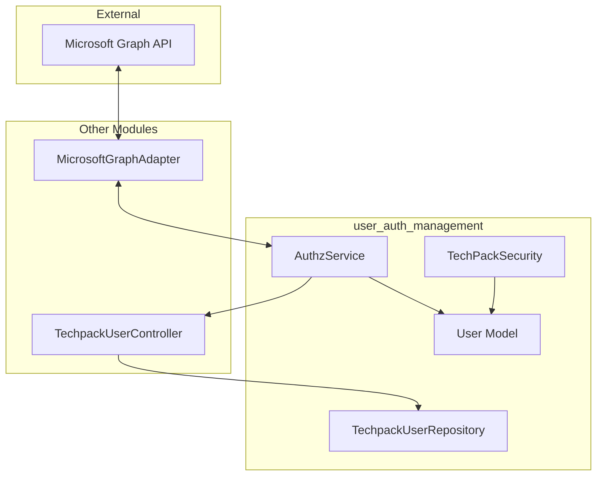

# User Authentication & Management Module

## Overview
The `user_auth_management` module is a critical security component of the TechPack system. It handles user identity verification, session management via JWT (JSON Web Tokens), and fine-grained access control (RBAC). 

The module bridges external identity providers (specifically Microsoft Graph) with the internal application security model, ensuring that users are authenticated and their permissions are correctly mapped to system resources.

## Architecture

### Component Relationship
The following diagram illustrates how the authentication and authorization components interact:

### Data Flow: Authentication Process
1. **Login**: The frontend (see [frontend_screens](frontend_screens.md)) sends a Microsoft Access Token to the `AuthzService`.
2. **Verification**: `AuthzService` uses the `MicrosoftGraphAdapter` (see [external_adapters](external_adapters.md)) to verify the token and fetch user profile data.
3. **User Lookup**: The service queries the `TechpackUserRepository` to find the corresponding internal user record.
4. **Token Generation**: An internal JWT is generated, containing user identity, roles, and calculated resource permissions.
5. **Authorization**: Subsequent requests use this JWT, which is validated by `TechPackSecurity` to enforce access rules.

## Sub-modules

The module is organized into the following functional areas:

### 1. [Authentication & Token Management](authentication.md)
Handled by `AuthzService`. It manages the lifecycle of internal JWT tokens, including generation and verification. It acts as the primary interface for converting external identity into internal sessions.

### 2. [Security & Authorization](security_authorization.md)
Handled by `TechPackSecurity`. This sub-module provides the logic for checking user permissions against specific actions or resources. It supports Admin overrides and special "XTS" user root access.

### 3. [Identity Management](identity_management.md)
Includes the `User` data model and `TechpackUserRepository`. These components define the structure of a user within the system and provide methods to retrieve user data from the PostgreSQL database.

## Key Components

| Component | Responsibility |
|-----------|----------------|
| `AuthzService` | Stateless JWT management and Microsoft token exchange. |
| `TechPackSecurity` | Permission checking and RBAC enforcement. |
| `TechpackUserRepository` | Database operations for user and role retrieval. |
| `User` | Dataclass representing the authenticated user and their attributes. |

---
*For detailed implementation of sub-modules, please refer to the specific documentation files.*
