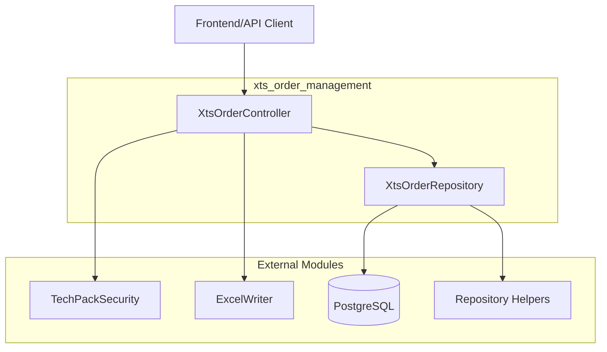
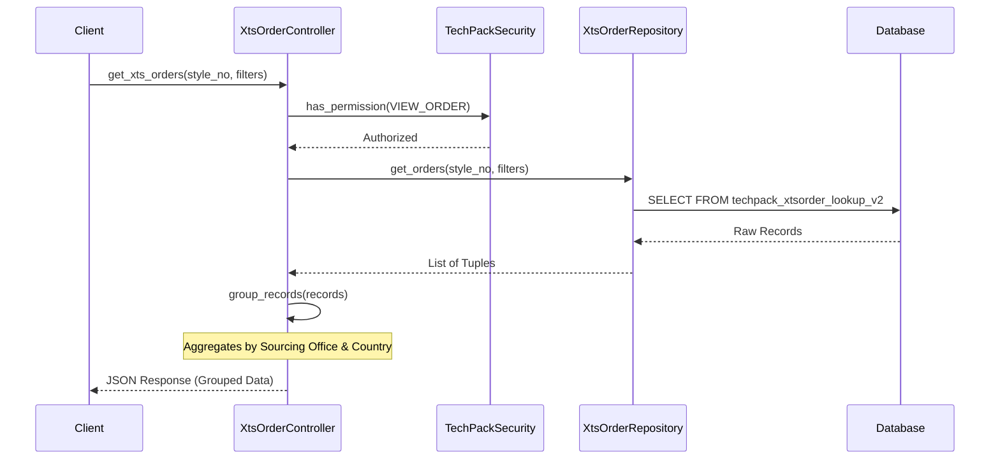

# XTS Order Management

The `xts_order_management` module is a critical component of the TechPack system responsible for handling order-related data originating from the XTS (External Tracking System). It provides functionalities for querying, filtering, grouping, and exporting order details associated with specific TechPacks, styles, and customers.

## Overview

This module acts as the bridge between the TechPack core services and the historical/current order data. It allows users to view production details such as sourcing offices, production countries, purchase order (PO) numbers, quantities, and pricing.

### Key Features
- **Order Retrieval**: Fetching grouped or detailed order information based on style and customer parameters.
- **Dynamic Filtering**: Advanced filtering capabilities for factory countries, statuses, product categories, and types.
- **Data Grouping**: Intelligent aggregation of order records by sourcing office and production country.
- **Excel Export**: Generating downloadable reports of order details.
- **Security**: Integrated permission checks to ensure data access is restricted to authorized users.

## Architecture

The module follows a standard Controller-Repository pattern, interacting with a PostgreSQL database (specifically the `techpack_xtsorder_lookup_v2` view/table).

## Component Descriptions

### XtsOrderController
Located in `controllers/XtsOrder.py`, this component manages the business logic and API response formatting.

- **Responsibilities**:
    - Validating user permissions via [user_auth_management](user_auth_management.md).
    - Orchestrating data retrieval from the repository.
    - Grouping raw database records into a structured format for the frontend.
    - Handling file generation for Excel downloads.
- **Key Methods**:
    - `get_xts_orders`: Retrieves a paginated list of orders grouped by sourcing office and production country.
    - `get_xts_order_details`: Provides granular details for specific orders.
    - `download_excel`: Triggers the generation of an `.xlsx` file containing order data.

### XtsOrderRepository
Located in `repository/xts_order_repository.py`, this component handles all direct database interactions.

- **Responsibilities**:
    - Executing complex SQL queries against the `techpack_xtsorder_lookup_v2` table.
    - Applying row-level security and access control filters.
    - Fetching unique query parameters for UI dropdowns (e.g., list of available seasons or factories).
- **Key Methods**:
    - `get_orders`: Executes the main query with support for dynamic filtering and user-specific access control.
    - `get_query_params`: Fetches distinct values for filter menus.
    - `get_num_po_by_techpack`: Returns the count of purchase orders associated with a specific TechPack.

## Data Flow

The following diagram illustrates the process of retrieving grouped order data:

## Integration with Other Modules

- **[user_auth_management](user_auth_management.md)**: Uses `TechPackSecurity` to verify if the current user has the `TECHPACK_DETAIL_XTS_ORDER_VIEW` permission.
- **[techpack_core_service](techpack_core_service.md)**: Provides the context (style number, customer department) required to look up relevant orders.
- **[xts_transformation](xts_transformation.md)**: While this module manages the *management* of orders, the transformation services handle the mapping of raw XTS data into the system's schema.

## Implementation Details

### Grouping Logic
The `group_records` function in the controller is unique. It takes flat database rows and aggregates them based on a composite key: `sourcing_office-production_country`. 
- **Quantities**: Summed up across all records in the group.
- **Prices/Dates**: The system calculates the `min` and `max` range for prices and scheduled dates within each group.
- **Counts**: For other attributes like `po_no` or `item_no`, it returns the count of unique values.

### Access Control
The repository utilizes `helpers.build_techpack_filtration_query` to inject `$filtration_where_clause` into SQL queries. This ensures that users only see order data for customers or departments they are explicitly permitted to access.
