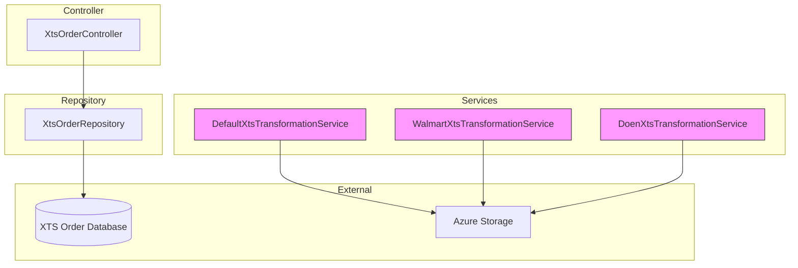
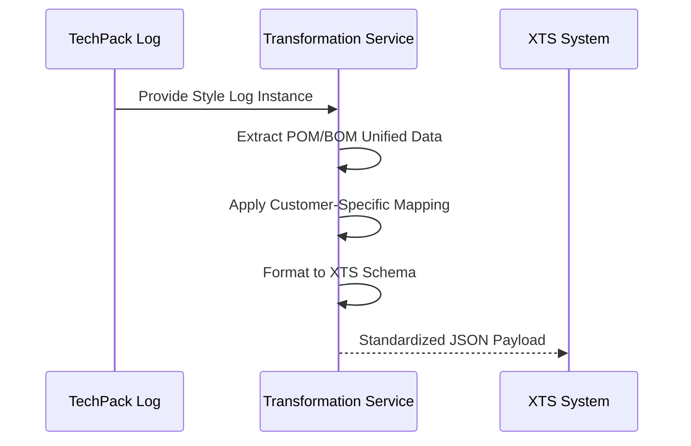

# XTS Transformation Module

## Overview
The `xts_transformation` module is a critical component of the TechPack system responsible for two primary functions:
1. **Data Transformation**: Converting internal TechPack data (BOM, POM, Colorway) into a standardized schema compatible with the XTS (External Tracking System) for downstream processing.
2. **Order Management**: Providing an interface to query, view, and export order data synchronized from XTS, linking physical production orders back to their respective TechPack designs.

The module supports customer-specific transformation logic (e.g., Walmart, Doen) to handle variations in data requirements and extraction rules.

## Architecture
The module follows a standard Controller-Service-Repository pattern, with specialized services for different customer transformation requirements.

## Sub-modules

### [Transformation Services](xts_transformation_services.md)
Handles the mapping of TechPack style logs into the XTS JSON schema. It includes logic for:
*   **BOM (Bill of Materials)**: Mapping material categories, suppliers, and compositions.
*   **POM (Points of Measure)**: Mapping grading models and measurement data.
*   **Colorways**: Standardizing color names and codes.
*   **Customer Specifics**: Tailored logic for Walmart and Doen brands.

### [Order Management](xts_order_management.md)
Manages the retrieval and display of production orders associated with TechPacks. Key features include:
*   **Order Lookup**: Querying orders by style number, season, and department.
*   **Aggregation**: Grouping raw order records by sourcing office and production country.
*   **Export**: Generating Excel reports of order details.
*   **Security**: Integration with [user_auth_management](user_auth_management.md) for permission-based access.

## Data Flow: TechPack to XTS

## Integration with Other Modules
*   **[techpack_core_service](techpack_core_service.md)**: Provides the source `CustomerTeckpackStyleLogModel` data.
*   **[external_adapters](external_adapters.md)**: Used for Azure Storage interactions and image shipping.
*   **[user_auth_management](user_auth_management.md)**: Validates permissions for viewing sensitive order data.
