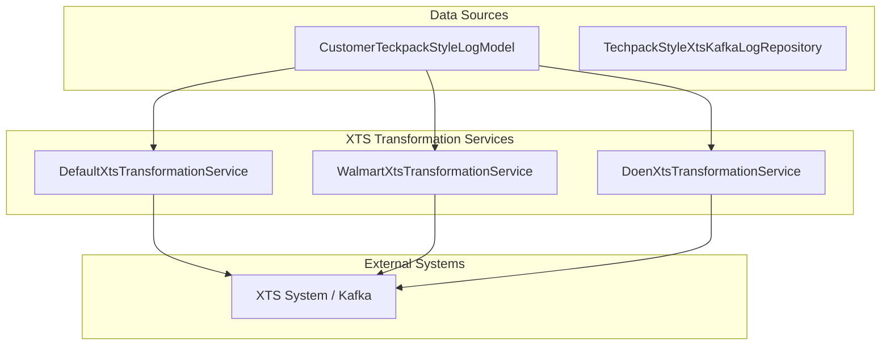
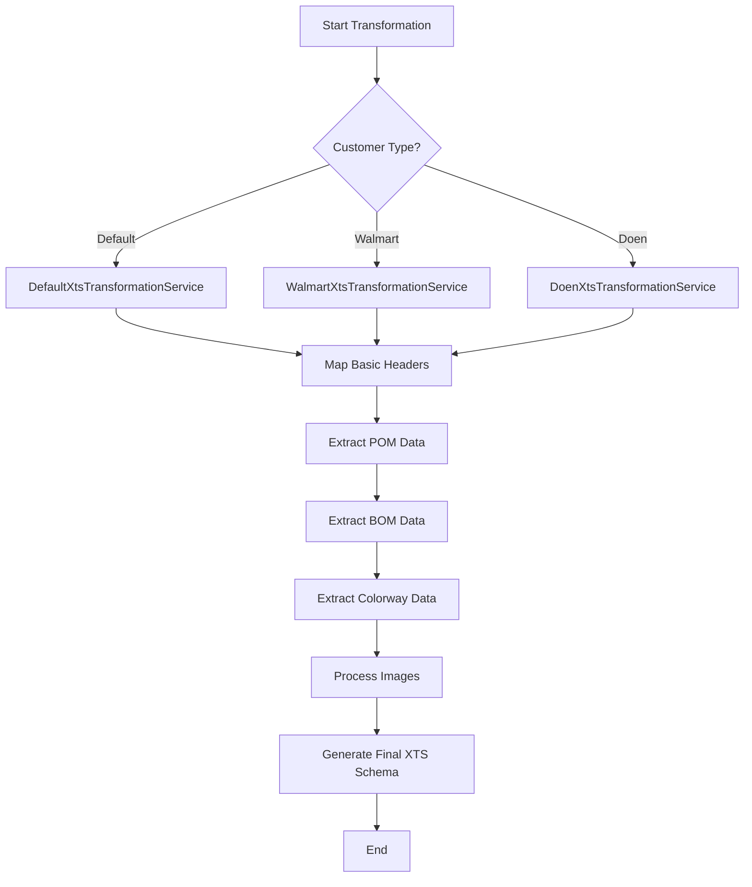

# XTS Transformation Services

The `xts_transformation_services` module is a critical component of the TechPack system responsible for converting extracted techpack data into a standardized schema compatible with the **XTS (External Tracking System)**. It acts as a translation layer between the internal data models and the external system's requirements, supporting multiple customer-specific transformation logic.

## Purpose
The primary goal of this module is to take raw or unified techpack data (BOM, POM, Colorways, etc.) and format it into a structured JSON schema that XTS can consume. This ensures that style information, material requirements, and measurement specifications are accurately synchronized with downstream manufacturing and tracking systems.

## Architecture and Components

The module follows a strategy-like pattern where different services handle transformations for specific customers, while sharing a common structural foundation.

### Core Components

| Component | Description |
|-----------|-------------|
| `DefaultXtsTransformationService` | Provides the baseline transformation logic used when no customer-specific rules are defined. |
| `WalmartXtsTransformationService` | Specialized transformation logic for Walmart techpacks, including specific header mappings and colorway formatting. |
| `DoenXtsTransformationService` | Specialized transformation logic for Doen techpacks, handling unique material description concatenations and factory details. |

### Component Relationship Diagram

## Data Flow and Transformation Process

The transformation process follows a standard sequence of steps to build the final XTS payload:

1.  **Initialization**: The service receives a `CustomerTeckpackStyleLogModel` instance containing extracted data.
2.  **File Mapping**: Azure storage paths for the original PDF and comparison files are resolved.
3.  **Header Construction**: Core style metadata (Style No, Season, Department, etc.) is mapped to XTS header fields.
4.  **Table Extraction**:
    *   **POM (Point of Measure)**: Unified measurement data is mapped to XTS POM tables.
    *   **BOM (Bill of Materials)**: Material details, compositions, and suppliers are formatted into the XTS BOM structure.
    *   **Colorways**: Style colors and codes are processed.
5.  **Image Integration**: Images are processed via `extract_images_ship_to_xts` utility.
6.  **Payload Generation**: The final JSON object is returned for transmission (typically via Kafka).

### Transformation Logic Flow

## Integration with Other Modules

*   **[extraction_engine](extraction_engine.md)**: Provides the raw data stored in `CustomerTeckpackStyleLogModel` that this module transforms.
*   **[techpack_core_service](techpack_core_service.md)**: Manages the lifecycle of the techpack records that trigger these transformations.
*   **[external_adapters](external_adapters.md)**: Uses `AzureStorageContainerService` logic (via environment variables) to reference file locations.
*   **[xts_order_management](xts_order_management.md)**: The parent module that orchestrates the flow between repositories and these transformation services.

## Key Transformation Features

### BOM (Bill of Materials) Handling
The services dynamically handle custom fields in the BOM. They scan the unified BOM details for fields like `Component`, `FinishedConstruction`, and `SpecialCareOrOtherNotes`, adding them to the `ColumnHeader` and `Data` arrays only if they contain values.

### Customer-Specific Logic
*   **Walmart**: Prioritizes data from `custom_fields["xts_data"]` if available, falling back to manual extraction. It uses specific column headers for colorways (`**ColorwayName`, `**ColorwayCode`).
*   **Doen**: Includes `CountryOfOrigin` and `Factory` in the header. It also performs specific string manipulation for material descriptions, concatenating size and material name.

## Configuration
The module relies on several environment variables for Azure Storage integration:
*   `AZURE_STORAGE_ACCOUNT`: The storage account name.
*   `AZURE_STORAGE_CONTAINER_TECHPACK_STYLE`: Container for PLM techpacks.
*   `AZURE_STORAGE_CONTAINER_TECHPACK_NONPLM`: Container for non-PLM techpacks.
