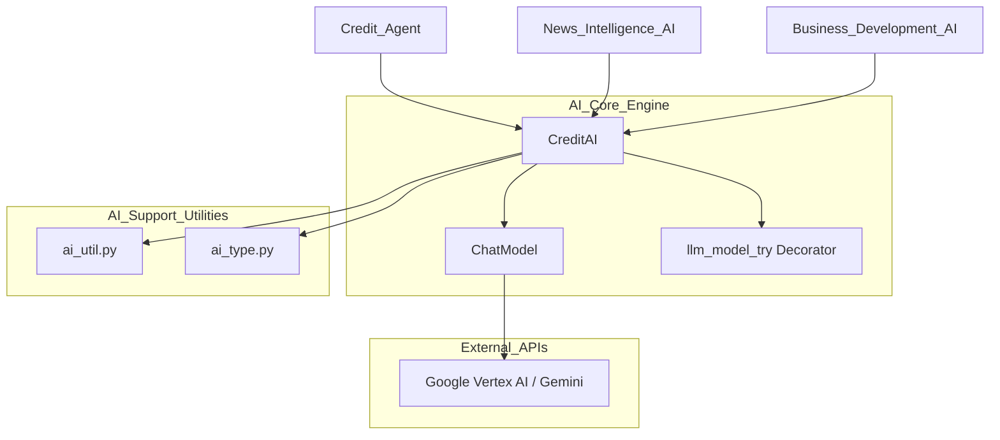
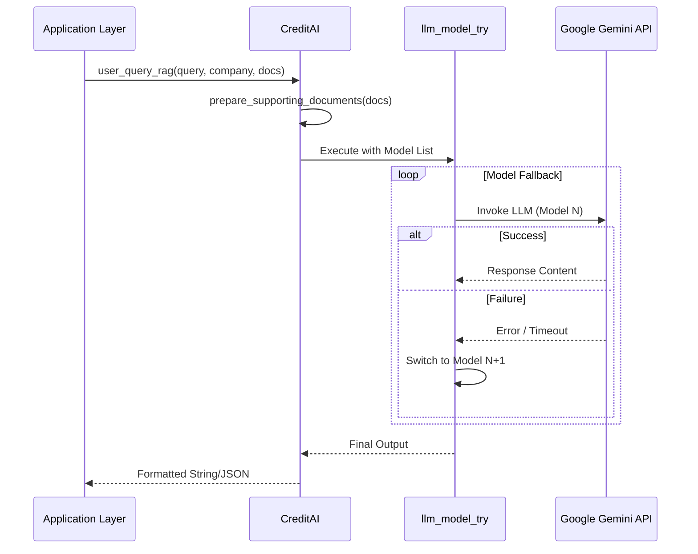

# AI Core Engine Module

## Introduction
The **AI Core Engine** is the central processing hub of the AI Engine Models ecosystem. It provides the foundational infrastructure for interacting with Large Language Models (LLMs), specifically Google's Gemini series via Vertex AI. This module encapsulates model initialization, prompt management, retry logic, and Retrieval-Augmented Generation (RAG) capabilities, serving as the base for specialized AI agents like [News Intelligence AI](News_Intelligence_AI.md) and [Business Development AI](Business_Development_AI.md).

## Architecture Overview
The AI Core Engine acts as a bridge between raw LLM APIs and business-specific logic. It manages a fleet of model instances (Flash, Pro, and Preview versions) with varying configurations for temperature, token limits, and output formats (Text vs. JSON).

### Component Relationship

## Core Components

### 1. ChatModel (`models/ai.py`)
A wrapper class responsible for initializing specific LLM instances. It handles:
- **Provider Integration**: Currently optimized for `ChatGoogleGenerativeAI`.
- **Safety Settings**: Configures harm category thresholds to ensure stable content generation.
- **Media Handling**: Includes utilities to convert PDFs and images into base64-encoded messages for multimodal processing.

### 2. CreditAI (`models/ai.py`)
The primary interface for AI operations. It maintains static instances of various Gemini models to avoid re-initialization overhead.

**Key Features:**
- **Model Tiering**: Defines lists of models (e.g., `gemini3_list`, `gemini2_5_json_out_list`) used for fallback mechanisms.
- **Prompt Management**: Loads system prompts, reasoning structures, and task templates from a centralized directory.
- **RAG Support**: Implements `prepare_supporting_documents` to format financial docs, news, and events into context windows.
- **Grounding**: Supports Google Search grounding via `enable_search` parameters in query methods.

### 3. Error Handling & Resilience
The module employs a custom decorator `@llm_model_try`.
- **Fallback Logic**: If a primary model (e.g., Gemini 3 Pro) fails or hits a rate limit, the decorator automatically retries the request using the next model in the defined list (e.g., Gemini 2.5 Pro).
- **Configurable Retries**: Managed via `LLMConfig`.

## Data Flow: User Query (RAG)
The following diagram illustrates how a user query is processed through the engine using supporting documents.

## Integration with Other Modules
- **[AI Support Utilities](AI_Support_Utilities.md)**: Provides `OpenAIEmbedder` for vector operations and `RiskAssessment` types used in prompt construction.
- **[Credit Report Service](Credit_Report_Service.md)**: Utilizes `CreditAI` to analyze financial data and generate sections of the credit report.
- **[News Intelligence](News_Intelligence.md)**: Feeds extracted news summaries into `CreditAI` via the `SupportingDocuments` object.

## Technical Specifications
| Feature | Implementation |
|---------|----------------|
| **LLM Provider** | Google Vertex AI (Gemini) |
| **Output Formats** | Plain Text, JSON, Structured Pydantic Objects |
| **Multimodal** | PDF, JPEG, PNG support |
| **Search Integration** | Google Search Grounding (Vertex AI Tool) |
| **Context Management** | Dynamic prompt templating with `langchain_core` |
