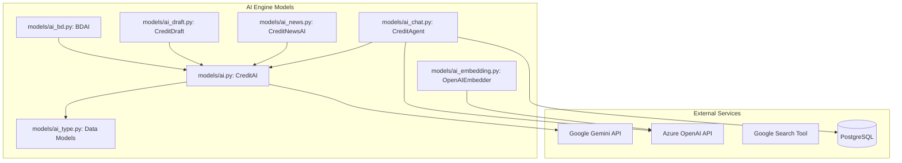

# AI Engine Models Module

## Overview
The `AI_Engine_Models` module is the core intelligence layer of the Credit Analysis Platform. It leverages Large Language Models (LLMs), primarily Google Gemini and Azure OpenAI, to automate credit risk assessment, business development research, news intelligence, and interactive decision support.

The module transforms raw data (financial documents, news articles, and web search results) into structured insights, including credit memos, risk ratings, and company profiles.

## Architecture
The module follows a service-oriented architecture where a base `CreditAI` class provides foundational LLM interaction capabilities, and specialized sub-modules extend this functionality for specific business domains.

## Sub-Modules

### 1. [Core AI Engine](AI_Core_Engine.md)
The foundation of the module, handling LLM initialization, prompt management, and RAG (Retrieval-Augmented Generation) workflows.
- **Key Component:** `CreditAI`

### 2. [Business Development AI](Business_Development_AI.md)
Automates the generation of comprehensive company profiles, including logo extraction, store image classification, and CRM data synthesis.
- **Key Component:** `BDAI`

### 3. [Credit Drafting AI](Credit_Drafting_AI.md)
Generates automated credit memos, risk assessments, and recommendations for both existing and potential customers.
- **Key Component:** `CreditDraft`

### 4. [News Intelligence AI](News_Intelligence_AI.md)
Processes real-time news feeds to identify, verify, and group financial events relevant to credit risk.
- **Key Component:** `CreditNewsAI`

### 5. [Conversational AI (Credit Agent)](Credit_Agent.md)
Provides an interactive chatbot interface capable of querying internal reports and external web data using LangGraph.
- **Key Components:** `CreditAgent`, `CreditChat`

### 6. [Embedding & Types](AI_Support_Utilities.md)
Handles vector embeddings for semantic search and defines the Pydantic data structures used across the module.
- **Key Components:** `OpenAIEmbedder`, `RiskAssessment`, `CreditRating`

## Integration with Other Modules
- **[Credit_Report_Service](Credit_Report_Service.md):** Provides the financial data and factsheets used by `CreditDraft` and `BDAI`.
- **[News_Intelligence](News_Intelligence.md):** Supplies the raw news feed that `CreditNewsAI` processes.
- **[Entity_Management](Entity_Management.md):** Used by `BDAI` to resolve corporate hierarchies.
- **[Workflow_Automation](Workflow_Automation.md):** Triggers AI drafting and reassessment processes.
