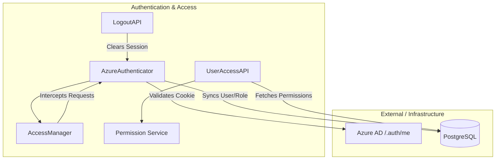
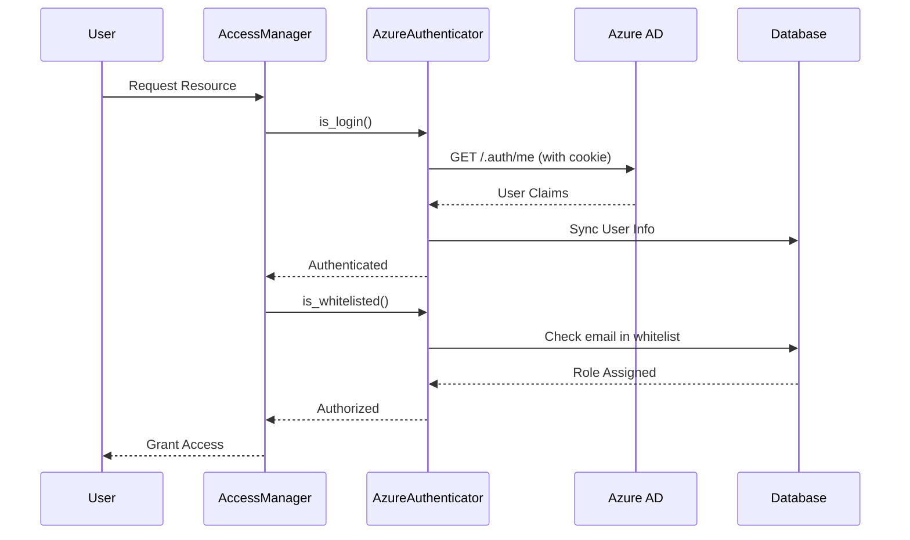

# Authentication and Access Module

## Overview
The **Authentication_Access** module is a critical security component of the system, responsible for managing user identity, session lifecycle, and role-based access control (RBAC). It integrates with **Azure Active Directory (AAD)** for authentication and provides a robust mechanism to authorize user actions based on whitelisted roles and permissions.

The module ensures that only authenticated and authorized users can access specific resources, such as [Credit Report Service](Credit_Report_Service.md) or [AI Engine Models](AI_Engine_Models.md).

## Architecture
The module follows a layered architecture consisting of authentication providers, access managers, and API endpoints.

### Component Diagram

## Core Functionality

### 1. Identity Management
The module uses `AzureAuthenticator` to interface with Azure App Service's built-in authentication. It extracts user claims (email, name, OID) from the `AppServiceAuthSession` cookie and synchronizes this data with the local `credit_ad_users` table.

### 2. Role-Based Access Control (RBAC)
Access is governed by a whitelist system. Users must be present in the `credit_whitelist` table to gain access. 
- **Roles:** Defined in `credit_roles`.
- **Permissions:** Managed via `UserAccessAPI`, which provides the frontend with allowed pages and action maps.
- **Route Protection:** `AccessManager` acts as a middleware to intercept requests and verify if the user's role has permission to access the requested path.

### 3. Session Management
User state is maintained using Flask sessions, storing:
- User identity (ID, Email, Name)
- Role information (Role Name, Role ID)
- Permissions cache (Allowed pages, routes, and filters)

## Sub-modules

| Sub-module | Description | Core Components |
|------------|-------------|-----------------|
| [Authentication Provider](authentication_provider.md) | Handles Azure AD integration and user synchronization. | `AzureAuthenticator` |
| [Access Control](access_control.md) | Manages RBAC, route protection, and permission retrieval. | `AccessManager`, `UserAccessAPI` |
| [Session Lifecycle](session_lifecycle.md) | Handles login checks and secure logout procedures. | `LogoutAPI`, `AccessManager` |

## Related Modules
- [AI Engine Models](AI_Engine_Models.md): Protected by access control.
- [Credit Report Service](Credit_Report_Service.md): Protected by access control.
- [Frontend Core](Frontend_Core.md): Consumes permissions and user info from `UserAccessAPI`.

## Data Flow: Authentication Process

