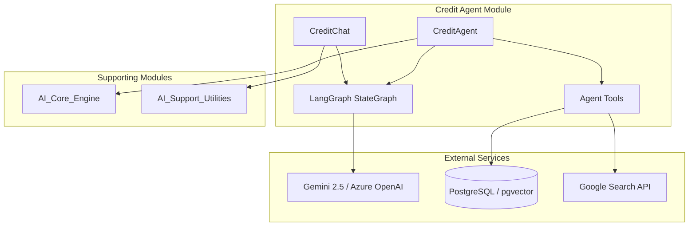
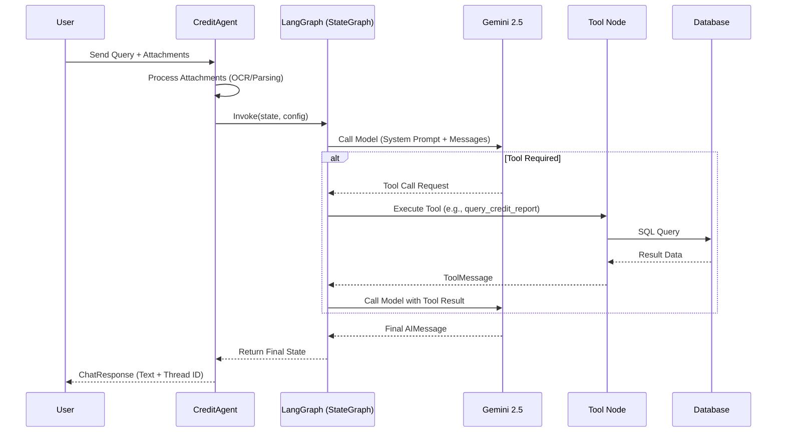

# Credit Agent Module

The **Credit Agent** module is a sophisticated AI-driven chat and analysis system designed to provide insights into credit risk and financial data. It leverages Large Language Models (LLMs), specifically Gemini 2.5, integrated with [LangGraph](https://langchain-ai.github.io/langgraph/) to create stateful, tool-augmented agents capable of querying internal credit reports, performing external searches, and processing various document formats.

## Core Functionality

The module consists of two primary classes:
1.  **`CreditChat`**: A specialized chatbot focused on specific credit reports, providing context-aware answers based on internal company data.
2.  **`CreditAgent`**: A more general-purpose ReAct (Reasoning and Acting) agent equipped with tools to query internal databases, find similar companies via vector embeddings, and perform Google searches.

## Architecture & Component Relationships

The module is built on a stateful architecture using `LangGraph` and `PostgresSaver` for persistent conversation history.

## Component Details

### 1. CreditAgent
The `CreditAgent` implements a ReAct pattern. It can decide whether to answer a query directly or use one of its registered tools.

*   **Tools**:
    *   `query_credit_report`: Fetches detailed financial data, credit memos, and company profiles from the database.
    *   `query_similar_company_report_id`: Uses vector similarity search (`pgvector`) to find companies with similar names and retrieve their latest report IDs.
    *   `query_google`: Performs external searches for up-to-date information.
*   **State Management**: Uses `MessagesState` to track conversation history, persisted in PostgreSQL.

### 2. CreditChat
A streamlined version of the agent tailored for deep-dives into a specific `report_id`. It automatically constructs a system prompt containing:
*   Company Profile
*   Credit Memo Data
*   Financial Data (parsed via [AI_Support_Utilities](AI_Support_Utilities.md))
*   Credit & Turnover Summary

### 3. Document Processing
Both components support multi-modal inputs through `_create_media_message`. Supported formats include:
*   **Images**: JPG, PNG (Base64 encoded)
*   **Documents**: PDF, DOCX, TXT
*   **Data**: CSV, XLSX (processed via `UnstructuredExcelLoader`)

## Data Flow

The following diagram illustrates the process of a user query being handled by the `CreditAgent`.

## Integration with Other Modules

*   **[AI_Core_Engine](AI_Core_Engine.md)**: Provides the underlying `ChatModel` abstraction and `LLMConfig`.
*   **[AI_Support_Utilities](AI_Support_Utilities.md)**: Used for parsing credit limits (`parse_credit_limit`), mapping citations, and handling specific AI types like `RiskAssessment`.
*   **[Credit_Report_Service](Credit_Report_Service.md)**: The source of the `credit_report` table data queried by the agent's tools.
*   **[Entity_Management](Entity_Management.md)**: Provides the organizational context (parent/subsidiary relationships) often reflected in the credit reports.

## Technical Specifications

| Feature | Implementation |
| :--- | :--- |
| **LLM Providers** | Google Vertex AI (Gemini), Azure OpenAI (Embeddings) |
| **Orchestration** | LangGraph |
| **Persistence** | PostgresSaver (Checkpointer) |
| **Vector Search** | `embedding <=> :embedding` (Cosine distance via pgvector) |
| **Context Window** | Trimmed to 800,000 tokens using `trim_messages` |

## Setup and Configuration

The module requires the following environment variables:
*   `DB_USER`, `DB_PASSWORD`, `DB_HOST`, `DB_PORT`, `DB_NAME`: Database connectivity.
*   `OPENAI_LFTEG_API_KEY`, `OPENAI_LFTEG_ENDPOINT`: For generating company name embeddings.
*   Vertex AI credentials for Gemini models.
